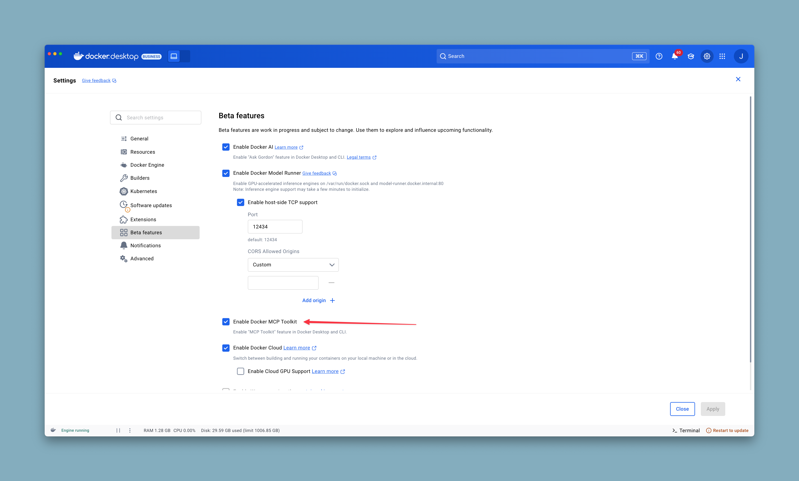

# Docker MCP Plugin, Gateway & Portal


This repository contains **two complementary projects** for Model Context Protocol (MCP) server management:

1. **🚀 Docker MCP Plugin & Gateway** - A mature Docker CLI plugin for secure MCP server management
2. **🌐 MCP Portal** - A modern web interface that wraps the CLI for enhanced user experience

## Projects Overview

### Docker MCP CLI Plugin & Gateway

The [MCP Toolkit](https://docs.docker.com/ai/mcp-catalog-and-toolkit/toolkit/), in Docker Desktop, allows
developers to configure and consume MCP servers from the [Docker MCP Catalog](https://hub.docker.com/mcp).

Underneath, the Toolkit is powered by a docker CLI plugin: `docker-mcp`. This repository contains the source code of this CLI plugin. It can work in Docker Desktop or independently.

#### Running Without Docker Desktop

The MCP Gateway can run standalone without Docker Desktop by setting an environment variable:

```bash
# Set environment variable to skip Docker Desktop check
# This is only needed if you are running without Docker Desktop and not using Linux
export DOCKER_MCP_SKIP_DESKTOP_CHECK=1

# Run the gateway
docker mcp gateway run
```

The main feature of this CLI is the **Docker MCP Gateway** which allows easy and secure running and deployment of MCP servers.

### MCP Portal

The **MCP Portal** is a web-based interface that provides an intuitive way to manage MCP servers through a modern dashboard. It wraps the CLI commands to provide:

- **🔐 Azure AD Authentication** - Enterprise-grade authentication with multi-user support
- **🎯 Dashboard Interface** - Intuitive web UI for server management
- **📊 Real-time Updates** - Live server status and health monitoring via WebSocket/SSE
- **👥 Multi-user Support** - Role-based access control and user isolation
- **📦 Bulk Operations** - Manage multiple servers simultaneously
- **⚙️ Configuration Management** - Import/export configurations with encryption
- **📈 Admin Panel** - System monitoring, user management, and audit logs

**Status**: ~82% Complete (Phases 1-3 done, Phase 4 75% - test stabilization, Phase 5 80% - needs Azure integration)

**Recent Updates (2025-09-19)**: Test suite stabilization (6/9 packages fixed), OAuth implementation analysis completed, and major codebase cleanup. Build system significantly stabilized.

**Current Focus**: Test coverage expansion from 11% to 50%+ and Azure OAuth service integration completion for production readiness.

## What is MCP?

The [Model Context Protocol (MCP)](https://spec.modelcontextprotocol.io/) is an open protocol that standardizes how AI applications connect to external data sources and tools. It provides a secure, controlled way for language models to access and interact with various services, databases, and APIs.

## Overview

Developers face criticial barriers when integrating Model Context Protocol (MCP) tools into production workflows:

- **Managing MCP server lifecycle** Each local MCP sever in the catalog runs in an isolated Docker container. npx and uvx servers are granted minimal host privileges.
- **Providing a unified interface** AI models access MCP servers through a single Gateway.
- **Handling authentication and security** Keep secrets out of environment variables using Docker Desktop's secrets management.
- **Supports dynamic tool discovery** and configuration. Each MCP client (eg VS Code, Cursor, Claude Desktop, etc.) connects to the same Gateway configuration, ensuring consistency across different clients.
- **Enables OAuth flows** for MCPs that require OAuth access token service connections.

## Features

### CLI Plugin & Gateway Features

- 🐳 **Container-based Servers**: Run MCP servers as Docker containers with proper isolation.
- 🔧 **Server Management**: List, inspect, and call MCP tools, resources and prompts from multiple servers.
- 🔐 **Secrets Management**: Secure handling of API keys and credentials via Docker Desktop.
- 🌐 **OAuth Integration**: Built-in OAuth flows for service authentication (Phase 5: Enhanced with automatic 401 handling).
- 📋 **Server Catalog**: Manage and configure multiple MCP catalogs.
- 🔍 **Dynamic Discovery**: Automatic tool, prompt, and resource discovery from running servers.
- 📊 **Monitoring**: Built-in logging and call tracing capabilities.

### Portal Features (NEW)

- 🔐 **Enterprise Authentication**: Azure AD integration with JWT tokens and session management
- 🎯 **Web Dashboard**: Modern React-based interface for intuitive server management
- 📊 **Real-time Monitoring**: Live server status updates via WebSocket and Server-Sent Events
- 👥 **Multi-tenant Support**: User isolation with PostgreSQL Row-Level Security (RLS)
- 📦 **Bulk Operations**: Enable/disable multiple servers with progress tracking and rollback
- ⚙️ **Configuration Management**: Encrypted import/export of configurations (AES-256-GCM)
- 📈 **Admin Panel**: User management, system monitoring, and comprehensive audit logging
- 🛡️ **Security Framework**: Rate limiting, command injection prevention, and audit trails
- 🔄 **Docker Integration**: Complete container lifecycle management with health monitoring

## Installation

### Prerequisites

- Docker Desktop (with MCP Toolkit feature enabled)

<div align="left">
  
</div>
- Go 1.24+ (for development)

### Install as Docker CLI Plugin

The MCP cli will already be installed on recent versions of Docker Desktop but you can build and install the latest version by following these steps:

```bash
# Clone the repository
git clone https://github.com/jrmatherly/mcp-hub-gateway.git
cd mcp-gateway
mkdir -p "$HOME/.docker/cli-plugins/"

# Build and install the plugin
make docker-mcp
```

After installation, the plugin will be available as:

```bash
docker mcp --help
```

### Portal Installation & Setup

The Portal requires additional infrastructure components:

**Prerequisites:**

- PostgreSQL 17+ (for data persistence with Row-Level Security)
- Redis 8+ (for sessions and caching)
- Node.js 22+ and npm 10+ (for frontend development)
- Go 1.24+ (for backend development)

**Quick Setup with Docker (Working Solution - Phase 4):**

```bash
# 1. Setup unified environment configuration
cp .env.example .env
# Edit .env with your Azure AD and database configuration
# Add NEXT_PUBLIC_SITE_URL for sitemap generation

# 2. Deploy using the Docker solution
./deploy-mcp-portal.sh

# Or manually with docker-compose
docker-compose -f docker-compose.mcp-portal.yml up -d

# 3. Check status
docker-compose -f docker-compose.mcp-portal.yml ps
docker-compose -f docker-compose.mcp-portal.yml logs -f
```

The Portal will be available at `http://localhost:3000` with the backend API at `http://localhost:8080`.

**Key Infrastructure Changes (2025-09-18):**

- **Working Deployment**: Dockerfile.mcp-portal and docker-compose.mcp-portal.yml complete
- **Infrastructure Cleanup**: Moved obsolete docker/ scripts to TEMP_DEL/
- **Simplified Configuration**: Single .env file with NEXT_PUBLIC_SITE_URL added
- **Build Quality**: All hadolint errors resolved, Tailwind CSS @apply issues fixed
- **Git Cleanup**: Generated files (sitemap, robots.txt) removed from tracking

For detailed setup instructions, see [Portal Development Setup](./implementation-plan/04-guides/development-setup.md).

## Production Deployment

The MCP Portal includes enterprise-grade production deployment infrastructure:

### 🚀 Quick Production Setup

```bash
# For production deployment
./deploy-mcp-portal.sh

# This deployment script provides:
# - Docker container orchestration
# - Environment configuration
# - Service health monitoring
# - Automated rollback on failure
# - Multi-service coordination
```

### 📦 Production Components

- **Security Hardened**: Non-root containers, read-only filesystems, capability restrictions
- **Audit Logging**: Comprehensive audit trail with 7-year retention for compliance (SOC2, GDPR, PCI-DSS)
- **Monitoring**: Prometheus alerts, Fluent Bit log aggregation, health checks
- **High Availability**: Auto-restart policies, health monitoring, graceful shutdowns

### 📄 Production Documentation

- [Production Deployment Report](./reports/PRODUCTION_DEPLOYMENT_COMPLETE.md) - Complete deployment overview
- [Docker Documentation Update Plan](./reports/DOCKER_DOCUMENTATION_UPDATE_PLAN_2025-09-18.md) - Infrastructure updates
- [Deployment Guide](./implementation-plan/04-guides/deployment-without-docker-desktop.md) - Step-by-step deployment

## Usage

### Catalog Management

Manage the catalogs available to the MCP gateway. The [default catalog](https://hub.docker.com/mcp) is available with the name 'docker-mcp'.

```bash
# Manage server catalogs
docker mcp catalog --help

# Initialize the default Docker MCP Catalog
docker mcp catalog init

# List available catalogs
docker mcp catalog ls

# Show all servers in a catalog
docker mcp catalog show docker-mcp
```

More about [the MCP Catalog](docs/catalog.md).

### MCP Gateway Operations

Start up an MCP Gateway. This can be used for one client, or to service multiple clients if using either `sse` or `streaming` transports.

```bash
# Run the MCP gateway (stdio)
docker mcp gateway run

# Run the MCP gateway (streaming)
docker mcp gateway run --port 8080 --transport streaming
```

More about [the MCP Gateway](docs/mcp-gateway.md).

### Server Management

Enable and disable the set of MCP servers that will be available for default clients. The MCP gateway can be configured to expose different sets of servers and tools but enabling and disabling servers here impacts the default gateway configuration.

```bash
# List enabled servers
docker mcp server list

# Enable one or more servers
docker mcp server enable <server-name> [server-name...]

# Disable servers
docker mcp server disable <server-name> [server-name...]

# Get detailed information about a server
docker mcp server inspect <server-name>

# Reset (disable all servers)
docker mcp server reset
```

### Configuration Management

Configure any MCP servers that require custom runtime configuration.

```bash
# Read current configuration
docker mcp config read

# Write new configuration
docker mcp config write '<yaml-config>'

# Reset configuration to defaults
docker mcp config reset
```

### Secrets and OAuth

Configure MCP servers that require either secrets or OAuth.

```bash
# Manage secrets
docker mcp secret --help

# Handle OAuth flows
docker mcp oauth --help

# Manage access policies
docker mcp policy --help

# export any desktop secrets needed by either server1 or server2
#   (temporary requirement to export secrets for docker cloud runs - this command
#    will no longer be required once Docker Cloud can access secret stores)
docker mcp secret export server1 server2
```

### Tool Management

```bash
# Show available commands
docker mcp --help

# Count available tools
docker mcp tools count

# List all available MCP tools
docker mcp tools list

# List all available MCP tools in JSON format
docker mcp tools list --format=json

# Inspect a specific tool
docker mcp tools inspect <tool-name>

# Call a tool with arguments
docker mcp tools call <tool-name> [arguments...]
```

### Portal Usage

Once the Portal is running, you can access the web interface for intuitive server management:

```bash
# Start the Portal backend service
docker mcp portal serve

# In development, start the frontend
cd cmd/docker-mcp/portal/frontend
npm run dev
```

**Portal Features:**

- **Dashboard**: View all MCP servers with status indicators
- **Server Management**: Enable/disable servers with a single click
- **Bulk Operations**: Select multiple servers for batch operations
- **Real-time Updates**: See server status changes instantly
- **Configuration Import/Export**: Backup and restore server configurations
- **User Management**: Manage team access and permissions (Admin only)
- **Audit Logs**: Track all system changes and user actions

The Portal provides the same functionality as the CLI but through an intuitive web interface with additional features like user management and audit logging.

**Development Commands:**

```bash
# Production environment
make portal-up               # Start all services
make portal-logs             # View logs
make portal-down             # Stop services

# Development environment
make portal-dev-up           # Start with development overrides
make portal-debug            # Start with debug tools

# Testing
make portal-test             # Run integration tests
make portal-build            # Build all images
```

## Configuration

The MCP CLI uses several configuration files:

- **`docker-mcp.yaml`**: Server catalog defining available MCP servers
- **`registry.yaml`**: Registry of enabled servers
- **`config.yaml`**: Configuration per server
- **`tools.yaml`**: Enabled tools per server

Configuration files are typically stored in `~/.docker/mcp/`. This is in this directory that Docker Desktop's
MCP Toolkit with store its configuration.

## Architecture

### CLI Gateway Architecture

The Docker MCP CLI implements a gateway pattern:

```
AI Client → MCP Gateway → MCP Servers (Docker Containers)
```

- **AI Client**: Language model or AI application
- **MCP Gateway**: This CLI tool managing protocol translation and routing
- **MCP Servers**: Individual MCP servers running in Docker containers

### Portal Architecture

The Portal adds a web interface layer that wraps the CLI:

```
Web Browser → Portal Frontend → Portal Backend → CLI Commands → MCP Gateway → MCP Servers
                    ↓              ↓
                Next.js          Go API
                React            PostgreSQL
                                 Redis
```

**Components:**

- **Frontend**: Next.js/React application with modern UI components
- **Backend**: Go service that executes CLI commands and manages web-specific features
- **Database**: PostgreSQL with Row-Level Security for multi-user data isolation
- **Cache**: Redis for sessions, real-time updates, and performance
- **Authentication**: Azure AD integration with JWT tokens
- **CLI Integration**: Portal executes `docker mcp` commands and parses output

The Portal doesn't reimplement MCP functionality - it provides a web interface to the existing CLI with additional enterprise features like user management, audit logging, and bulk operations.

See [docs/message-flow.md](docs/message-flow.md) for detailed message flow diagrams and [Portal Architecture](./implementation-plan/03-architecture/technical-architecture.md) for complete technical details.

## Recent Achievements (January 2025)

### MCP SDK v0.5.0 Upgrade ✅ COMPLETE

- Fixed URI template validation errors
- Native RFC 6570 support (removed workarounds)
- Proper CallToolParamsRaw handling

### Dynamic MCP Tools ✅ OPERATIONAL

- 5 new runtime management tools implemented
- Total tools available: 75 (70 original + 5 dynamic)
- Enable/disable servers without gateway restart

## Roadmap

### Phase 5: OAuth & Authentication Integration (80% Complete - Needs Testing)

Building on the existing OAuth support, Phase 5 introduces enterprise-grade OAuth management:

**OAuth Interceptor Middleware** ✅ IMPLEMENTED

- ✅ Automatic 401 response detection and handling
- ✅ Token refresh with exponential backoff
- ✅ Provider-specific OAuth configuration

**Dynamic Client Registration (DCR)** ✅ IMPLEMENTED

- ✅ RFC 7591 compliant DCR bridge service
- ✅ Azure AD Graph API integration for app registration
- ✅ Automatic client credential generation

**Enhanced Secret Management** ✅ IMPLEMENTED

- ✅ Azure Key Vault integration for credential storage
- ✅ Environment variable fallback for development
- ✅ Secure token storage and rotation mechanisms

**Multi-Provider Support** ✅ FRAMEWORK IMPLEMENTED

- ✅ GitHub, Google, Microsoft OAuth provider framework
- ✅ Extensible provider architecture
- 🔴 Testing blocked by build system issues

**Next Steps**: Complete testing and validation of OAuth implementation

See [Phase 5 Documentation](./implementation-plan/02-phases/phase-5-oauth-authentication.md) for complete implementation details.

## Contributing

The build instructions are available in the [contribution guide](CONTRIBUTING.md).

## License

This project is licensed under the MIT License - see the [LICENSE](LICENSE) file for details.

## Documentation & Support

### CLI Documentation

- 💬 [CLI Troubleshooting](/docs/troubleshooting.md)
- 📋 [MCP Catalog Guide](docs/catalog.md)
- 🚀 [MCP Gateway Guide](docs/mcp-gateway.md)
- 🔄 [Message Flow Diagrams](docs/message-flow.md)

### Portal Documentation

- 📚 [Portal Implementation Plan](./implementation-plan/README.md)
- 🏗️ [Technical Architecture](./implementation-plan/03-architecture/technical-architecture.md)
- ⚙️ [Development Setup](./implementation-plan/04-guides/development-setup.md)
- 🔐 [Security Framework](./docs/security.md)
- 📊 [API Documentation](./implementation-plan/03-architecture/api-specification.md)

### General Resources

- 📖 [MCP Specification](https://spec.modelcontextprotocol.io/)
- 🐳 [Docker Desktop Documentation](https://docs.docker.com/desktop/)
- 📝 [Getting Started Guide](./QUICKSTART.md)

### Community & Issues

- 🐛 [Report Issues](https://github.com/jrmatherly/mcp-hub-gateway/issues)
- 💬 [Discussions](https://github.com/jrmatherly/mcp-hub-gateway/discussions)
