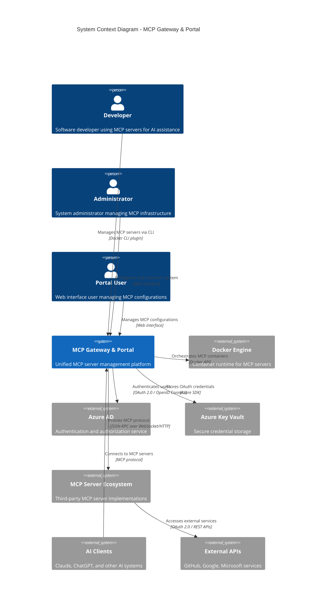

# C4 Model - Level 1: System Context

**MCP Gateway & Portal System Context**

## System Overview

The MCP Gateway & Portal system provides a comprehensive solution for managing Model Context Protocol (MCP) servers through both command-line and web interfaces.

## External Systems

### AI Clients

- **Claude Desktop**: Primary target for MCP server integration
- **ChatGPT**: OpenAI clients supporting MCP protocol
- **Custom AI Applications**: Third-party implementations using MCP

**Interactions**: Connect to MCP Gateway for server discovery and communication

### Docker Ecosystem

- **Docker Engine**: Container runtime for MCP server instances
- **Docker Desktop**: Developer environment with GUI and secrets management
- **Docker Registry**: Source for MCP server container images

**Interactions**: Gateway orchestrates container lifecycle and networking

### Microsoft Azure Services

- **Azure Active Directory**: Identity provider for portal authentication
- **Azure Key Vault**: Secure storage for OAuth credentials and secrets
- **Microsoft Graph API**: User and application management

**Interactions**: Portal integrates for authentication and credential management

### MCP Server Ecosystem

- **GitHub MCP Servers**: Repository management and code analysis
- **Google Workspace Servers**: Document and calendar integration
- **Database Servers**: SQL and NoSQL database connectors
- **Custom MCP Implementations**: Organization-specific tools

**Interactions**: Gateway proxies MCP protocol and manages OAuth flows

### External APIs

- **GitHub API**: Repository access requiring OAuth
- **Google APIs**: Calendar, Drive, Gmail integration
- **Microsoft APIs**: Office 365 and SharePoint access
- **Custom APIs**: Organization-specific service integrations

**Interactions**: MCP servers authenticate via gateway-managed OAuth

## Business Context

### Primary Use Cases

**Developer Productivity**

- Local MCP server management for AI-assisted development
- Quick server discovery and configuration
- Debugging and monitoring MCP interactions

**Team Collaboration**

- Shared MCP server configurations across development teams
- Centralized authentication and access control
- Usage analytics and cost management

**Enterprise Integration**

- Secure MCP server deployment in corporate environments
- Compliance with organizational security policies
- Integration with existing identity and access management

### Key Business Drivers

**Developer Experience**: Simplified MCP server management reducing setup friction
**Security**: Centralized OAuth management preventing credential sprawl
**Scalability**: Container-based deployment supporting team and enterprise use
**Compliance**: Audit trails and access controls meeting corporate requirements

## System Boundaries

### In Scope

- MCP server lifecycle management (install, configure, monitor)
- OAuth authentication proxy for MCP servers
- Web-based management interface with Azure AD authentication
- CLI plugin for Docker Desktop integration
- Container orchestration and networking

### Out of Scope

- MCP server implementation (relies on third-party servers)
- AI client development (integrates with existing clients)
- Identity provider services (uses Azure AD)
- Cloud infrastructure management (deployment-agnostic)

## Quality Attributes

### Performance

- **CLI Operations**: <100ms for typical commands
- **OAuth Token Operations**: <200ms for refresh/validation
- **Web Interface**: <2s page load, <500ms API responses
- **Container Operations**: <5s for server start/stop

### Security

- **Authentication**: Azure AD with OAuth 2.0/OIDC
- **Authorization**: Role-based access control with audit logging
- **Data Protection**: AES-256-GCM encryption for sensitive data
- **Network Security**: TLS 1.3 for all external communications

### Reliability

- **Availability**: 99.9% uptime for production deployments
- **Data Durability**: PostgreSQL with automated backups
- **Fault Tolerance**: Graceful degradation when dependencies unavailable
- **Recovery**: <30s recovery time for container failures

### Scalability

- **Concurrent Users**: 1000+ portal users, 10+ per organization
- **MCP Servers**: 100+ servers per installation
- **API Throughput**: 1000+ requests/second
- **Storage**: TB-scale for logs and configurations

---

**Diagram Type**: C4 Level 1 - System Context
**Last Updated**: September 19, 2025
**Next Level**: [C4-02-Container.md](./C4-02-Container.md) - Container Architecture
