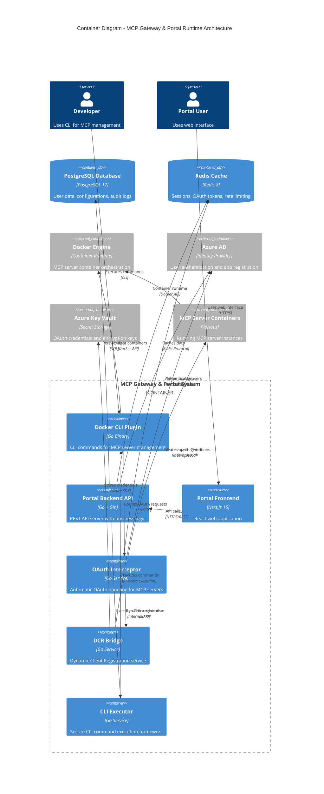

# C4 Model - Level 2: Container Architecture

**MCP Gateway & Portal Container Architecture**

## Container Overview

The system consists of multiple runtime containers handling different aspects of MCP server management, from CLI operations to web-based administration.



## Container Details

### CLI Plugin Container

**Technology**: Go 1.24+ binary
**Purpose**: Docker CLI plugin providing MCP server management commands
**Deployment**: Installed as Docker CLI plugin (~10MB binary)

**Key Responsibilities**:

- MCP server discovery and catalog management
- Container lifecycle operations (start, stop, update)
- Gateway runtime for MCP protocol proxying
- Local development tools and debugging

**API Endpoints**: N/A (CLI interface)
**Data Storage**: Local catalog files, Docker metadata
**Security**: File system permissions, Docker socket access

### Portal Backend API

**Technology**: Go + Gin framework
**Purpose**: REST API server providing web interface backend
**Deployment**: Container or binary (~25MB)

**Key Responsibilities**:

- User authentication and session management
- MCP server configuration management
- CLI command execution orchestration
- Audit logging and metrics collection

**API Endpoints**:

- `/api/auth/*` - Authentication endpoints
- `/api/servers/*` - MCP server management
- `/api/config/*` - User configuration
- `/api/health` - Health check

**Data Storage**: PostgreSQL for persistence, Redis for caching
**Security**: JWT tokens, RBAC, input validation

### Portal Frontend

**Technology**: Next.js 15 with App Router
**Purpose**: React web application for MCP management
**Deployment**: Static build served by backend or CDN

**Key Responsibilities**:

- User interface for MCP server management
- Real-time status updates via WebSocket/SSE
- Configuration forms and wizards
- Usage analytics and monitoring dashboards

**Build Output**: Static files (~5MB), client-side JavaScript
**Authentication**: Azure AD via MSAL.js
**State Management**: React Query + Zustand

### OAuth Interceptor

**Technology**: Go HTTP proxy service
**Purpose**: Automatic OAuth handling for MCP server requests
**Deployment**: Embedded in CLI plugin or standalone service

**Key Responsibilities**:

- Detecting 401 responses from MCP servers
- Automatic token refresh and retry logic
- OAuth flow initiation and completion
- Token storage and rotation management

**Performance**: <50ms latency overhead
**Scalability**: Handles 1000+ concurrent connections
**Security**: Token encryption, secure storage

### DCR Bridge

**Technology**: Go microservice
**Purpose**: Dynamic Client Registration bridge to Azure AD
**Deployment**: Standalone container or embedded service

**Key Responsibilities**:

- RFC 7591 DCR request handling
- Azure AD app registration automation
- Client credential generation and management
- Secure credential storage in Key Vault

**API**: RFC 7591 compliant DCR endpoint
**Integration**: Microsoft Graph API for app registration
**Security**: Client authentication, credential encryption

### CLI Executor

**Technology**: Go service with security controls
**Purpose**: Secure execution framework for CLI commands
**Deployment**: Embedded in Portal Backend

**Key Responsibilities**:

- Command validation and sanitization
- Secure process execution with isolation
- Output capture and streaming
- Error handling and logging

**Security Features**:

- Input whitelisting and validation
- Process isolation and sandboxing
- Command injection prevention
- Audit logging for all executions

## Data Flow Patterns

### CLI Operations

```
Developer → CLI Plugin → Docker Engine → MCP Containers
                    ↓
              OAuth Interceptor → DCR Bridge → Azure AD
```

### Web Portal Operations

```
User → Frontend → Backend API → CLI Executor → CLI Plugin
                     ↓               ↓
               PostgreSQL      OAuth Interceptor
                     ↓               ↓
                Redis Cache    MCP Containers
```

### OAuth Flow

```
MCP Server (401) → OAuth Interceptor → DCR Bridge → Azure AD
                                    ↓
                           Token Storage (Redis/Key Vault)
                                    ↓
                           Retry with Token → MCP Server
```

## Deployment Patterns

### Development Environment

```yaml
CLI Plugin: Local binary installation
Portal: Docker Compose stack
  - Backend + Frontend containers
  - PostgreSQL + Redis containers
  - Shared Docker socket mount
```

### Production Environment

```yaml
CLI Plugin: Distributed binary installation
Portal: Kubernetes or Docker Swarm
  - Load-balanced backend instances
  - CDN for frontend static files
  - Managed PostgreSQL + Redis
  - Azure services integration
```

## Inter-Container Communication

### Synchronous Communication

- **Frontend ↔ Backend**: REST API over HTTPS
- **Backend ↔ CLI Executor**: Internal API calls
- **CLI Executor ↔ CLI Plugin**: Process execution
- **OAuth Interceptor ↔ DCR Bridge**: HTTP API calls

### Asynchronous Communication

- **Backend → Frontend**: WebSocket/SSE for real-time updates
- **OAuth Interceptor → Token Storage**: Redis pub/sub for token events
- **All Services → Audit Log**: Event streaming to PostgreSQL

### Data Storage Communication

- **Backend → PostgreSQL**: Connection pooling with pgx driver
- **Multiple Services → Redis**: Connection pooling with go-redis
- **DCR Bridge → Key Vault**: Azure SDK with managed identity

## Security Boundaries

### Network Security

- All external communication over TLS 1.3
- Internal service communication over encrypted channels
- Network segmentation between user and system services

### Process Security

- CLI Executor runs with minimal privileges
- Container isolation for MCP servers
- Process sandboxing for command execution

### Data Security

- Encryption at rest for PostgreSQL and Redis
- Token encryption in memory and storage
- Secure key management via Azure Key Vault

---

**Diagram Type**: C4 Level 2 - Container Architecture
**Last Updated**: September 19, 2025
**Previous Level**: [C4-01-Context.md](./C4-01-Context.md) - System Context
**Next Level**: [C4-03-Components.md](./C4-03-Components.md) - Component Architecture
