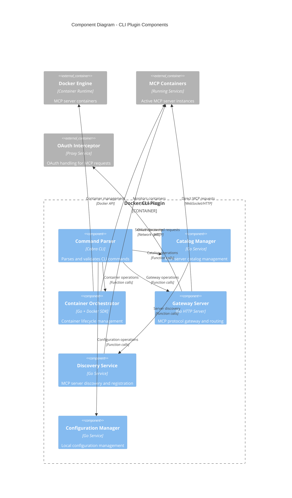

# C4 Model - Level 3: Component Architecture

**MCP Gateway & Portal Component Architecture**

## Portal Backend Components

The Portal Backend container contains multiple specialized components handling different aspects of the web interface functionality.

```mermaid
C4Component
    title Component Diagram - Portal Backend API Components

    Container_Boundary(portalBackend, "Portal Backend API") {
        Component(authHandler, "Authentication Handler", "Go + JWT", "Handles user authentication and authorization")
        Component(serverManager, "Server Manager", "Go Service", "MCP server lifecycle management")
        Component(configService, "Configuration Service", "Go Service", "User and system configuration management")
        Component(auditLogger, "Audit Logger", "Go Service", "Security and operational event logging")
        Component(metricsCollector, "Metrics Collector", "Go Service", "Performance and usage metrics")
        Component(apiRouter, "API Router", "Gin Framework", "HTTP request routing and middleware")
        Component(wsHandler, "WebSocket Handler", "Gorilla WebSocket", "Real-time communication with frontend")
    }

    Container_Boundary(cliExecutor, "CLI Executor Framework") {
        Component(commandValidator, "Command Validator", "Go Service", "Input validation and sanitization")
        Component(processManager, "Process Manager", "Go Service", "Secure process execution and isolation")
        Component(outputStreamer, "Output Streamer", "Go Service", "Real-time command output streaming")
        Component(errorHandler, "Error Handler", "Go Service", "Error processing and user feedback")
    }

    ContainerDb(postgres, "PostgreSQL", "Database", "Persistent data storage")
    ContainerDb(redis, "Redis", "Cache", "Session and token storage")
    Container_Ext(azureAD, "Azure AD", "Identity Provider", "User authentication")
    Container_Ext(cliPlugin, "CLI Plugin", "Go Binary", "MCP management commands")

    Rel(apiRouter, authHandler, "Authenticates requests", "Function calls")
    Rel(apiRouter, serverManager, "Routes server operations", "Function calls")
    Rel(apiRouter, configService, "Routes configuration", "Function calls")
    Rel(authHandler, azureAD, "Validates tokens", "HTTPS")
    Rel(authHandler, redis, "Stores sessions", "Redis Protocol")

    Rel(serverManager, cliExecutor, "Executes MCP commands", "Internal API")
    Rel(configService, postgres, "Persists configuration", "SQL")
    Rel(auditLogger, postgres, "Stores audit logs", "SQL")
    Rel(metricsCollector, redis, "Caches metrics", "Redis Protocol")

    Rel(wsHandler, serverManager, "Streams server status", "Function calls")
    Rel(wsHandler, metricsCollector, "Streams metrics", "Function calls")

    Rel(commandValidator, processManager, "Validated commands", "Function calls")
    Rel(processManager, outputStreamer, "Command output", "Channels")
    Rel(processManager, errorHandler, "Error events", "Function calls")
    Rel(processManager, cliPlugin, "Executes commands", "Process execution")
    Rel(processManager, auditLogger, "Logs execution", "Function calls")

    UpdateLayoutConfig($c4ShapeInRow="2", $c4BoundaryInRow="2")
```

## OAuth Interceptor Components

The OAuth Interceptor handles automatic authentication for MCP servers requiring OAuth.

```mermaid
C4Component
    title Component Diagram - OAuth Interceptor Components

    Container_Boundary(oauthInterceptor, "OAuth Interceptor Service") {
        Component(requestRouter, "Request Router", "Go HTTP Proxy", "Routes MCP requests and handles 401 responses")
        Component(tokenManager, "Token Manager", "Go Service", "OAuth token lifecycle management")
        Component(providerRegistry, "Provider Registry", "Go Service", "OAuth provider configuration and selection")
        Component(flowOrchestrator, "Flow Orchestrator", "Go Service", "OAuth flow initiation and completion")
        Component(retryEngine, "Retry Engine", "Go Service", "Automatic retry logic with exponential backoff")
        Component(secretsClient, "Secrets Client", "Go Service", "Secure token storage and retrieval")
    }

    Container_Boundary(dcrBridge, "DCR Bridge Service") {
        Component(dcrHandler, "DCR Handler", "Go HTTP Server", "RFC 7591 Dynamic Client Registration endpoint")
        Component(graphClient, "Graph Client", "Go + Microsoft Graph SDK", "Azure AD app registration automation")
        Component(credentialGenerator, "Credential Generator", "Go Service", "Client ID/secret generation and management")
        Component(vaultClient, "Vault Client", "Go + Azure SDK", "Azure Key Vault integration")
    }

    ContainerDb(redis, "Redis", "Token Cache", "OAuth token storage")
    Container_Ext(keyVault, "Azure Key Vault", "Secret Storage", "Long-term credential storage")
    Container_Ext(azureAD, "Azure AD", "Identity Provider", "OAuth provider and app registration")
    Container_Ext(mcpServers, "MCP Servers", "External Services", "OAuth-protected MCP endpoints")

    Rel(requestRouter, tokenManager, "Requests tokens", "Function calls")
    Rel(requestRouter, retryEngine, "Handles retries", "Function calls")
    Rel(requestRouter, mcpServers, "Proxies requests", "HTTPS")

    Rel(tokenManager, providerRegistry, "Gets provider config", "Function calls")
    Rel(tokenManager, flowOrchestrator, "Initiates OAuth flows", "Function calls")
    Rel(tokenManager, secretsClient, "Stores/retrieves tokens", "Function calls")

    Rel(flowOrchestrator, dcrBridge, "Dynamic registration", "HTTPS")
    Rel(secretsClient, redis, "Caches tokens", "Redis Protocol")
    Rel(secretsClient, keyVault, "Stores credentials", "Azure SDK")

    Rel(dcrHandler, graphClient, "Creates app registrations", "Function calls")
    Rel(dcrHandler, credentialGenerator, "Generates credentials", "Function calls")
    Rel(graphClient, azureAD, "App registration API", "Graph API")
    Rel(credentialGenerator, vaultClient, "Stores credentials", "Function calls")
    Rel(vaultClient, keyVault, "Secure storage", "Azure SDK")

    UpdateLayoutConfig($c4ShapeInRow="3", $c4BoundaryInRow="2")
```

## CLI Plugin Components

The CLI Plugin provides the core MCP server management functionality.



## Component Responsibilities

### Portal Backend Components

**Authentication Handler**

- JWT token validation and refresh
- Azure AD integration and user profile management
- Session lifecycle and security policies
- Role-based access control enforcement

**Server Manager**

- MCP server CRUD operations
- Server status monitoring and health checks
- Configuration validation and deployment
- Integration with CLI Executor for operations

**Configuration Service**

- User preference management
- System configuration and feature flags
- Environment-specific settings
- Configuration validation and schema enforcement

**API Router**

- HTTP request routing and middleware pipeline
- Rate limiting and request throttling
- CORS policy enforcement
- Request/response logging and metrics

**WebSocket Handler**

- Real-time server status updates
- Live command execution output streaming
- Client connection management
- Event broadcasting and subscription

### OAuth Interceptor Components

**Request Router**

- HTTP proxy for MCP requests
- 401 response detection and handling
- Request/response modification for OAuth
- Load balancing and failover logic

**Token Manager**

- OAuth token acquisition and refresh
- Token expiration monitoring and renewal
- Multi-provider token management
- Token validation and introspection

**Provider Registry**

- OAuth provider configuration management
- Provider-specific flow customization
- Credential mapping and transformation
- Provider health monitoring

**Flow Orchestrator**

- OAuth authorization flow initiation
- PKCE implementation for security
- State parameter management
- Callback handling and token exchange

### CLI Plugin Components

**Command Parser**

- CLI argument parsing and validation
- Help text generation and command documentation
- Error handling and user feedback
- Command aliasing and shortcuts

**Catalog Manager**

- MCP server catalog CRUD operations
- Catalog synchronization and updates
- Server metadata management
- Version compatibility checking

**Container Orchestrator**

- Docker container lifecycle management
- Container health monitoring and restart
- Network configuration and port management
- Volume mounting and data persistence

**Gateway Server**

- MCP protocol implementation and routing
- WebSocket and HTTP endpoint management
- Message transformation and validation
- Connection pooling and load balancing

## Performance Characteristics

### Portal Backend

- **API Response Times**: <500ms for 95th percentile
- **WebSocket Latency**: <50ms for real-time updates
- **Concurrent Users**: 1000+ simultaneous connections
- **Database Connections**: Connection pooling with max 100 connections

### OAuth Interceptor

- **Proxy Latency**: <50ms overhead for OAuth-enabled requests
- **Token Operations**: <200ms for token acquisition/refresh
- **Cache Hit Rate**: >90% for token retrieval from Redis
- **Concurrent Flows**: 100+ simultaneous OAuth flows

### CLI Plugin

- **Command Execution**: <100ms for typical operations
- **Container Operations**: <5s for start/stop operations
- **Gateway Throughput**: 1000+ MCP requests/second
- **Memory Usage**: <50MB for typical workloads

## Security Considerations

### Input Validation

- All user inputs validated against strict schemas
- Command injection prevention in CLI Executor
- SQL injection prevention with parameterized queries
- XSS protection in API responses

### Authentication & Authorization

- JWT tokens with RS256 signature validation
- Role-based access control (RBAC) enforcement
- Session management with secure cookies
- OAuth state parameter validation

### Data Protection

- TLS 1.3 for all network communication
- AES-256-GCM encryption for sensitive data at rest
- Secure token storage with encryption
- Audit logging for all security-relevant events

---

**Diagram Type**: C4 Level 3 - Component Architecture
**Last Updated**: September 19, 2025
**Previous Level**: [C4-02-Container.md](./C4-02-Container.md) - Container Architecture
**Next Level**: [ADR-001-cli-wrapper-pattern.md](./decisions/ADR-001-cli-wrapper-pattern.md) - Architecture Decisions
