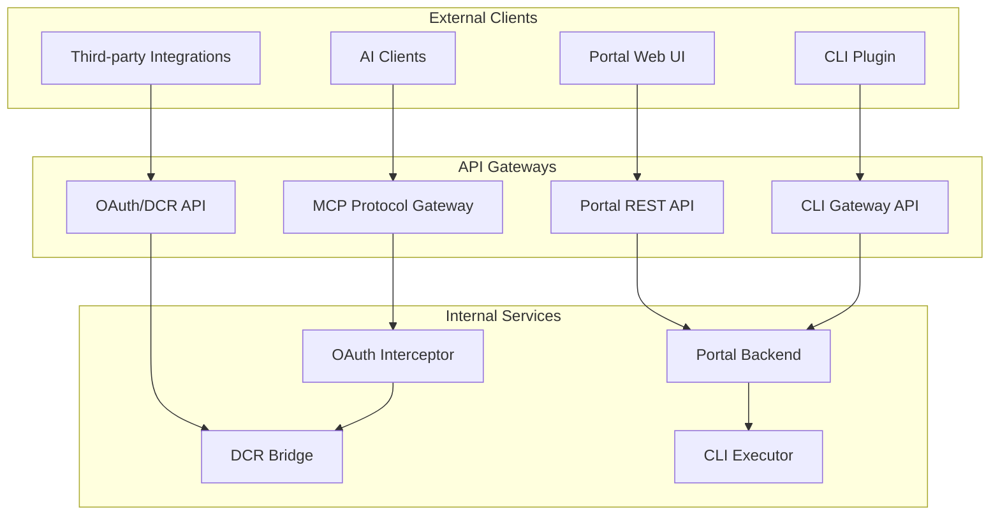

# API Contracts and Interface Specifications

**MCP Gateway & Portal API Contracts, Interface Definitions, and Integration Specifications**

## API Architecture Overview

The MCP Gateway & Portal system exposes multiple API interfaces for different types of clients and use cases. This document defines all API contracts, interface specifications, and integration patterns.

## API Surface Area

### External APIs



## Portal REST API Specification

### API Base Configuration

```yaml
openapi: 3.0.3
info:
  title: MCP Portal API
  description: REST API for MCP Gateway Portal web interface
  version: 2.0.0
  contact:
    name: MCP Portal Team
    url: https://github.com/jrmatherly/mcp-hub-gateway

servers:
  - url: https://portal.example.com/api/v2
    description: Production server
  - url: https://staging-portal.example.com/api/v2
    description: Staging server
  - url: http://localhost:8080/api/v2
    description: Development server

security:
  - BearerAuth: []
  - CookieAuth: []
```

### Authentication Endpoints

```yaml
paths:
  /auth/login:
    post:
      summary: Initiate Azure AD OAuth login
      operationId: initiateLogin
      security: []
      requestBody:
        required: true
        content:
          application/json:
            schema:
              type: object
              properties:
                redirect_uri:
                  type: string
                  format: uri
                  example: "https://portal.example.com/dashboard"
              required:
                - redirect_uri
      responses:
        "302":
          description: Redirect to Azure AD authorization endpoint
          headers:
            Location:
              schema:
                type: string
                format: uri
        "400":
          $ref: "#/components/responses/BadRequest"

  /auth/callback:
    post:
      summary: Handle OAuth callback from Azure AD
      operationId: handleCallback
      security: []
      requestBody:
        required: true
        content:
          application/json:
            schema:
              type: object
              properties:
                code:
                  type: string
                  description: Authorization code from Azure AD
                state:
                  type: string
                  description: State parameter for CSRF protection
              required:
                - code
                - state
      responses:
        "200":
          description: Authentication successful
          content:
            application/json:
              schema:
                type: object
                properties:
                  access_token:
                    type: string
                    description: JWT access token
                  expires_in:
                    type: integer
                    description: Token expiration in seconds
                  user:
                    $ref: "#/components/schemas/User"

  /auth/refresh:
    post:
      summary: Refresh access token
      operationId: refreshToken
      responses:
        "200":
          description: Token refreshed successfully
          content:
            application/json:
              schema:
                type: object
                properties:
                  access_token:
                    type: string
                  expires_in:
                    type: integer

  /auth/logout:
    post:
      summary: Logout and invalidate session
      operationId: logout
      responses:
        "204":
          description: Logout successful
```

### MCP Server Management Endpoints

```yaml
/servers:
  get:
    summary: List user's MCP servers
    operationId: listServers
    parameters:
      - name: enabled
        in: query
        schema:
          type: boolean
        description: Filter by enabled status
      - name: search
        in: query
        schema:
          type: string
        description: Search by server name or image
    responses:
      "200":
        description: List of MCP servers
        content:
          application/json:
            schema:
              type: object
              properties:
                servers:
                  type: array
                  items:
                    $ref: "#/components/schemas/MCPServer"
                pagination:
                  $ref: "#/components/schemas/Pagination"

  post:
    summary: Create new MCP server
    operationId: createServer
    requestBody:
      required: true
      content:
        application/json:
          schema:
            $ref: "#/components/schemas/CreateServerRequest"
    responses:
      "201":
        description: Server created successfully
        content:
          application/json:
            schema:
              $ref: "#/components/schemas/MCPServer"
      "400":
        $ref: "#/components/responses/BadRequest"
      "409":
        $ref: "#/components/responses/Conflict"

/servers/{server_id}:
  get:
    summary: Get server details
    operationId: getServer
    parameters:
      - $ref: "#/components/parameters/ServerID"
    responses:
      "200":
        description: Server details
        content:
          application/json:
            schema:
              $ref: "#/components/schemas/MCPServerDetails"
      "404":
        $ref: "#/components/responses/NotFound"

  put:
    summary: Update server configuration
    operationId: updateServer
    parameters:
      - $ref: "#/components/parameters/ServerID"
    requestBody:
      required: true
      content:
        application/json:
          schema:
            $ref: "#/components/schemas/UpdateServerRequest"
    responses:
      "200":
        description: Server updated successfully
        content:
          application/json:
            schema:
              $ref: "#/components/schemas/MCPServer"

  delete:
    summary: Delete server
    operationId: deleteServer
    parameters:
      - $ref: "#/components/parameters/ServerID"
    responses:
      "204":
        description: Server deleted successfully
      "409":
        description: Server cannot be deleted (still running)

/servers/{server_id}/start:
  post:
    summary: Start MCP server
    operationId: startServer
    parameters:
      - $ref: "#/components/parameters/ServerID"
    responses:
      "202":
        description: Start operation initiated
        content:
          application/json:
            schema:
              $ref: "#/components/schemas/OperationStatus"

/servers/{server_id}/stop:
  post:
    summary: Stop MCP server
    operationId: stopServer
    parameters:
      - $ref: "#/components/parameters/ServerID"
    responses:
      "202":
        description: Stop operation initiated
        content:
          application/json:
            schema:
              $ref: "#/components/schemas/OperationStatus"

/servers/{server_id}/logs:
  get:
    summary: Get server logs
    operationId: getServerLogs
    parameters:
      - $ref: "#/components/parameters/ServerID"
      - name: lines
        in: query
        schema:
          type: integer
          default: 100
          minimum: 1
          maximum: 1000
      - name: follow
        in: query
        schema:
          type: boolean
          default: false
    responses:
      "200":
        description: Server logs
        content:
          application/json:
            schema:
              type: object
              properties:
                logs:
                  type: array
                  items:
                    $ref: "#/components/schemas/LogEntry"
          text/event-stream:
            schema:
              type: string
              description: Real-time log stream when follow=true
```

### OAuth Management Endpoints

```yaml
/oauth/providers:
  get:
    summary: List available OAuth providers
    operationId: listOAuthProviders
    responses:
      "200":
        description: List of OAuth providers
        content:
          application/json:
            schema:
              type: object
              properties:
                providers:
                  type: array
                  items:
                    $ref: "#/components/schemas/OAuthProvider"

/oauth/authorize:
  post:
    summary: Initiate OAuth authorization for MCP server
    operationId: authorizeOAuth
    requestBody:
      required: true
      content:
        application/json:
          schema:
            type: object
            properties:
              server_id:
                type: string
                format: uuid
              provider:
                type: string
                enum: [github, google, microsoft]
              scopes:
                type: array
                items:
                  type: string
            required:
              - server_id
              - provider
              - scopes
    responses:
      "200":
        description: Authorization URL generated
        content:
          application/json:
            schema:
              type: object
              properties:
                authorization_url:
                  type: string
                  format: uri
                state:
                  type: string

/oauth/credentials/{server_id}:
  get:
    summary: Get OAuth credential status for server
    operationId: getOAuthCredentials
    parameters:
      - $ref: "#/components/parameters/ServerID"
    responses:
      "200":
        description: OAuth credential status
        content:
          application/json:
            schema:
              type: object
              properties:
                credentials:
                  type: array
                  items:
                    $ref: "#/components/schemas/OAuthCredentialStatus"

  delete:
    summary: Revoke OAuth credentials for server
    operationId: revokeOAuthCredentials
    parameters:
      - $ref: "#/components/parameters/ServerID"
      - name: provider
        in: query
        required: true
        schema:
          type: string
    responses:
      "204":
        description: Credentials revoked successfully
```

### WebSocket API for Real-time Updates

```yaml
/ws/servers:
  get:
    summary: WebSocket endpoint for real-time server status updates
    operationId: serverStatusWebSocket
    parameters:
      - name: Upgrade
        in: header
        required: true
        schema:
          type: string
          enum: [websocket]
      - name: Connection
        in: header
        required: true
        schema:
          type: string
          enum: [Upgrade]
    responses:
      "101":
        description: WebSocket connection established
        content:
          application/json:
            schema:
              type: object
              properties:
                type:
                  type: string
                  enum: [server_status, operation_update, error]
                data:
                  oneOf:
                    - $ref: "#/components/schemas/ServerStatusEvent"
                    - $ref: "#/components/schemas/OperationEvent"
                    - $ref: "#/components/schemas/ErrorEvent"
```

## Schema Definitions

### Core Data Models

```yaml
components:
  schemas:
    User:
      type: object
      properties:
        id:
          type: string
          format: uuid
        email:
          type: string
          format: email
        name:
          type: string
        organization_id:
          type: string
          format: uuid
        role:
          type: string
          enum: [user, admin, auditor]
        created_at:
          type: string
          format: date-time
      required:
        - id
        - email
        - name
        - organization_id
        - role

    MCPServer:
      type: object
      properties:
        id:
          type: string
          format: uuid
        name:
          type: string
          minLength: 1
          maxLength: 100
        image:
          type: string
          description: Container image name and tag
        status:
          type: string
          enum: [stopped, starting, running, stopping, error]
        enabled:
          type: boolean
        port:
          type: integer
          minimum: 1024
          maximum: 65535
        configuration:
          type: object
          additionalProperties: true
        oauth_required:
          type: boolean
        oauth_providers:
          type: array
          items:
            type: string
        created_at:
          type: string
          format: date-time
        updated_at:
          type: string
          format: date-time
      required:
        - id
        - name
        - image
        - status
        - enabled

    CreateServerRequest:
      type: object
      properties:
        name:
          type: string
          minLength: 1
          maxLength: 100
          pattern: "^[a-zA-Z0-9-_]+$"
        image:
          type: string
          description: Container image name and tag
        port:
          type: integer
          minimum: 1024
          maximum: 65535
          default: 8080
        environment:
          type: object
          additionalProperties:
            type: string
        volumes:
          type: array
          items:
            type: object
            properties:
              host_path:
                type: string
              container_path:
                type: string
              read_only:
                type: boolean
                default: false
        oauth_providers:
          type: array
          items:
            type: string
            enum: [github, google, microsoft]
      required:
        - name
        - image

    OAuthProvider:
      type: object
      properties:
        name:
          type: string
        display_name:
          type: string
        authorization_url:
          type: string
          format: uri
        token_url:
          type: string
          format: uri
        scopes:
          type: array
          items:
            type: string
        supports_refresh:
          type: boolean
      required:
        - name
        - display_name
        - authorization_url
        - token_url

    OAuthCredentialStatus:
      type: object
      properties:
        provider:
          type: string
        status:
          type: string
          enum: [not_configured, valid, expired, revoked]
        scopes:
          type: array
          items:
            type: string
        expires_at:
          type: string
          format: date-time
          nullable: true
        last_refreshed:
          type: string
          format: date-time
          nullable: true
```

### Event and Operation Models

```yaml
OperationStatus:
  type: object
  properties:
    operation_id:
      type: string
      format: uuid
    type:
      type: string
      enum: [start, stop, restart, update]
    status:
      type: string
      enum: [queued, running, completed, failed]
    progress:
      type: number
      minimum: 0
      maximum: 100
    message:
      type: string
    started_at:
      type: string
      format: date-time
    completed_at:
      type: string
      format: date-time
      nullable: true
  required:
    - operation_id
    - type
    - status

ServerStatusEvent:
  type: object
  properties:
    server_id:
      type: string
      format: uuid
    status:
      type: string
      enum: [stopped, starting, running, stopping, error]
    cpu_usage:
      type: number
      minimum: 0
      maximum: 100
    memory_usage:
      type: number
      minimum: 0
      maximum: 100
    network_io:
      type: object
      properties:
        bytes_sent:
          type: integer
        bytes_received:
          type: integer
    timestamp:
      type: string
      format: date-time
  required:
    - server_id
    - status
    - timestamp

LogEntry:
  type: object
  properties:
    timestamp:
      type: string
      format: date-time
    level:
      type: string
      enum: [debug, info, warn, error]
    message:
      type: string
    source:
      type: string
      description: Log source (container, host, etc.)
  required:
    - timestamp
    - level
    - message
```

## MCP Protocol Gateway API

### MCP Protocol Implementation

The MCP Gateway implements the Model Context Protocol specification for AI client communication.

```yaml
MCP Protocol Endpoints:
  - POST /mcp/v1/initialize
  - POST /mcp/v1/tools/list
  - POST /mcp/v1/tools/call
  - POST /mcp/v1/resources/list
  - POST /mcp/v1/resources/read
  - WebSocket /mcp/v1/session
```

### MCP Message Format

```typescript
interface MCPRequest {
  jsonrpc: "2.0";
  id: string | number;
  method: string;
  params?: Record<string, any>;
}

interface MCPResponse {
  jsonrpc: "2.0";
  id: string | number;
  result?: any;
  error?: MCPError;
}

interface MCPError {
  code: number;
  message: string;
  data?: any;
}

// Tool call example
interface ToolCallRequest extends MCPRequest {
  method: "tools/call";
  params: {
    name: string;
    arguments: Record<string, any>;
  };
}

interface ToolCallResponse extends MCPResponse {
  result: {
    content: Array<{
      type: "text" | "image" | "resource";
      text?: string;
      data?: string;
      mimeType?: string;
    }>;
    isError?: boolean;
  };
}
```

### OAuth Integration in MCP Gateway

```go
type MCPGateway struct {
    oauthInterceptor *OAuthInterceptor
    serverRegistry   *ServerRegistry
    messageRouter    *MessageRouter
}

func (gw *MCPGateway) HandleMCPRequest(ctx context.Context, req *MCPRequest) (*MCPResponse, error) {
    // 1. Route request to appropriate MCP server
    server, err := gw.serverRegistry.FindServer(req.ServerID)
    if err != nil {
        return nil, fmt.Errorf("server not found: %w", err)
    }

    // 2. Check if server requires OAuth
    if server.RequiresOAuth() {
        req, err = gw.oauthInterceptor.ProcessRequest(ctx, req)
        if err != nil {
            return nil, fmt.Errorf("OAuth processing failed: %w", err)
        }
    }

    // 3. Forward request to MCP server
    resp, err := gw.messageRouter.ForwardRequest(ctx, server, req)
    if err != nil {
        // Handle OAuth-related errors
        if isOAuthError(err) {
            return gw.handleOAuthError(ctx, req, err)
        }
        return nil, err
    }

    return resp, nil
}
```

## DCR Bridge API Specification

### RFC 7591 Dynamic Client Registration

```yaml
DCR Endpoints:
  - POST /oauth/register
  - GET /oauth/register/{client_id}
  - PUT /oauth/register/{client_id}
  - DELETE /oauth/register/{client_id}
```

### DCR Request/Response Format

```json
{
  "// DCR Registration Request": "",
  "client_name": "GitHub MCP Server",
  "redirect_uris": ["http://localhost:8080/oauth/callback"],
  "scope": "repo read:user",
  "grant_types": ["authorization_code", "refresh_token"],
  "response_types": ["code"],
  "application_type": "web",
  "contacts": ["admin@example.com"],
  "logo_uri": "https://example.com/logo.png",
  "client_uri": "https://example.com",
  "policy_uri": "https://example.com/privacy",
  "tos_uri": "https://example.com/terms"
}
```

```json
{
  "// DCR Registration Response": "",
  "client_id": "550e8400-e29b-41d4-a716-446655440000",
  "client_secret": "ZJYCqe3GGRvdrudKyZS0XhGv_Z45DuKhCUk0gBR1vZk",
  "client_id_issued_at": 1571865200,
  "client_secret_expires_at": 1579641200,
  "redirect_uris": ["http://localhost:8080/oauth/callback"],
  "grant_types": ["authorization_code", "refresh_token"],
  "response_types": ["code"],
  "scope": "repo read:user",
  "application_type": "web"
}
```

## Error Handling and Status Codes

### HTTP Status Code Usage

```yaml
Success Responses:
  200: OK - Request successful
  201: Created - Resource created successfully
  202: Accepted - Operation started (async)
  204: No Content - Operation successful, no response body

Client Error Responses:
  400: Bad Request - Invalid request format or parameters
  401: Unauthorized - Authentication required or invalid
  403: Forbidden - Insufficient permissions
  404: Not Found - Resource does not exist
  409: Conflict - Resource conflict (e.g., duplicate name)
  422: Unprocessable Entity - Valid format but business logic error
  429: Too Many Requests - Rate limit exceeded

Server Error Responses:
  500: Internal Server Error - Unexpected server error
  502: Bad Gateway - Upstream service error
  503: Service Unavailable - Service temporarily unavailable
  504: Gateway Timeout - Upstream service timeout
```

### Error Response Format

```yaml
Error Response Schema:
  type: object
  properties:
    error:
      type: object
      properties:
        code:
          type: string
          description: Machine-readable error code
        message:
          type: string
          description: Human-readable error message
        details:
          type: object
          additionalProperties: true
          description: Additional error context
        trace_id:
          type: string
          description: Request trace ID for debugging
      required:
        - code
        - message
  required:
    - error

Example Error Response:
{
  "error": {
    "code": "SERVER_NOT_FOUND",
    "message": "MCP server with ID '123e4567-e89b-12d3-a456-426614174000' not found",
    "details": {
      "server_id": "123e4567-e89b-12d3-a456-426614174000",
      "user_id": "user_123"
    },
    "trace_id": "req_abc123def456"
  }
}
```

## Rate Limiting and Quotas

### Rate Limiting Configuration

```yaml
Rate Limits:
  Authentication Endpoints:
    - /auth/login: 5 requests per minute per IP
    - /auth/refresh: 10 requests per minute per user
    - /auth/logout: 20 requests per minute per user

  Server Management:
    - /servers (GET): 100 requests per minute per user
    - /servers (POST): 10 requests per minute per user
    - /servers/{id}/start: 20 requests per minute per user
    - /servers/{id}/stop: 20 requests per minute per user

  OAuth Operations:
    - /oauth/authorize: 30 requests per minute per user
    - /oauth/register (DCR): 10 requests per minute per user

  WebSocket Connections:
    - Maximum 5 concurrent connections per user
    - Connection rate: 10 connections per minute per user

Rate Limit Headers:
  X-RateLimit-Limit: Maximum requests per window
  X-RateLimit-Remaining: Remaining requests in window
  X-RateLimit-Reset: Unix timestamp when window resets
  Retry-After: Seconds to wait before retrying (429 responses)
```

### Quota Management

```yaml
User Quotas:
  max_servers: 50 per user
  max_containers_running: 10 per user
  max_oauth_registrations: 100 per user
  storage_quota: 1GB per user

Organization Quotas:
  max_users: 1000 per organization
  max_servers_total: 5000 per organization
  api_calls_per_day: 1_000_000 per organization
  bandwidth_quota: 100GB per month per organization
```

## API Versioning Strategy

### Versioning Approach

```yaml
Versioning Strategy: URL Path Versioning
  - Current: /api/v2
  - Previous: /api/v1 (deprecated)
  - Future: /api/v3 (planned)

Version Lifecycle:
  - New versions: 6 months development
  - Stable versions: 18 months support
  - Deprecated versions: 12 months before removal
  - Breaking changes: Only in major versions

Backward Compatibility:
  - Minor versions: Additive changes only
  - Patch versions: Bug fixes only
  - Major versions: Breaking changes allowed
```

### API Evolution Guidelines

```yaml
Compatible Changes (Minor/Patch):
  - Adding new optional fields
  - Adding new endpoints
  - Adding new enum values
  - Relaxing validation rules
  - Bug fixes that don't change behavior

Breaking Changes (Major Version):
  - Removing fields or endpoints
  - Changing field types
  - Making optional fields required
  - Changing response formats
  - Changing error codes or messages
```

## Security Considerations

### API Security Requirements

```yaml
Authentication:
  - All endpoints require authentication (except auth and health)
  - JWT Bearer tokens with RS256 signature
  - Token expiration: 1 hour (with refresh)
  - Session management with secure cookies

Authorization:
  - Role-based access control (RBAC)
  - Resource-level permissions
  - Organization isolation enforced
  - Audit logging for all actions

Input Validation:
  - JSON schema validation for all inputs
  - SQL injection prevention
  - XSS protection for string fields
  - File upload restrictions

Output Security:
  - No sensitive data in error messages
  - Consistent error responses (no information leakage)
  - Response filtering by user permissions
  - CORS policy enforcement
```

## Future API Enhancements

### Planned Features

**GraphQL API**:

- Flexible query language for complex data fetching
- Real-time subscriptions for server status
- Schema introspection and type safety
- Reduced over-fetching and under-fetching

**gRPC API**:

- High-performance binary protocol
- Type-safe service definitions
- Streaming support for real-time data
- Better error handling and status codes

**Webhook API**:

- Event notifications to external systems
- Configurable event filtering
- Retry logic and failure handling
- HMAC signature verification

---

**Document Type**: API Contracts and Interface Specifications
**Last Updated**: September 19, 2025
**Related Documents**: [Service Dependencies](./service-dependencies.md), [Security Architecture](./security-architecture.md)
**API Version**: v2.0.0
**Review Schedule**: Monthly API review with development team
