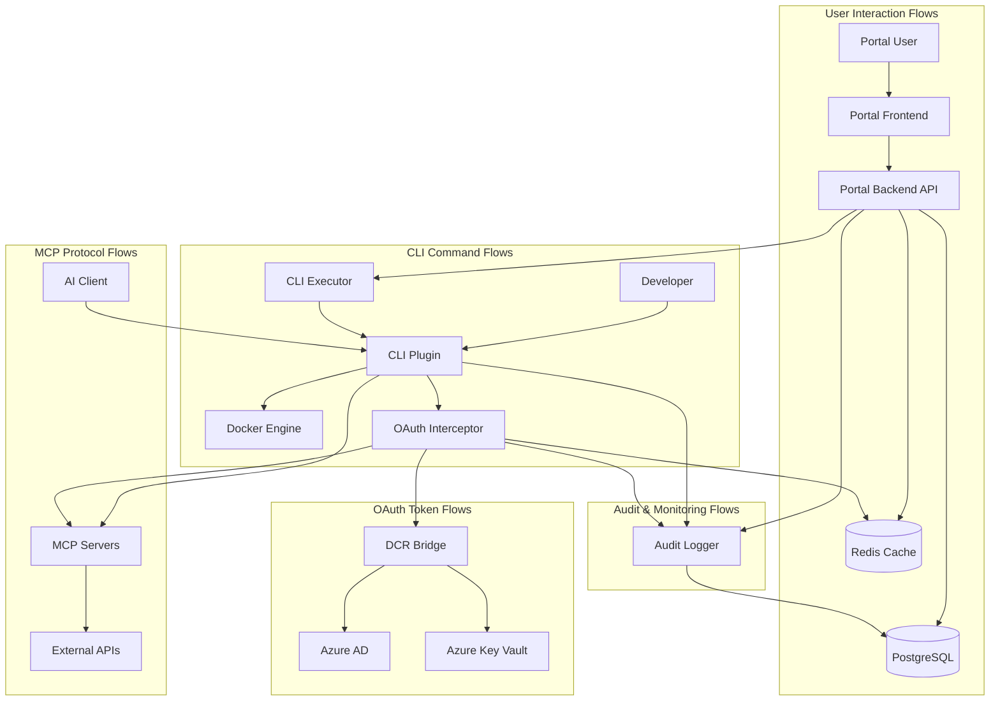
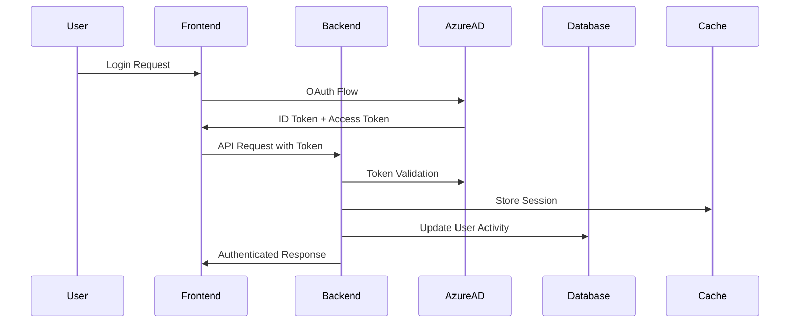
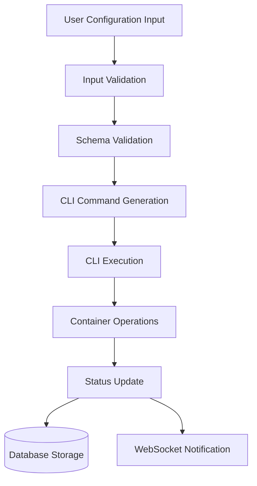
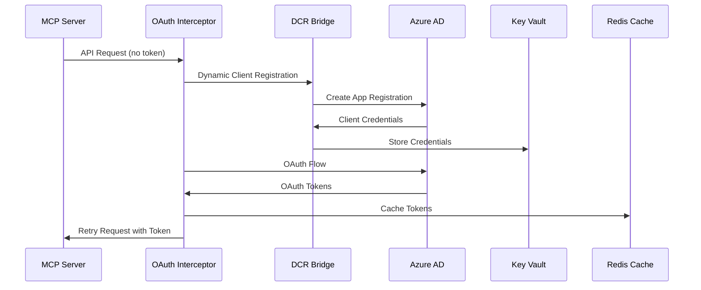
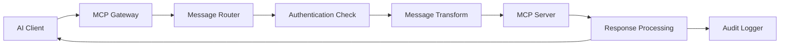
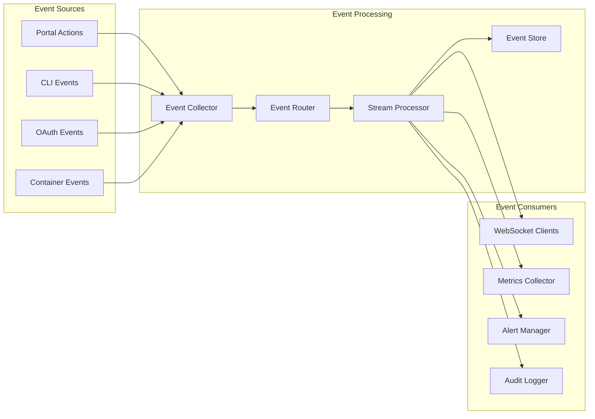

# Data Flow Architecture

**MCP Gateway & Portal Data Flow and Processing Architecture**

## Overview

The MCP Gateway & Portal system processes multiple types of data flows, from user interactions and CLI commands to OAuth token management and MCP protocol messages. This document outlines the data architecture, flow patterns, and processing pipelines.

## Data Flow Patterns

### Primary Data Flows



## Data Types and Processing

### User Data Processing

**Data Types**:

- User profiles and authentication tokens
- User preferences and configuration settings
- Session data and activity tracking
- Role-based access control information

**Processing Pipeline**:



**Data Transformations**:

- Azure AD tokens → Internal user context
- User preferences → Database-normalized configuration
- Session state → Redis cache entries with TTL
- Activity events → Structured audit log entries

### MCP Server Configuration Data

**Data Types**:

- Server metadata (name, image, version)
- Container configuration (ports, volumes, environment)
- User-specific settings and customizations
- Server status and health information

**Processing Pipeline**:



**Data Transformations**:

- Web form input → Validated configuration object
- Configuration object → CLI command parameters
- CLI output → Structured status information
- Container events → Real-time status updates

### OAuth Credential Management

**Data Types**:

- OAuth tokens (access, refresh, ID tokens)
- Client credentials (client ID, secret)
- Provider configurations and metadata
- Token expiration and refresh schedules

**Processing Pipeline**:



**Data Transformations**:

- DCR request → Azure AD app registration
- OAuth response → Encrypted token storage
- Token metadata → Cache entries with expiration
- Refresh events → Updated credentials in Key Vault

### MCP Protocol Message Processing

**Data Types**:

- MCP protocol messages (JSON-RPC format)
- Tool invocation requests and responses
- Resource access requests and metadata
- Real-time communication streams

**Processing Pipeline**:



**Data Transformations**:

- AI client requests → MCP protocol messages
- Authentication headers → OAuth token injection
- Server responses → Structured result objects
- Message metadata → Audit log entries

## Data Storage Architecture

### PostgreSQL Database Design

**Primary Tables**:

```sql
-- Core entity relationships
organizations (1) ─── (n) users
users (1) ─── (n) mcp_servers
users (1) ─── (n) oauth_credentials
organizations (1) ─── (n) audit_logs

-- Configuration and session data
users (1) ─── (n) user_sessions
organizations (1) ─── (n) configurations
mcp_servers (1) ─── (n) server_configurations
```

**Data Partitioning Strategy**:

- **Horizontal Partitioning**: Audit logs partitioned by month
- **Organizational Isolation**: Row-Level Security for multi-tenancy
- **Read Replicas**: Separate read replicas for analytics queries
- **Archive Strategy**: Cold storage for audit logs >1 year

### Redis Cache Architecture

**Cache Patterns**:

```yaml
Session Data:
  pattern: "session:{user_id}"
  ttl: 24_hours
  size: ~1KB per session

OAuth Tokens:
  pattern: "oauth:{provider}:{server_id}"
  ttl: token_expiry - 300s # 5min buffer
  size: ~2KB per token_set

API Response Cache:
  pattern: "api:{endpoint}:{params_hash}"
  ttl: 60s - 3600s # based on endpoint
  size: varies

Real-time Events:
  pattern: "events:{user_id}"
  ttl: 300s
  size: ~500B per event
```

**Performance Characteristics**:

- **Hit Ratio Target**: >95% for session data, >90% for OAuth tokens
- **Latency**: <1ms for cache operations
- **Memory Usage**: ~100MB for 1000 concurrent users
- **Persistence**: AOF persistence for session data

### Azure Key Vault Integration

**Secret Organization**:

```yaml
OAuth Credentials:
  pattern: "oauth-{provider}-{server_id}"
  encryption: AES-256-GCM
  rotation: 90_days
  access_policy: DCR_Bridge_only

System Secrets:
  pattern: "system-{component}-{secret_type}"
  encryption: Hardware_HSM
  rotation: 365_days
  access_policy: Component_specific

Database Credentials:
  pattern: "db-{environment}-{role}"
  encryption: Hardware_HSM
  rotation: 30_days
  access_policy: Infrastructure_only
```

## Data Processing Pipelines

### Real-time Event Processing

**Event Sources**:

- User actions in portal interface
- CLI command executions and results
- Container lifecycle events
- OAuth token operations and failures
- MCP server health status changes

**Processing Architecture**:



### Batch Processing Workflows

**Daily Batch Jobs**:

- Usage metrics aggregation and reporting
- OAuth token expiration monitoring and alerts
- Audit log analysis and compliance reporting
- Performance metrics collection and analysis
- Database maintenance and optimization

**Weekly Batch Jobs**:

- Security posture assessment and reporting
- Capacity planning analysis
- User engagement metrics
- Cost optimization recommendations

**Monthly Batch Jobs**:

- Compliance audit report generation
- Data retention policy enforcement
- Performance trend analysis
- Security vulnerability assessment

## Data Security and Privacy

### Encryption at Rest

**Database Encryption**:

- PostgreSQL Transparent Data Encryption (TDE)
- Column-level encryption for sensitive fields
- Backup encryption with separate key management
- Point-in-time recovery with encrypted WAL files

**Cache Encryption**:

- Redis AUTH with strong passwords
- TLS encryption for Redis connections
- Memory encryption where supported
- Secure key exchange for cache access

**File System Encryption**:

- Full disk encryption on all storage volumes
- Container image signing and verification
- Log file encryption with rotation
- Temporary file secure deletion

### Encryption in Transit

**External Communications**:

- TLS 1.3 for all HTTPS communications
- Certificate pinning for critical connections
- Perfect Forward Secrecy (PFS) support
- Strong cipher suite selection

**Internal Communications**:

- mTLS for service-to-service communication
- Encrypted service mesh where applicable
- Secure container networking
- Database connection encryption

### Data Privacy and Compliance

**Personal Data Handling**:

- GDPR-compliant data collection and processing
- User consent management for optional data
- Data subject rights implementation (access, deletion)
- Privacy by design principles

**Data Retention Policies**:

```yaml
User Data:
  active_users: indefinite (while account active)
  inactive_users: 2_years_after_last_login
  deleted_accounts: 30_days_grace_period

Audit Logs:
  security_events: 7_years
  access_logs: 1_year
  performance_logs: 90_days

OAuth Tokens:
  access_tokens: token_expiry + 7_days
  refresh_tokens: 90_days_max
  expired_tokens: immediate_deletion

Session Data:
  active_sessions: session_expiry
  expired_sessions: immediate_deletion
```

## Performance Optimization

### Query Optimization

**Database Query Patterns**:

- Prepared statements for all parameterized queries
- Connection pooling with optimal pool sizing
- Query result caching for expensive operations
- Read/write splitting for scalability

**Index Strategy**:

```sql
-- Performance-critical indexes
CREATE INDEX CONCURRENTLY idx_users_org_role ON users(organization_id, role);
CREATE INDEX CONCURRENTLY idx_servers_user_enabled ON mcp_servers(user_id, enabled);
CREATE INDEX CONCURRENTLY idx_oauth_creds_expiry ON oauth_credentials(expires_at) WHERE expires_at IS NOT NULL;
CREATE INDEX CONCURRENTLY idx_audit_logs_time_org ON audit_logs(created_at, organization_id);

-- Partial indexes for common queries
CREATE INDEX CONCURRENTLY idx_active_sessions ON user_sessions(user_id) WHERE expires_at > NOW();
CREATE INDEX CONCURRENTLY idx_enabled_servers ON mcp_servers(user_id) WHERE enabled = true;
```

### Caching Strategy

**Multi-Level Caching**:

1. **Application Cache**: In-memory caching for frequently accessed data
2. **Redis Cache**: Shared cache for session and temporary data
3. **Database Query Cache**: PostgreSQL query result caching
4. **CDN Cache**: Static asset and API response caching

**Cache Invalidation**:

- Event-driven cache invalidation for data consistency
- Time-based expiration for less critical data
- Cache warming for predictable access patterns
- Circuit breaker pattern for cache failures

### Monitoring and Observability

**Key Metrics**:

```yaml
Performance Metrics:
  - api_response_time_p95
  - database_query_duration
  - cache_hit_ratio
  - oauth_token_acquisition_time

Business Metrics:
  - active_users_daily
  - mcp_servers_deployed
  - oauth_flows_completed
  - cli_commands_executed

Security Metrics:
  - authentication_failures
  - authorization_violations
  - token_refresh_failures
  - suspicious_activity_events

System Metrics:
  - cpu_utilization
  - memory_usage
  - disk_io_wait
  - network_throughput
```

**Alerting Thresholds**:

- API response time P95 >500ms
- Database connection pool utilization >80%
- Cache hit ratio <90%
- OAuth failure rate >1%
- Authentication failure rate >5%

## Future Enhancements

### Streaming Architecture

**Event Streaming Platform**:

- Apache Kafka for high-volume event streaming
- Real-time analytics and machine learning pipelines
- Event sourcing for complete audit trails
- CQRS pattern for read/write optimization

### Advanced Analytics

**Data Lake Integration**:

- Export to cloud data lake for advanced analytics
- Machine learning models for usage prediction
- Anomaly detection for security events
- Predictive capacity planning

### Global Distribution

**Multi-Region Architecture**:

- Read replicas in multiple geographic regions
- Edge caching for global performance
- Data residency compliance
- Disaster recovery automation

---

**Document Type**: Data Flow Architecture
**Last Updated**: September 19, 2025
**Related Documents**: [Security Architecture](./security-architecture.md), [C4-02-Container](./C4-02-Container.md)
**Review Schedule**: Quarterly review with data architecture team
