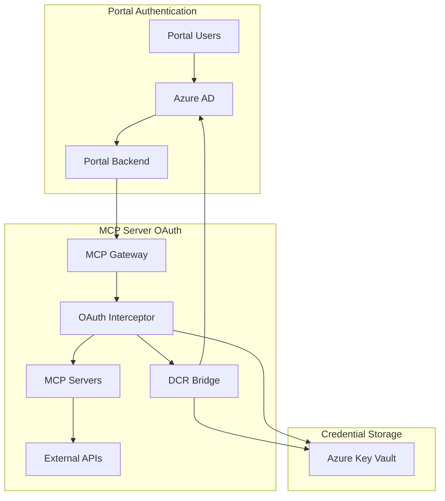

# ADR-002: Azure Active Directory OAuth Integration

**Status**: Accepted
**Date**: 2025-09-17
**Deciders**: Security Team, Architecture Team
**Technical Story**: Portal requires enterprise-grade authentication and MCP servers need OAuth credential management

## Context and Problem Statement

The MCP Portal needs to provide secure authentication for multiple users while also managing OAuth credentials for MCP servers that require authentication to third-party services (GitHub, Google, Microsoft, etc.).

We need to address two distinct but related authentication concerns:

1. **Portal User Authentication**: Who can access the portal and what can they do?
2. **MCP Server OAuth**: How do MCP servers authenticate to external APIs on behalf of users?

This creates a dual OAuth architecture requirement.

## Decision Drivers

- **Enterprise Integration**: Must integrate with existing corporate identity systems
- **Security Standards**: Compliance with SOC 2, GDPR, and corporate security policies
- **Scalability**: Support for multiple organizations and hundreds of users
- **Developer Experience**: Simple authentication flow for developers
- **OAuth Complexity**: Abstract OAuth complexity from MCP server developers
- **Credential Security**: Secure storage and management of OAuth credentials
- **Audit Requirements**: Complete audit trail for authentication and authorization events

## Considered Options

### Option A: Custom Authentication with Local OAuth

**Description**: Build custom authentication system with local OAuth provider for MCP servers.

**Pros**:

- Full control over authentication flows and policies
- No external dependencies for core functionality
- Custom features and integrations possible

**Cons**:

- Significant development and maintenance overhead
- Need to implement OAuth 2.0 specification correctly
- Security review and compliance certification required
- No integration with existing corporate identity systems
- Users need separate credentials for portal

### Option B: Auth0 with External OAuth Proxy

**Description**: Use Auth0 for portal authentication and separate service for MCP server OAuth.

**Pros**:

- Proven authentication platform with enterprise features
- Rich ecosystem and integrations
- Handles complex authentication flows

**Cons**:

- Additional vendor dependency and cost
- Limited customization for specific requirements
- Data residency and compliance concerns
- Complex integration with MCP server OAuth needs

### Option C: Azure AD with Integrated OAuth Management

**Description**: Use Azure AD for portal authentication and leverage Azure AD for MCP server OAuth via Dynamic Client Registration.

**Pros**:

- Single vendor for authentication needs
- Native integration with Microsoft ecosystem
- Enterprise-grade security and compliance
- Leverage existing corporate Azure AD tenants
- Unified audit logging and monitoring
- Dynamic Client Registration support

**Cons**:

- Vendor lock-in to Microsoft ecosystem
- Azure AD complexity for simple use cases
- Cost considerations for high-volume usage

## Decision Outcome

**Chosen Option**: Option C - Azure AD with Integrated OAuth Management

**Rationale**:

- Most enterprises already use Azure AD for identity management
- Native support for OAuth 2.0 and OpenID Connect standards
- Dynamic Client Registration capabilities enable seamless MCP server OAuth
- Unified security model and audit logging
- Mature platform with extensive security certifications
- Cost-effective for enterprise deployments

## Architecture Overview

### Dual OAuth Architecture



### Portal Authentication Flow

1. User accesses portal → redirected to Azure AD
2. Azure AD authenticates user → returns authorization code
3. Portal exchanges code for access token and ID token
4. Portal validates token and creates session
5. Subsequent requests use JWT bearer tokens

### MCP Server OAuth Flow

1. MCP server returns 401 → OAuth Interceptor activated
2. Interceptor checks for existing tokens → if none, initiates OAuth
3. DCR Bridge creates Azure AD app registration dynamically
4. OAuth flow completed → tokens stored in Key Vault
5. Interceptor retries original request with OAuth token

## Implementation Details

### Portal Authentication Configuration

```go
type AzureADConfig struct {
    TenantID     string `env:"AZURE_TENANT_ID" required:"true"`
    ClientID     string `env:"AZURE_CLIENT_ID" required:"true"`
    ClientSecret string `env:"AZURE_CLIENT_SECRET" required:"true"`
    RedirectURL  string `env:"AZURE_REDIRECT_URL" required:"true"`
    Scopes       []string // ["openid", "profile", "email"]
}
```

### JWT Token Validation

- **Algorithm**: RS256 with Azure AD public keys
- **Claims Validation**: `iss`, `aud`, `exp`, `nbf`, `iat`
- **User Context**: Extract user ID, email, roles from token claims
- **Session Management**: Server-side sessions with Redis storage

### MCP Server OAuth Integration

```go
type OAuthProvider struct {
    Name         string            `json:"name"`
    AuthURL      string            `json:"auth_url"`
    TokenURL     string            `json:"token_url"`
    Scopes       []string          `json:"scopes"`
    ClientConfig *ClientConfig     `json:"client_config"`
}

type ClientConfig struct {
    ClientID     string `json:"client_id"`
    ClientSecret string `json:"client_secret,omitempty"`
    RedirectURL  string `json:"redirect_url"`
}
```

### Dynamic Client Registration (DCR) Bridge

- **RFC 7591 Compliance**: Standard DCR request/response format
- **Azure AD Translation**: Convert DCR requests to Graph API calls
- **Automatic Registration**: Create Azure AD app registrations on-demand
- **Credential Management**: Generate and store client credentials securely

## Security Implementation

### Portal Security Features

- **Multi-Factor Authentication**: Enforced via Azure AD policies
- **Conditional Access**: Location, device, and risk-based policies
- **Session Management**: Secure session cookies with HTTP-only and SameSite flags
- **CSRF Protection**: Anti-CSRF tokens for state-changing operations
- **Rate Limiting**: Request throttling to prevent abuse

### OAuth Security Features

- **PKCE Implementation**: Proof Key for Code Exchange for all OAuth flows
- **State Parameter**: Cryptographically secure state validation
- **Token Encryption**: AES-256-GCM encryption for stored tokens
- **Credential Rotation**: Automatic token refresh and credential rotation
- **Audit Logging**: Complete audit trail for all OAuth operations

### Key Vault Integration

```go
type KeyVaultClient struct {
    client   *keyvault.Client
    vaultURL string
}

func (kv *KeyVaultClient) StoreOAuthCredentials(ctx context.Context,
    serverID string, provider string, creds *OAuthCredentials) error {
    secretName := fmt.Sprintf("oauth-%s-%s", provider, serverID)
    encryptedCreds, err := encrypt(creds)
    if err != nil {
        return fmt.Errorf("encryption failed: %w", err)
    }

    return kv.client.SetSecret(ctx, secretName, encryptedCreds, nil)
}
```

## Integration Patterns

### Frontend Integration (MSAL.js)

```typescript
const msalConfig = {
  auth: {
    clientId: process.env.NEXT_PUBLIC_AZURE_CLIENT_ID,
    authority: `https://login.microsoftonline.com/${process.env.NEXT_PUBLIC_AZURE_TENANT_ID}`,
    redirectUri: process.env.NEXT_PUBLIC_AZURE_REDIRECT_URI,
  },
  cache: {
    cacheLocation: "sessionStorage",
    storeAuthStateInCookie: false,
  },
};

const msalInstance = new PublicClientApplication(msalConfig);
```

### Backend Token Validation

```go
func (auth *AuthHandler) ValidateToken(tokenString string) (*UserClaims, error) {
    // 1. Parse JWT token
    token, err := jwt.Parse(tokenString, auth.getAzureADKey)
    if err != nil {
        return nil, fmt.Errorf("token parsing failed: %w", err)
    }

    // 2. Validate claims
    claims := token.Claims.(jwt.MapClaims)
    if !auth.validateClaims(claims) {
        return nil, errors.New("invalid token claims")
    }

    // 3. Extract user context
    return auth.extractUserClaims(claims), nil
}
```

## Operational Considerations

### Monitoring and Alerting

- **Authentication Failures**: Alert on repeated failed authentication attempts
- **Token Expiration**: Monitor and alert on token refresh failures
- **OAuth Flow Failures**: Track and alert on MCP server OAuth failures
- **Performance Metrics**: Monitor authentication latency and throughput

### Backup and Recovery

- **Key Vault Backup**: Automated backup of OAuth credentials
- **Configuration Backup**: Azure AD app registration configuration
- **Disaster Recovery**: Cross-region replication for critical authentication data

### Compliance and Audit

- **Audit Logging**: All authentication events logged to PostgreSQL
- **Compliance Reports**: Regular reports for SOC 2 and GDPR compliance
- **Data Retention**: Configurable retention policies for audit logs
- **Export Capabilities**: Data export for compliance and legal requirements

## Positive Consequences

- **Enterprise Integration**: Seamless integration with existing Azure AD tenants
- **Security Posture**: Leverage Microsoft's security expertise and certifications
- **Developer Experience**: Simple authentication flow with familiar Microsoft tools
- **Unified Management**: Single pane of glass for authentication and OAuth management
- **Compliance**: Built-in compliance with enterprise security standards
- **Scalability**: Azure AD scales to millions of users and applications

## Negative Consequences

- **Vendor Lock-in**: Strong dependency on Microsoft Azure ecosystem
- **Complexity**: Azure AD configuration can be complex for simple deployments
- **Cost**: Azure AD premium features may require additional licensing
- **Learning Curve**: Team needs to understand Azure AD concepts and configuration

## Mitigation Strategies

### Vendor Lock-in Mitigation

- Abstract authentication behind interfaces for future provider changes
- Document migration procedures to other OAuth providers
- Implement feature flags to enable/disable Azure AD specific features

### Complexity Mitigation

- Provide automated setup scripts for common Azure AD configurations
- Create comprehensive documentation and troubleshooting guides
- Implement health checks and diagnostics for authentication flows

### Cost Optimization

- Use Azure AD free tier for development and small deployments
- Implement efficient token caching to minimize API calls
- Monitor usage and optimize for cost-effective licensing

## Validation Criteria

### Functional Validation

- [ ] Users can authenticate via Azure AD with MFA
- [ ] JWT tokens properly validated and user context extracted
- [ ] MCP servers can obtain OAuth tokens automatically
- [ ] Dynamic Client Registration creates Azure AD apps correctly
- [ ] OAuth token refresh works automatically

### Security Validation

- [ ] Penetration testing confirms secure authentication flows
- [ ] OAuth flows implement PKCE and state validation correctly
- [ ] Stored credentials encrypted with AES-256-GCM
- [ ] Audit logging captures all authentication events
- [ ] Rate limiting prevents authentication abuse

### Performance Validation

- [ ] Authentication latency <500ms for 95th percentile
- [ ] OAuth token operations complete <200ms
- [ ] System supports 1000+ concurrent authenticated users
- [ ] Token refresh operations don't impact user experience

## Future Enhancements

### Phase 2 Features

- **Custom Scopes**: Define custom OAuth scopes for organization-specific APIs
- **Token Binding**: Bind OAuth tokens to specific devices or sessions
- **Advanced Policies**: Custom authentication policies beyond Azure AD defaults

### Phase 3 Features

- **Multi-Provider Support**: Support for additional OAuth providers beyond Azure AD
- **Federated Identity**: Support for SAML and other identity federation protocols
- **API Authentication**: M2M authentication for programmatic access

## Related Decisions

- **ADR-001**: CLI wrapper pattern affects OAuth credential access patterns
- **ADR-003**: DCR bridge design implements Azure AD app registration automation
- **ADR-004**: Database RLS uses Azure AD user identity for row-level security

## References

- [Azure AD Documentation](https://docs.microsoft.com/en-us/azure/active-directory/)
- [OAuth 2.0 RFC 6749](https://tools.ietf.org/html/rfc6749)
- [Dynamic Client Registration RFC 7591](https://tools.ietf.org/html/rfc7591)
- [MSAL.js Documentation](https://docs.microsoft.com/en-us/azure/active-directory/develop/msal-js-initializing-client-applications)

---

**ADR**: Architecture Decision Record
**Last Updated**: September 19, 2025
**Next Review**: December 2025 (quarterly review)
**Status**: Implemented - Portal authentication complete, MCP OAuth 80% complete
