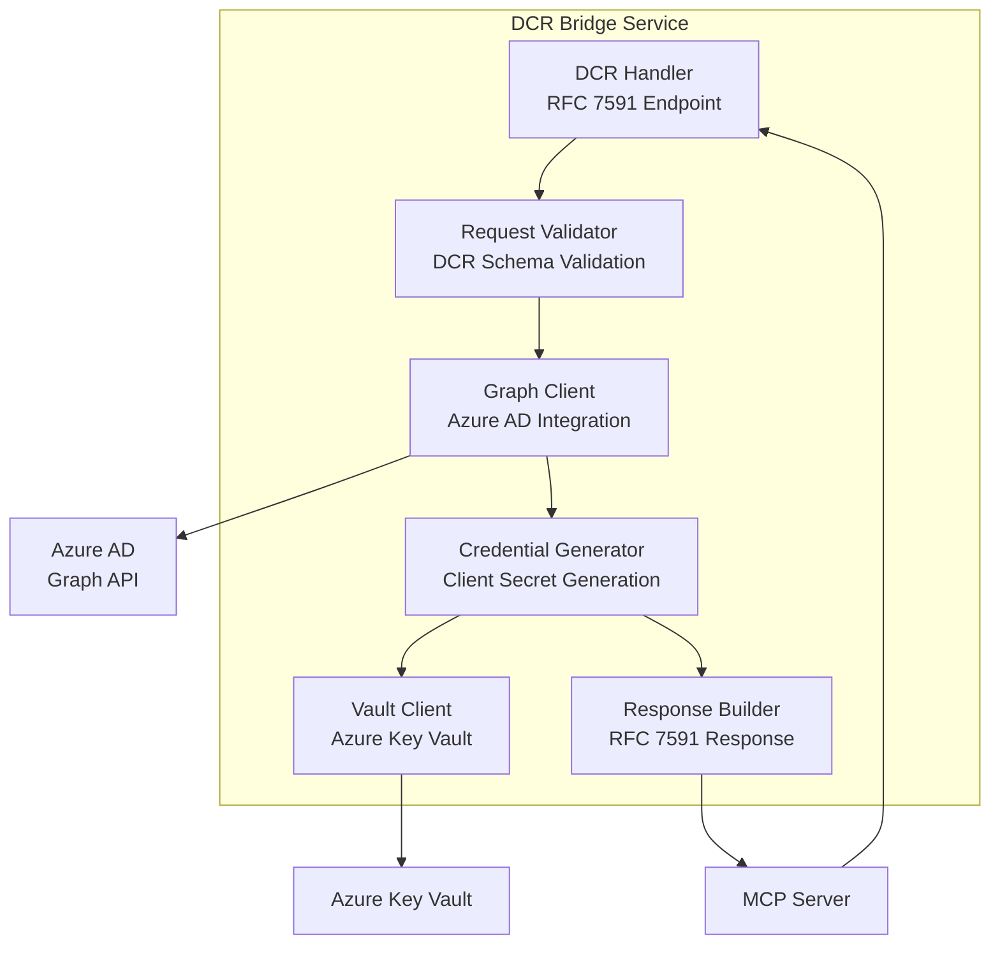

# ADR-003: Dynamic Client Registration (DCR) Bridge Design

**Status**: Accepted
**Date**: 2025-09-18
**Deciders**: Security Team, Architecture Team
**Technical Story**: MCP servers need automatic OAuth client registration without manual Azure AD configuration

## Context and Problem Statement

MCP servers often require OAuth authentication to third-party services (GitHub, Google, Microsoft APIs). Traditional OAuth flows require pre-registered client applications with known client IDs and secrets. However, MCP servers in our ecosystem are:

1. **Dynamically deployed**: New servers can be added at runtime
2. **Third-party developed**: We don't control their OAuth registration process
3. **Diverse**: Each server may need different OAuth scopes and providers
4. **Secure**: Should not require manual credential sharing or management

The OAuth 2.0 Dynamic Client Registration (DCR) specification (RFC 7591) provides a standard way for applications to register themselves with OAuth providers programmatically. However, Azure AD doesn't implement RFC 7591 directly - it uses Microsoft Graph API for app registration.

We need a bridge service that translates DCR requests into Azure AD app registrations.

## Decision Drivers

- **Automation**: Zero manual configuration for MCP server OAuth setup
- **Security**: Avoid sharing long-lived credentials or manual registration
- **Standards Compliance**: Support RFC 7591 DCR specification
- **Azure Integration**: Work with Azure AD's Graph API registration model
- **Scalability**: Handle hundreds of MCP servers with different OAuth needs
- **Developer Experience**: Simple OAuth setup for MCP server developers
- **Credential Management**: Secure storage and rotation of generated credentials

## Considered Options

### Option A: Manual App Registration

**Description**: Require manual Azure AD app registration for each MCP server.

**Pros**:

- Simple implementation - no additional services needed
- Full control over app registration configuration
- Azure AD native experience for administrators

**Cons**:

- Manual process doesn't scale beyond a few servers
- Poor developer experience for MCP server authors
- Requires Azure AD knowledge for every MCP server deployment
- No standardization across different OAuth providers
- Credential distribution and management complexity

### Option B: Shared Client Credentials

**Description**: Use a single Azure AD app registration for all MCP servers with shared credentials.

**Pros**:

- Simple deployment with single set of credentials
- No additional services required
- Minimal Azure AD app registrations

**Cons**:

- Security risk - credential compromise affects all servers
- No granular permission control per server
- Difficult to revoke access for specific servers
- Audit trail complications - can't distinguish server activities
- Doesn't support server-specific scopes or redirect URLs

### Option C: DCR Bridge Service

**Description**: Implement RFC 7591 DCR bridge that translates to Azure AD Graph API calls.

**Pros**:

- Standards-compliant OAuth 2.0 DCR implementation
- Automatic registration with zero manual configuration
- Server-specific credentials and permissions
- Secure credential generation and storage
- Extensible to other OAuth providers in future

**Cons**:

- Additional service complexity and maintenance
- Custom implementation of RFC 7591 specification
- Azure AD Graph API integration complexity
- Credential storage and rotation requirements

## Decision Outcome

**Chosen Option**: Option C - DCR Bridge Service

**Rationale**:

- Provides the best developer experience for MCP server authors
- Scales to hundreds of servers without manual intervention
- Maintains security isolation between servers
- Follows OAuth 2.0 standards for future compatibility
- Enables granular permission control and audit trails

## Architecture Design

### DCR Bridge Service Components



### RFC 7591 Request/Response Flow

**DCR Request Example**:

```json
POST /oauth/register
Content-Type: application/json

{
  "client_name": "GitHub MCP Server",
  "redirect_uris": ["http://localhost:8080/oauth/callback"],
  "scope": "repo read:user",
  "grant_types": ["authorization_code", "refresh_token"],
  "response_types": ["code"],
  "application_type": "web",
  "contacts": ["admin@example.com"],
  "logo_uri": "https://example.com/logo.png"
}
```

**DCR Response Example**:

```json
{
  "client_id": "550e8400-e29b-41d4-a716-446655440000",
  "client_secret": "ZJYCqe3GGRvdrudKyZS0XhGv_Z45DuKhCUk0gBR1vZk",
  "client_id_issued_at": 1571865200,
  "client_secret_expires_at": 1579641200,
  "redirect_uris": ["http://localhost:8080/oauth/callback"],
  "grant_types": ["authorization_code", "refresh_token"],
  "response_types": ["code"],
  "scope": "repo read:user"
}
```

## Implementation Details

### DCR Request Validation

```go
type DCRRequest struct {
    ClientName        string   `json:"client_name" validate:"required,max=100"`
    RedirectURIs      []string `json:"redirect_uris" validate:"required,dive,url"`
    Scope             string   `json:"scope" validate:"required"`
    GrantTypes        []string `json:"grant_types" validate:"required,dive,oneof=authorization_code refresh_token"`
    ResponseTypes     []string `json:"response_types" validate:"required,dive,oneof=code"`
    ApplicationType   string   `json:"application_type" validate:"oneof=web native"`
    Contacts          []string `json:"contacts,omitempty" validate:"dive,email"`
    LogoURI           string   `json:"logo_uri,omitempty" validate:"omitempty,url"`
    PolicyURI         string   `json:"policy_uri,omitempty" validate:"omitempty,url"`
    TermsOfServiceURI string   `json:"tos_uri,omitempty" validate:"omitempty,url"`
}
```

### Azure AD App Registration Mapping

```go
func (dcr *DCRBridge) createAzureADApp(ctx context.Context, req *DCRRequest) (*graphmodels.Application, error) {
    app := &graphmodels.Application{
        DisplayName: &req.ClientName,
        Web: &graphmodels.WebApplication{
            RedirectUris: req.RedirectURIs,
        },
        RequiredResourceAccess: dcr.mapScopesToResourceAccess(req.Scope),
        SignInAudience: ptr.String("AzureADMyOrg"),
    }

    // Create application in Azure AD
    result, err := dcr.graphClient.Applications().Post(ctx, app, nil)
    if err != nil {
        return nil, fmt.Errorf("Azure AD app creation failed: %w", err)
    }

    // Generate and add client secret
    credential := &graphmodels.PasswordCredential{
        DisplayName: ptr.String("DCR Generated Secret"),
        EndDateTime: ptr.Time(time.Now().AddDate(1, 0, 0)), // 1 year expiry
    }

    secret, err := dcr.graphClient.Applications().
        ByApplicationId(*result.GetId()).
        AddPassword().Post(ctx, credential, nil)
    if err != nil {
        return nil, fmt.Errorf("secret generation failed: %w", err)
    }

    // Store secret in Key Vault
    err = dcr.storeClientSecret(*result.GetAppId(), *secret.GetSecretText())
    if err != nil {
        return nil, fmt.Errorf("secret storage failed: %w", err)
    }

    return result, nil
}
```

### Credential Storage and Rotation

```go
type ClientCredentials struct {
    ClientID     string    `json:"client_id"`
    ClientSecret string    `json:"client_secret"`
    CreatedAt    time.Time `json:"created_at"`
    ExpiresAt    time.Time `json:"expires_at"`
    Scopes       []string  `json:"scopes"`
    RedirectURIs []string  `json:"redirect_uris"`
}

func (dcr *DCRBridge) storeClientSecret(clientID, secret string) error {
    creds := &ClientCredentials{
        ClientID:     clientID,
        ClientSecret: secret,
        CreatedAt:    time.Now(),
        ExpiresAt:    time.Now().AddDate(1, 0, 0), // 1 year
    }

    // Encrypt credentials before storage
    encrypted, err := dcr.encrypt(creds)
    if err != nil {
        return fmt.Errorf("encryption failed: %w", err)
    }

    // Store in Azure Key Vault
    secretName := fmt.Sprintf("dcr-client-%s", clientID)
    return dcr.vaultClient.SetSecret(context.Background(), secretName, string(encrypted), nil)
}
```

### Scope Mapping to Azure AD Resources

```go
func (dcr *DCRBridge) mapScopesToResourceAccess(scopes string) []graphmodels.RequiredResourceAccess {
    scopeList := strings.Split(scopes, " ")
    resourceMap := make(map[string][]string)

    for _, scope := range scopeList {
        switch {
        case strings.HasPrefix(scope, "https://graph.microsoft.com/"):
            resourceMap["00000003-0000-0000-c000-000000000000"] = append(
                resourceMap["00000003-0000-0000-c000-000000000000"], scope)
        case scope == "openid" || scope == "profile" || scope == "email":
            // OpenID Connect scopes - handled automatically by Azure AD
            continue
        default:
            // Custom application scopes
            resourceMap[dcr.appResourceID] = append(resourceMap[dcr.appResourceID], scope)
        }
    }

    // Convert to Azure AD RequiredResourceAccess format
    var resources []graphmodels.RequiredResourceAccess
    for resourceID, scopes := range resourceMap {
        resource := graphmodels.RequiredResourceAccess{
            ResourceAppId: &resourceID,
            ResourceAccess: dcr.buildResourceAccess(scopes),
        }
        resources = append(resources, resource)
    }

    return resources
}
```

## Security Considerations

### Authentication and Authorization

- **DCR Endpoint Security**: Require authentication for DCR requests
- **Rate Limiting**: Prevent abuse of app registration endpoint
- **Scope Validation**: Validate requested scopes against allowed list
- **Client Validation**: Verify MCP server identity before registration

### Credential Security

- **Secret Generation**: Cryptographically secure random generation
- **Encryption at Rest**: AES-256-GCM encryption for stored credentials
- **Secret Rotation**: Automatic rotation before expiration
- **Access Control**: Principle of least privilege for Graph API permissions

### Audit and Monitoring

- **Registration Audit**: Log all DCR registration requests and outcomes
- **Secret Access Audit**: Log credential retrieval and usage
- **Anomaly Detection**: Monitor for unusual registration patterns
- **Compliance Reporting**: Regular reports on app registrations and access

## Operational Procedures

### Deployment Configuration

```yaml
dcr_bridge:
  azure_ad:
    tenant_id: "${AZURE_TENANT_ID}"
    client_id: "${DCR_BRIDGE_CLIENT_ID}"
    client_secret: "${DCR_BRIDGE_CLIENT_SECRET}"
    graph_api_scope: "https://graph.microsoft.com/.default"

  key_vault:
    vault_url: "${AZURE_KEY_VAULT_URL}"

  server:
    port: 8080
    tls_enabled: true
    cors_origins: ["https://portal.example.com"]

  security:
    rate_limit: "10/minute"
    max_apps_per_client: 50
    secret_expiry_days: 365
```

### Monitoring and Alerting

```yaml
alerts:
  - name: DCR Registration Failures
    condition: error_rate > 5%
    action: notify_security_team

  - name: High Registration Volume
    condition: registrations > 100/hour
    action: investigate_potential_abuse

  - name: Secret Expiration Warning
    condition: expires_in < 30_days
    action: trigger_rotation_process

  - name: Azure AD API Failures
    condition: graph_api_errors > 1%
    action: check_service_health
```

### Backup and Recovery

- **App Registration Backup**: Daily export of all DCR-created app registrations
- **Credential Backup**: Encrypted backup of Key Vault contents
- **Configuration Backup**: DCR bridge configuration and allowed scopes
- **Recovery Procedures**: Documented process for service restoration

## Performance Characteristics

### Throughput and Latency

- **Registration Latency**: <5 seconds for Azure AD app creation
- **Concurrent Registrations**: 50+ simultaneous DCR requests
- **Cache Performance**: 95% cache hit rate for repeated credential requests
- **Graph API Efficiency**: Batch operations where possible

### Resource Requirements

- **Memory Usage**: <256MB for typical workloads
- **CPU Usage**: <10% during normal operations
- **Storage**: Minimal - credentials stored in Key Vault
- **Network**: <1MB/s bandwidth for typical usage

## Positive Consequences

- **Zero Configuration**: MCP servers can register automatically without manual setup
- **Standards Compliance**: RFC 7591 DCR support enables interoperability
- **Security Isolation**: Each server gets unique credentials and permissions
- **Scalability**: Supports hundreds of MCP servers with automatic registration
- **Audit Trail**: Complete visibility into server registrations and access
- **Future Flexibility**: Bridge pattern allows support for other OAuth providers

## Negative Consequences

- **Service Complexity**: Additional service to deploy, monitor, and maintain
- **Azure AD Dependency**: Strong coupling to Azure AD's Graph API
- **Custom Implementation**: RFC 7591 bridge requires careful specification compliance
- **Credential Lifecycle**: Need to manage credential rotation and expiration
- **Security Attack Surface**: DCR endpoint could be target for abuse

## Mitigation Strategies

### Service Reliability

- **Health Checks**: Comprehensive health monitoring for all dependencies
- **Graceful Degradation**: Fallback to manual registration if DCR unavailable
- **Circuit Breakers**: Protect against Azure AD API failures
- **Retry Logic**: Robust retry for transient failures

### Security Hardening

- **Input Validation**: Strict validation of all DCR request parameters
- **Rate Limiting**: Prevent abuse and DoS attacks on registration endpoint
- **Authentication**: Strong authentication requirements for DCR access
- **Monitoring**: Real-time monitoring for security anomalies

### Operational Excellence

- **Documentation**: Comprehensive operational runbooks and troubleshooting guides
- **Testing**: Automated testing of DCR flows and Azure AD integration
- **Monitoring**: Detailed metrics and alerting for all operations
- **Training**: Team training on DCR concepts and troubleshooting

## Future Enhancements

### Phase 2 Features

- **Multi-Provider Support**: Extend bridge to support Google, GitHub native DCR
- **Advanced Scope Mapping**: More sophisticated scope translation and validation
- **Client Management**: Web UI for managing registered clients
- **Bulk Operations**: Support for bulk client registration and management

### Phase 3 Features

- **Federation**: Support for federated client registration across organizations
- **Policy Engine**: Advanced policy engine for registration approval workflows
- **Analytics**: Usage analytics and insights for registered applications
- **Self-Service**: Developer portal for self-service client management

## Validation Criteria

### Functional Validation

- [ ] RFC 7591 DCR requests processed correctly
- [ ] Azure AD app registrations created with proper configuration
- [ ] Client credentials generated and stored securely
- [ ] OAuth flows work end-to-end with registered clients
- [ ] Error handling provides clear feedback to MCP servers

### Security Validation

- [ ] Penetration testing confirms secure DCR endpoint
- [ ] Credential generation uses cryptographically secure methods
- [ ] Stored credentials encrypted with AES-256-GCM
- [ ] Access controls prevent unauthorized registrations
- [ ] Audit logging captures all security-relevant events

### Performance Validation

- [ ] DCR registration completes within 5 seconds
- [ ] Service handles 50+ concurrent registrations
- [ ] Azure AD API calls optimized with batching where possible
- [ ] Memory usage remains under 256MB during normal operations

## Related Decisions

- **ADR-001**: CLI wrapper pattern affects how MCP servers access DCR bridge
- **ADR-002**: Azure AD OAuth integration provides foundation for DCR implementation
- **ADR-004**: Database RLS stores DCR audit logs with proper access controls

## References

- [RFC 7591 - Dynamic Client Registration](https://tools.ietf.org/html/rfc7591)
- [Microsoft Graph API Applications](https://docs.microsoft.com/en-us/graph/api/resources/application)
- [Azure Key Vault Secrets](https://docs.microsoft.com/en-us/azure/key-vault/secrets/)
- [OAuth 2.0 Security Best Practices](https://tools.ietf.org/html/draft-ietf-oauth-security-topics)

---

**ADR**: Architecture Decision Record
**Last Updated**: September 19, 2025
**Next Review**: December 2025 (quarterly review)
**Status**: Implemented - DCR bridge service operational with Azure AD integration
