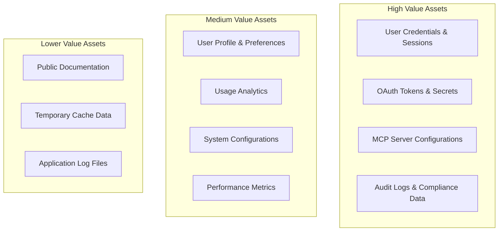
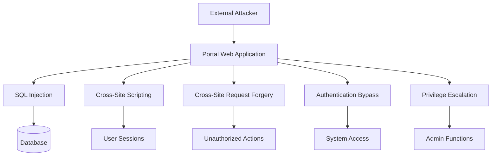
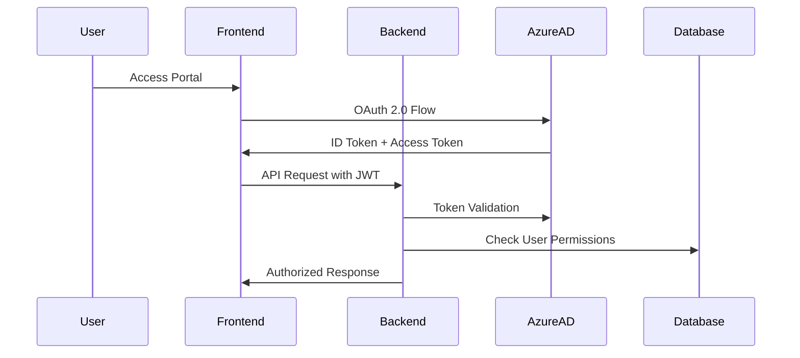
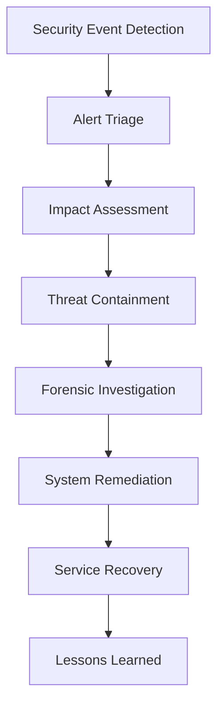

# Security Architecture

**MCP Gateway & Portal Security Model and Threat Analysis**

## Security Overview

The MCP Gateway & Portal implements a defense-in-depth security model with multiple layers of protection, from network security to application-level controls. This document outlines the comprehensive security architecture, threat model, and security controls.

## Security Principles

### Core Security Principles

**Zero Trust Architecture**:

- Never trust, always verify
- Least privilege access controls
- Continuous verification and monitoring
- Explicit access decisions for every request

**Defense in Depth**:

- Multiple independent security layers
- Fail-secure defaults and graceful degradation
- Comprehensive logging and monitoring
- Regular security assessments and updates

**Security by Design**:

- Security considerations in all design decisions
- Threat modeling for new features
- Secure coding practices and reviews
- Privacy by design principles

## Threat Model

### Assets and Protection Requirements



### Threat Actors and Motivations

**External Attackers**:

- **Script Kiddies**: Opportunistic attacks, automated scanning
- **Organized Crime**: Financial motivation, credential theft
- **Nation State**: Espionage, supply chain attacks
- **Competitors**: Intellectual property theft, service disruption

**Internal Threats**:

- **Malicious Insiders**: Privileged access abuse, data exfiltration
- **Compromised Accounts**: Legitimate accounts used maliciously
- **Negligent Users**: Accidental data exposure, weak passwords

**Supply Chain Threats**:

- **Compromised Dependencies**: Malicious code in third-party libraries
- **Container Images**: Vulnerable or malicious container images
- **Infrastructure Providers**: Cloud provider security incidents

### Attack Vectors and Scenarios

**Web Application Attacks**:



**OAuth and Authentication Attacks**:

- **Token Theft**: Stealing OAuth tokens for unauthorized API access
- **Session Hijacking**: Capturing and replaying user sessions
- **CSRF on OAuth**: Cross-site request forgery in OAuth flows
- **Authorization Code Interception**: Intercepting OAuth authorization codes
- **Refresh Token Abuse**: Long-term access via refresh token compromise

**Infrastructure Attacks**:

- **Container Escape**: Breaking out of container isolation
- **Privilege Escalation**: Gaining elevated system privileges
- **Lateral Movement**: Moving between compromised systems
- **Data Exfiltration**: Stealing sensitive data from databases
- **Denial of Service**: Disrupting service availability

## Security Architecture Layers

### Network Security Layer

**External Perimeter**:

```yaml
Load Balancer:
  - TLS termination with strong cipher suites
  - DDoS protection and rate limiting
  - Geographic access controls
  - WAF (Web Application Firewall) rules

Network Segmentation:
  - DMZ for public-facing services
  - Private subnets for backend services
  - Database subnet with restricted access
  - Management network isolation
```

**Internal Network Security**:

- Service mesh with mTLS encryption
- Network policies for container communication
- Firewall rules between service tiers
- Network monitoring and intrusion detection

### Application Security Layer

**Authentication Architecture**:



**Authorization Controls**:

```yaml
Role-Based Access Control (RBAC):
  roles:
    - user: Standard MCP server management
    - admin: Organization-wide administration
    - auditor: Read-only access to audit logs
    - system: Internal service operations

Permission Matrix:
  mcp_servers:
    - user: [create, read_own, update_own, delete_own]
    - admin: [create, read_all, update_all, delete_all]
    - auditor: [read_all]

  oauth_credentials:
    - user: [create_own, read_own, update_own, delete_own]
    - admin: [read_all, delete_all]
    - system: [create, read_all, update_all, delete_all]
```

**Input Validation and Sanitization**:

```go
type InputValidator struct {
    jsonSchema   *jsonschema.Schema
    htmlSanitizer *bluemonday.Policy
    sqlValidator  *sql.Validator
}

func (v *InputValidator) ValidateAPIRequest(req *APIRequest) error {
    // 1. JSON schema validation
    if err := v.jsonSchema.Validate(req.Body); err != nil {
        return fmt.Errorf("schema validation failed: %w", err)
    }

    // 2. HTML/XSS prevention
    for field, value := range req.StringFields {
        sanitized := v.htmlSanitizer.Sanitize(value)
        if sanitized != value {
            return fmt.Errorf("potential XSS in field %s", field)
        }
    }

    // 3. SQL injection prevention
    if err := v.sqlValidator.ValidateQuery(req.QueryParams); err != nil {
        return fmt.Errorf("potential SQL injection: %w", err)
    }

    return nil
}
```

### Data Security Layer

**Encryption at Rest**:

```yaml
Database Encryption:
  algorithm: AES-256-GCM
  key_management: Azure Key Vault
  scope: Full database encryption
  backup_encryption: Yes

Application Secrets:
  storage: Azure Key Vault
  encryption: Hardware HSM
  rotation: Automatic (90 days)
  access_control: Service-specific policies

OAuth Credentials:
  storage: Azure Key Vault + Database
  encryption: AES-256-GCM + HSM
  scope: Client secrets, refresh tokens
  expiration: Automatic cleanup
```

**Encryption in Transit**:

```yaml
External Communications:
  protocol: TLS 1.3
  cipher_suites:
    - TLS_AES_256_GCM_SHA384
    - TLS_CHACHA20_POLY1305_SHA256
  certificate_management: Azure Key Vault
  hsts: max-age=31536000; includeSubDomains

Internal Communications:
  service_mesh: Istio with mTLS
  database_connections: TLS required
  cache_connections: TLS + AUTH
  container_networking: Encrypted overlay
```

**Data Loss Prevention (DLP)**:

- Sensitive data classification and labeling
- Automated detection of credential leaks in logs
- Database activity monitoring and alerting
- Export controls and data residency compliance

### Infrastructure Security Layer

**Container Security**:

```yaml
Container Image Security:
  base_images: Distroless or minimal base images
  vulnerability_scanning: Trivy + Snyk integration
  image_signing: Docker Content Trust
  registry_security: Private registry with RBAC

Runtime Security:
  security_contexts: Non-root containers
  resource_limits: CPU and memory limits
  network_policies: Kubernetes NetworkPolicies
  pod_security_standards: Restricted profile

Secrets Management:
  kubernetes_secrets: External Secrets Operator
  secret_rotation: Automated via External Secrets
  secret_injection: Init containers or CSI driver
  audit_logging: All secret access logged
```

**Infrastructure as Code Security**:

```yaml
IaC Security:
  tools: [Checkov, tfsec, Terrascan]
  policies:
    - No public S3 buckets
    - Encryption required for all storage
    - Network security groups properly configured
    - IAM permissions follow least privilege

Compliance Scanning:
  cis_benchmarks: CIS Kubernetes Benchmark
  security_policies: Open Policy Agent (OPA)
  configuration_drift: Continuous monitoring
  remediation: Automated where possible
```

## Security Controls Implementation

### Authentication Security

**Multi-Factor Authentication (MFA)**:

```yaml
MFA Requirements:
  enforcement: Required for all users
  methods: [TOTP, SMS, Hardware keys]
  backup_codes: Available for account recovery
  conditional_access: Risk-based authentication

Azure AD Integration:
  protocols: [OAuth 2.0, OpenID Connect]
  token_validation: RS256 with key rotation
  session_management: Secure cookie handling
  single_sign_on: Enterprise SSO support
```

**Session Security**:

```go
type SessionConfig struct {
    CookieName     string        `default:"session_id"`
    Secure         bool          `default:"true"`
    HttpOnly       bool          `default:"true"`
    SameSite       http.SameSite `default:"SameSiteStrict"`
    MaxAge         time.Duration `default:"24h"`
    SessionTimeout time.Duration `default:"30m"`
    RefreshWindow  time.Duration `default:"5m"`
}

func (s *SessionManager) CreateSession(userID uuid.UUID) (*Session, error) {
    session := &Session{
        ID:        generateSecureID(),
        UserID:    userID,
        CreatedAt: time.Now(),
        ExpiresAt: time.Now().Add(s.config.MaxAge),
        CSRFToken: generateCSRFToken(),
    }

    // Store in Redis with automatic expiration
    if err := s.redis.SetEX(session.ID, session, s.config.MaxAge); err != nil {
        return nil, fmt.Errorf("session storage failed: %w", err)
    }

    return session, nil
}
```

### Authorization Security

**Row-Level Security (RLS)**:

```sql
-- Example RLS policies for multi-tenant security
CREATE POLICY mcp_servers_isolation ON mcp_servers
    FOR ALL
    TO portal_app
    USING (user_id = current_setting('app.current_user_id')::UUID);

CREATE POLICY audit_logs_organization_access ON audit_logs
    FOR SELECT
    TO portal_app
    USING (
        organization_id = current_setting('app.current_organization_id')::UUID
        AND current_setting('app.current_user_role') IN ('admin', 'auditor')
    );
```

**API Authorization**:

```go
func (h *Handler) RequirePermission(permission string) gin.HandlerFunc {
    return func(c *gin.Context) {
        user, exists := c.Get("user")
        if !exists {
            c.AbortWithStatusJSON(401, gin.H{"error": "authentication required"})
            return
        }

        userClaims := user.(*UserClaims)

        if !h.authz.HasPermission(userClaims, permission) {
            h.auditLogger.LogUnauthorizedAccess(c.Request.Context(), userClaims, permission)
            c.AbortWithStatusJSON(403, gin.H{"error": "insufficient permissions"})
            return
        }

        c.Next()
    }
}
```

### OAuth Security Implementation

**PKCE (Proof Key for Code Exchange)**:

```go
type PKCEChallenge struct {
    CodeVerifier  string `json:"code_verifier"`
    CodeChallenge string `json:"code_challenge"`
    Method        string `json:"code_challenge_method"`
}

func generatePKCEChallenge() (*PKCEChallenge, error) {
    // Generate cryptographically secure code verifier
    verifier := base64.URLEncoding.EncodeToString(generateRandomBytes(32))

    // Create SHA256 challenge
    hash := sha256.Sum256([]byte(verifier))
    challenge := base64.URLEncoding.EncodeToString(hash[:])

    return &PKCEChallenge{
        CodeVerifier:  verifier,
        CodeChallenge: challenge,
        Method:        "S256",
    }, nil
}
```

**State Parameter Validation**:

```go
func (o *OAuthHandler) GenerateState(serverID string) (string, error) {
    state := map[string]interface{}{
        "server_id": serverID,
        "nonce":     generateNonce(),
        "timestamp": time.Now().Unix(),
        "hmac":      "",
    }

    // Create HMAC for state integrity
    stateBytes, _ := json.Marshal(state)
    mac := hmac.New(sha256.New, o.stateSecret)
    mac.Write(stateBytes)
    state["hmac"] = base64.URLEncoding.EncodeToString(mac.Sum(nil))

    stateJSON, err := json.Marshal(state)
    if err != nil {
        return "", fmt.Errorf("state generation failed: %w", err)
    }

    return base64.URLEncoding.EncodeToString(stateJSON), nil
}
```

## Security Monitoring and Incident Response

### Security Monitoring

**Security Information and Event Management (SIEM)**:

```yaml
Log Sources:
  - Application logs (authentication, authorization)
  - Database audit logs (data access, modifications)
  - Network logs (traffic analysis, intrusion detection)
  - Container logs (runtime security events)
  - OAuth provider logs (token operations)

Correlation Rules:
  - Multiple failed authentication attempts
  - Unusual OAuth token usage patterns
  - Privilege escalation attempts
  - Data exfiltration indicators
  - Lateral movement detection

Alerting Thresholds:
  - >5 failed logins per user per 15 minutes
  - OAuth token usage from >3 IP addresses
  - Database queries returning >1000 rows
  - API requests >10x normal user patterns
```

**Real-time Security Monitoring**:

```go
type SecurityMonitor struct {
    eventChannel chan SecurityEvent
    ruleEngine   *RuleEngine
    alertManager *AlertManager
}

func (sm *SecurityMonitor) ProcessSecurityEvent(event SecurityEvent) {
    // Real-time rule evaluation
    if violations := sm.ruleEngine.EvaluateRules(event); len(violations) > 0 {
        for _, violation := range violations {
            alert := &SecurityAlert{
                Severity:    violation.Severity,
                EventID:     event.ID,
                Description: violation.Description,
                Timestamp:   time.Now(),
                UserID:      event.UserID,
            }

            sm.alertManager.TriggerAlert(alert)
        }
    }

    // Store for forensic analysis
    sm.storeSecurityEvent(event)
}
```

### Incident Response

**Incident Response Workflow**:



**Automated Response Actions**:

```yaml
Threat Containment:
  account_lockout:
    trigger: Multiple failed authentication attempts
    action: Temporary account disable (30 minutes)
    escalation: Security team notification

  session_termination:
    trigger: Suspicious session activity
    action: Force session logout
    escalation: User notification email

  rate_limiting:
    trigger: Abnormal API usage patterns
    action: Dynamic rate limit reduction
    escalation: Administrator alert

  oauth_token_revocation:
    trigger: Token abuse detection
    action: Immediate token revocation
    escalation: Audit log entry
```

## Compliance and Governance

### Security Compliance Frameworks

**SOC 2 Type II Compliance**:

```yaml
Security Controls:
  - Multi-factor authentication
  - Encryption at rest and in transit
  - Regular vulnerability assessments
  - Incident response procedures
  - Vendor risk management

Availability Controls:
  - 99.9% uptime SLA monitoring
  - Disaster recovery procedures
  - Backup and recovery testing
  - Performance monitoring

Processing Integrity:
  - Input validation and sanitization
  - Error handling and logging
  - Data integrity checks
  - Change management procedures

Confidentiality Controls:
  - Access controls and authorization
  - Data classification and handling
  - Secure development practices
  - Privacy by design implementation
```

**GDPR Compliance**:

```yaml
Data Protection:
  lawful_basis: Legitimate interest for service provision
  data_minimization: Collect only necessary data
  purpose_limitation: Use data only for stated purposes
  storage_limitation: Retention policies by data type

Individual Rights:
  - Right to access (automated export)
  - Right to rectification (user profile management)
  - Right to erasure (account deletion workflow)
  - Right to portability (data export formats)
  - Right to object (opt-out mechanisms)

Technical Measures:
  - Pseudonymization of personal data
  - Encryption of sensitive information
  - Regular security testing and assessment
  - Data breach notification procedures
```

### Security Governance

**Security Risk Management**:

```yaml
Risk Assessment Process:
  frequency: Quarterly
  scope: All system components and data flows
  methodology: NIST Risk Management Framework
  documentation: Risk register and treatment plans

Security Policies:
  - Information Security Policy
  - Data Classification and Handling Policy
  - Incident Response Policy
  - Vendor Risk Management Policy
  - Acceptable Use Policy

Security Training:
  - Annual security awareness training
  - Secure development training for developers
  - Incident response training for operations
  - Privacy training for all staff
```

## Security Testing and Validation

### Security Testing Strategy

**Static Application Security Testing (SAST)**:

```yaml
Tools: [SonarQube, Semgrep, CodeQL]
Languages: [Go, TypeScript, SQL]
Integration: CI/CD pipeline with quality gates
Frequency: Every code commit
Remediation: Blocking deployment for high-severity issues
```

**Dynamic Application Security Testing (DAST)**:

```yaml
Tools: [OWASP ZAP, Burp Suite]
Scope: All API endpoints and web interfaces
Frequency: Nightly scans against staging environment
Authentication: Automated login with test accounts
Reporting: Integration with vulnerability management system
```

**Penetration Testing**:

```yaml
Frequency: Semi-annual
Scope: External and internal infrastructure
Methodology: OWASP Testing Guide + NIST SP 800-115
Deliverables: Executive summary + technical findings
Remediation: 30-day SLA for critical findings
```

### Vulnerability Management

**Vulnerability Scanning**:

```yaml
Infrastructure Scanning:
  tool: Nessus + OpenVAS
  frequency: Weekly
  scope: All network-accessible systems

Container Scanning:
  tool: Trivy + Snyk
  frequency: Every image build
  scope: Base images + application containers

Dependency Scanning:
  tool: Snyk + npm audit + go mod audit
  frequency: Daily + on dependency updates
  scope: All application dependencies
```

**Patch Management**:

```yaml
Critical Patches: 24-48 hours
High Severity: 7 days
Medium Severity: 30 days
Low Severity: Next maintenance window

Process: 1. Vulnerability assessment and impact analysis
  2. Patch testing in development environment
  3. Staged deployment with monitoring
  4. Verification and rollback procedures
```

## Future Security Enhancements

### Advanced Security Features

**Zero Trust Architecture Evolution**:

- Service mesh with comprehensive mTLS
- Continuous verification and risk assessment
- Microsegmentation for all network communication
- Identity-based access controls for all resources

**Advanced Threat Detection**:

- Machine learning-based anomaly detection
- User and entity behavior analytics (UEBA)
- Threat intelligence integration
- Automated incident response orchestration

**Enhanced Privacy Controls**:

- Homomorphic encryption for sensitive computations
- Differential privacy for analytics
- Advanced consent management
- Privacy-preserving machine learning

---

**Document Type**: Security Architecture
**Last Updated**: September 19, 2025
**Related Documents**: [Data Flow Architecture](./data-flow-architecture.md), [ADR-002-Azure-AD-OAuth](./decisions/ADR-002-azure-ad-oauth.md)
**Security Review**: Monthly security architecture review with CISO team
