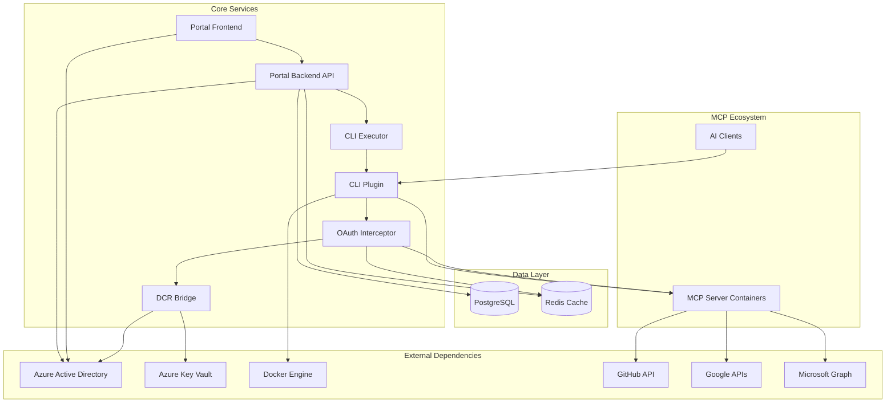
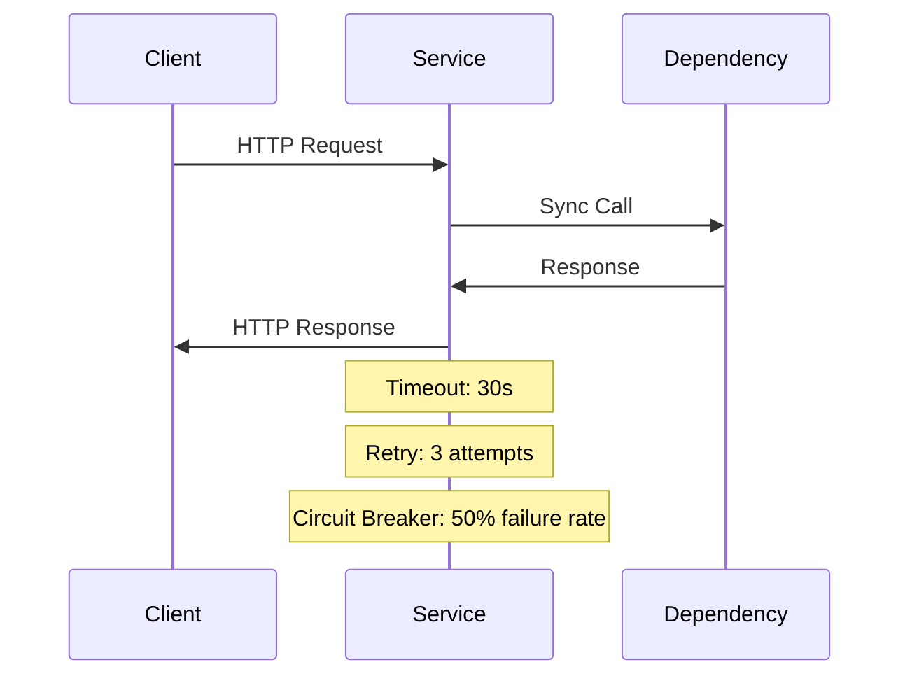
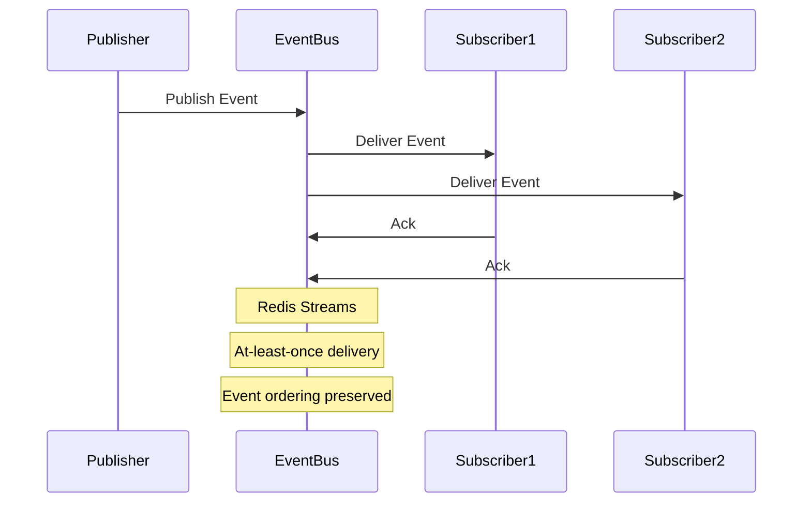

# Service Dependencies Architecture

**MCP Gateway & Portal Service Dependency Map and Integration Contracts**

## Service Dependency Overview

The MCP Gateway & Portal system consists of multiple interconnected services with complex dependency relationships. This document maps all service dependencies, integration patterns, and failure handling strategies.

## Service Dependency Map

### High-Level Service Topology



## Service Dependency Matrix

### Critical Dependencies

| Service           | Dependencies                | Criticality | Failure Impact             | Recovery Time |
| ----------------- | --------------------------- | ----------- | -------------------------- | ------------- |
| Portal Backend    | PostgreSQL, Redis, Azure AD | Critical    | Complete service outage    | <5 minutes    |
| Portal Frontend   | Portal Backend, Azure AD    | Critical    | UI unavailable             | <2 minutes    |
| CLI Plugin        | Docker Engine               | Critical    | No MCP management          | <1 minute     |
| OAuth Interceptor | Redis, DCR Bridge           | High        | OAuth failures only        | <3 minutes    |
| DCR Bridge        | Azure AD, Key Vault         | High        | No new OAuth registrations | <5 minutes    |
| CLI Executor      | CLI Plugin                  | Medium      | Portal CLI functions only  | <2 minutes    |

### Optional Dependencies

| Service           | Dependencies      | Degraded Mode | Functionality Lost           |
| ----------------- | ----------------- | ------------- | ---------------------------- |
| Portal Backend    | Redis             | Graceful      | Session persistence, caching |
| OAuth Interceptor | Key Vault         | Graceful      | Long-term credential storage |
| CLI Plugin        | OAuth Interceptor | Graceful      | OAuth-protected MCP servers  |
| DCR Bridge        | Key Vault         | Graceful      | Credential backup/recovery   |

## Service Integration Patterns

### Synchronous Communication

**HTTP REST API Pattern**:



**Database Transaction Pattern**:

```go
func (s *Service) ProcessRequestWithTransaction(ctx context.Context, req *Request) error {
    tx, err := s.db.BeginTx(ctx, nil)
    if err != nil {
        return fmt.Errorf("transaction start failed: %w", err)
    }
    defer tx.Rollback() // Rollback if not committed

    // Step 1: Validate request
    if err := s.validateRequest(ctx, tx, req); err != nil {
        return fmt.Errorf("validation failed: %w", err)
    }

    // Step 2: Update primary data
    if err := s.updatePrimaryData(ctx, tx, req); err != nil {
        return fmt.Errorf("primary update failed: %w", err)
    }

    // Step 3: Update related data
    if err := s.updateRelatedData(ctx, tx, req); err != nil {
        return fmt.Errorf("related update failed: %w", err)
    }

    // Commit transaction
    if err := tx.Commit(); err != nil {
        return fmt.Errorf("transaction commit failed: %w", err)
    }

    // Step 4: Send notifications (async, outside transaction)
    go s.sendNotifications(req)

    return nil
}
```

### Asynchronous Communication

**Event-Driven Pattern**:



**Message Queue Pattern**:

```go
type EventPublisher struct {
    redis *redis.Client
}

func (ep *EventPublisher) PublishEvent(ctx context.Context, event *Event) error {
    eventData, err := json.Marshal(event)
    if err != nil {
        return fmt.Errorf("event serialization failed: %w", err)
    }

    streamKey := fmt.Sprintf("events:%s", event.Type)
    args := &redis.XAddArgs{
        Stream: streamKey,
        Values: map[string]interface{}{
            "id":        event.ID,
            "type":      event.Type,
            "data":      eventData,
            "timestamp": time.Now().Unix(),
        },
    }

    _, err = ep.redis.XAdd(ctx, args).Result()
    if err != nil {
        return fmt.Errorf("event publishing failed: %w", err)
    }

    return nil
}
```

## Dependency Health Monitoring

### Health Check Implementation

**Service Health Endpoints**:

```go
type HealthChecker struct {
    db      *sql.DB
    redis   *redis.Client
    azure   *azuread.Client
    checks  map[string]HealthCheck
}

type HealthStatus struct {
    Service     string                 `json:"service"`
    Status      string                 `json:"status"` // "healthy", "degraded", "unhealthy"
    Timestamp   time.Time              `json:"timestamp"`
    Dependencies map[string]HealthInfo `json:"dependencies"`
    Details     map[string]interface{} `json:"details,omitempty"`
}

func (hc *HealthChecker) CheckHealth(ctx context.Context) *HealthStatus {
    status := &HealthStatus{
        Service:      "portal-backend",
        Timestamp:    time.Now(),
        Dependencies: make(map[string]HealthInfo),
        Details:      make(map[string]interface{}),
    }

    // Check database health
    if err := hc.checkDatabase(ctx); err != nil {
        status.Dependencies["postgresql"] = HealthInfo{
            Status: "unhealthy",
            Error:  err.Error(),
        }
    } else {
        status.Dependencies["postgresql"] = HealthInfo{Status: "healthy"}
    }

    // Check Redis health
    if err := hc.checkRedis(ctx); err != nil {
        status.Dependencies["redis"] = HealthInfo{
            Status: "degraded", // Non-critical for basic functionality
            Error:  err.Error(),
        }
    } else {
        status.Dependencies["redis"] = HealthInfo{Status: "healthy"}
    }

    // Determine overall status
    status.Status = hc.calculateOverallStatus(status.Dependencies)
    return status
}
```

**Dependency Circuit Breakers**:

```go
type CircuitBreaker struct {
    name           string
    maxFailures    int
    timeout        time.Duration
    resetTimeout   time.Duration
    state          CircuitState
    failureCount   int
    lastFailTime   time.Time
    mutex          sync.RWMutex
}

func (cb *CircuitBreaker) Execute(ctx context.Context, operation func() error) error {
    cb.mutex.Lock()
    defer cb.mutex.Unlock()

    if cb.state == StateOpen {
        if time.Since(cb.lastFailTime) > cb.resetTimeout {
            cb.state = StateHalfOpen
        } else {
            return ErrCircuitBreakerOpen
        }
    }

    err := operation()
    if err != nil {
        cb.onFailure()
        return err
    }

    cb.onSuccess()
    return nil
}
```

### Monitoring and Alerting

**Dependency Monitoring Dashboard**:

```yaml
Metrics Collection:
  - Service response times (p50, p95, p99)
  - Error rates by dependency
  - Circuit breaker state changes
  - Connection pool utilization
  - Cache hit rates

Alerting Rules:
  critical_dependency_down:
    condition: "postgresql_health != 'healthy' OR azure_ad_health != 'healthy'"
    severity: critical
    action: page_on_call

  degraded_performance:
    condition: "avg_response_time > 500ms OR error_rate > 1%"
    severity: warning
    action: notify_team

  circuit_breaker_open:
    condition: "circuit_breaker_state == 'open'"
    severity: warning
    action: investigate_dependency
```

## Service Integration Contracts

### Portal Backend API Contracts

**Authentication Service Contract**:

```yaml
service: authentication
dependencies:
  - azure_ad: "Required for token validation"
  - redis: "Required for session storage"
  - postgresql: "Required for user data"

contract:
  inputs:
    - JWT bearer tokens
    - Session cookies
    - User credentials
  outputs:
    - Authenticated user context
    - Session management
    - Authorization decisions

  sla:
    availability: 99.9%
    response_time: <200ms p95
    error_rate: <0.1%

  failure_modes:
    azure_ad_down:
      impact: "No new authentications"
      mitigation: "Cached session validation"
      recovery: "Automatic when Azure AD recovers"

    redis_down:
      impact: "Session persistence lost"
      mitigation: "In-memory session storage"
      recovery: "Session re-creation required"
```

**MCP Server Management Contract**:

```yaml
service: mcp_server_management
dependencies:
  - cli_executor: "Required for server operations"
  - docker_engine: "Required for container management"
  - postgresql: "Required for configuration storage"

contract:
  inputs:
    - Server configuration requests
    - Lifecycle management commands
    - Status monitoring requests
  outputs:
    - Server deployment status
    - Configuration persistence
    - Real-time status updates

  sla:
    availability: 99.5%
    response_time: <2s for operations, <100ms for status
    error_rate: <1%

  failure_modes:
    docker_engine_down:
      impact: "No container operations possible"
      mitigation: "Queue operations for retry"
      recovery: "Process queued operations when engine recovers"
```

### OAuth Interceptor Contracts

**Token Management Contract**:

```yaml
service: oauth_token_management
dependencies:
  - redis: "Required for token caching"
  - dcr_bridge: "Required for new client registration"
  - azure_key_vault: "Optional for credential backup"

contract:
  inputs:
    - OAuth authorization requests
    - Token refresh requests
    - MCP server API calls requiring OAuth
  outputs:
    - Valid OAuth tokens
    - Automatic token refresh
    - Transparent OAuth handling

  sla:
    availability: 99.9%
    response_time: <50ms overhead for token injection
    token_acquisition: <5s for new tokens
    error_rate: <0.5%

  failure_modes:
    redis_down:
      impact: "No token caching, increased latency"
      mitigation: "Direct provider calls"
      recovery: "Rebuild cache when Redis recovers"

    dcr_bridge_down:
      impact: "No new client registrations"
      mitigation: "Use existing registered clients"
      recovery: "Resume registrations when DCR recovers"
```

### DCR Bridge Contracts

**Dynamic Client Registration Contract**:

```yaml
service: dynamic_client_registration
dependencies:
  - azure_ad: "Required for app registration"
  - azure_key_vault: "Required for credential storage"

contract:
  inputs:
    - RFC 7591 DCR requests
    - Client metadata and configuration
    - Scope and permission requests
  outputs:
    - Client credentials (ID and secret)
    - App registration in Azure AD
    - Secure credential storage

  sla:
    availability: 99.5%
    response_time: <5s for registration
    error_rate: <2%

  failure_modes:
    azure_ad_api_limits:
      impact: "Registration delays"
      mitigation: "Request queuing and rate limiting"
      recovery: "Process queue when limits reset"

    key_vault_down:
      impact: "Credentials not backed up"
      mitigation: "Return credentials to client immediately"
      recovery: "Backup credentials when vault recovers"
```

## Failure Handling Strategies

### Cascading Failure Prevention

**Bulkhead Pattern Implementation**:

```go
type ServicePool struct {
    name        string
    maxWorkers  int
    workQueue   chan Work
    workers     []*Worker
    circuit     *CircuitBreaker
}

func (sp *ServicePool) Submit(ctx context.Context, work Work) error {
    select {
    case sp.workQueue <- work:
        return nil
    case <-ctx.Done():
        return ctx.Err()
    case <-time.After(100 * time.Millisecond):
        return ErrPoolSaturated
    }
}
```

**Timeout and Retry Strategies**:

```go
type RetryConfig struct {
    MaxAttempts    int           `default:"3"`
    InitialDelay   time.Duration `default:"100ms"`
    MaxDelay       time.Duration `default:"5s"`
    BackoffFactor  float64       `default:"2.0"`
    Jitter         bool          `default:"true"`
}

func (r *RetryConfig) ExecuteWithRetry(ctx context.Context, operation func() error) error {
    var lastErr error
    delay := r.InitialDelay

    for attempt := 1; attempt <= r.MaxAttempts; attempt++ {
        if err := operation(); err == nil {
            return nil
        } else {
            lastErr = err
        }

        if attempt < r.MaxAttempts {
            if r.Jitter {
                jitter := time.Duration(rand.Float64() * float64(delay) * 0.1)
                delay += jitter
            }

            select {
            case <-ctx.Done():
                return ctx.Err()
            case <-time.After(delay):
                delay = time.Duration(math.Min(float64(delay)*r.BackoffFactor, float64(r.MaxDelay)))
            }
        }
    }

    return fmt.Errorf("operation failed after %d attempts: %w", r.MaxAttempts, lastErr)
}
```

### Graceful Degradation

**Service Degradation Modes**:

```yaml
Portal Backend:
  full_service:
    dependencies: [postgresql, redis, azure_ad]
    capabilities: [full_api, real_time_updates, caching]

  degraded_mode:
    dependencies: [postgresql, azure_ad]
    capabilities: [core_api, basic_auth]
    limitations: [no_caching, no_real_time_updates]

  emergency_mode:
    dependencies: [postgresql]
    capabilities: [read_only_api]
    limitations: [no_authentication, no_modifications]

OAuth Interceptor:
  full_service:
    dependencies: [redis, dcr_bridge, azure_ad]
    capabilities: [token_caching, new_registrations, automatic_refresh]

  degraded_mode:
    dependencies: [azure_ad]
    capabilities: [direct_oauth_flows]
    limitations: [no_caching, higher_latency, existing_clients_only]
```

## Service Discovery and Registration

### Service Registry Pattern

**Service Registration**:

```go
type ServiceRegistry struct {
    services map[string]*ServiceInfo
    mutex    sync.RWMutex
    ttl      time.Duration
}

type ServiceInfo struct {
    Name         string            `json:"name"`
    Address      string            `json:"address"`
    Port         int               `json:"port"`
    Tags         []string          `json:"tags"`
    Health       string            `json:"health"`
    LastSeen     time.Time         `json:"last_seen"`
    Metadata     map[string]string `json:"metadata"`
}

func (sr *ServiceRegistry) Register(ctx context.Context, service *ServiceInfo) error {
    sr.mutex.Lock()
    defer sr.mutex.Unlock()

    service.LastSeen = time.Now()
    sr.services[service.Name] = service

    // Start health check goroutine
    go sr.monitorServiceHealth(ctx, service)

    return nil
}
```

**Service Discovery**:

```go
func (sr *ServiceRegistry) Discover(serviceName string) (*ServiceInfo, error) {
    sr.mutex.RLock()
    defer sr.mutex.RUnlock()

    service, exists := sr.services[serviceName]
    if !exists {
        return nil, ErrServiceNotFound
    }

    if time.Since(service.LastSeen) > sr.ttl {
        return nil, ErrServiceStale
    }

    if service.Health != "healthy" {
        return nil, ErrServiceUnhealthy
    }

    return service, nil
}
```

## Performance and Scaling Considerations

### Service Scaling Patterns

**Horizontal Scaling Configuration**:

```yaml
Portal Backend:
  min_instances: 2
  max_instances: 10
  target_cpu: 70%
  target_memory: 80%
  scale_up_policy:
    metric: request_rate
    threshold: 1000_requests_per_minute
    cooldown: 300s

OAuth Interceptor:
  min_instances: 1
  max_instances: 5
  target_cpu: 60%
  scaling_triggers:
    - oauth_request_rate > 100/minute
    - token_cache_miss_rate > 10%

DCR Bridge:
  min_instances: 1
  max_instances: 2 # Limited by Azure AD API rate limits
  scaling_policy: manual # Rate-limited by external dependency
```

**Load Balancing Strategies**:

```yaml
Portal Backend:
  algorithm: least_connections
  health_check: /api/health
  session_affinity: none # Stateless service

OAuth Interceptor:
  algorithm: round_robin
  health_check: /health
  session_affinity: source_ip # OAuth state consistency

DCR Bridge:
  algorithm: failover
  health_check: /health
  session_affinity: none
```

## Future Enhancements

### Service Mesh Integration

**Istio Service Mesh**:

- Automatic service discovery and load balancing
- mTLS for all service-to-service communication
- Advanced traffic management and circuit breaking
- Distributed tracing and observability

### Event-Driven Architecture

**Event Sourcing Pattern**:

- Immutable event log for all system changes
- Event replay for system recovery and debugging
- Eventual consistency across service boundaries
- CQRS pattern for read/write optimization

### Microservices Decomposition

**Service Extraction Candidates**:

- Notification service for email/SMS alerts
- Analytics service for usage metrics
- Backup service for data protection
- Configuration service for feature flags

---

**Document Type**: Service Dependencies Architecture
**Last Updated**: September 19, 2025
**Related Documents**: [C4-02-Container](./C4-02-Container.md), [Data Flow Architecture](./data-flow-architecture.md)
**Review Schedule**: Monthly dependency review with architecture team
