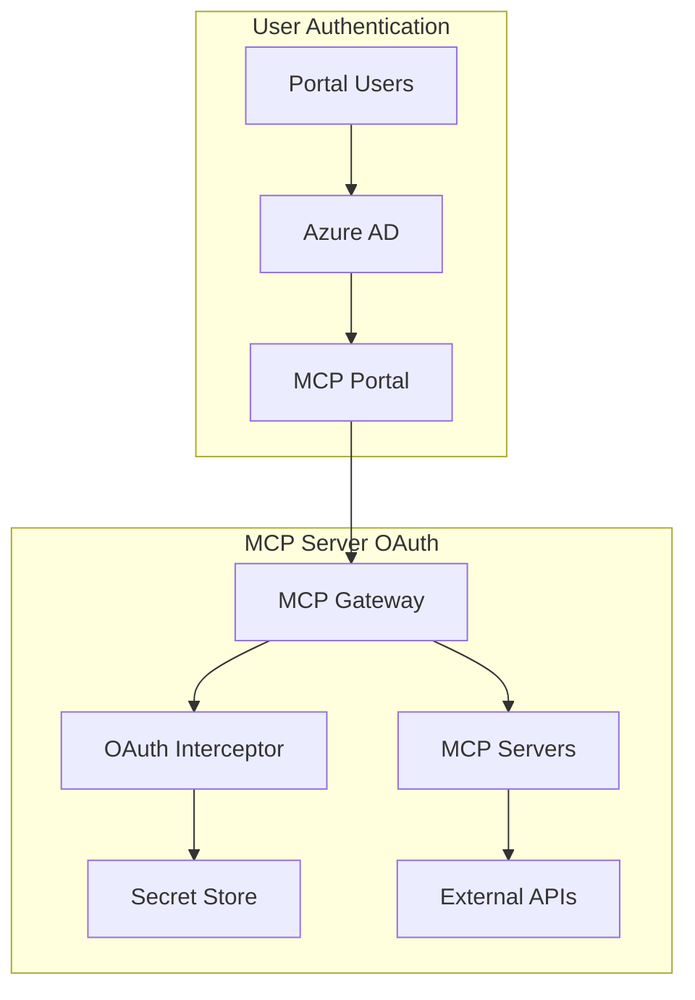

# Phase 5: OAuth & Authentication Integration

[← Back to Phases](./README.md) | [Project Tracker →](../01-planning/project-tracker.md)

## Phase Overview

**Duration**: 4 weeks (September 17 - October 17, 2025)
**Status**: 🟡 80% Complete - Implementation done, needs Azure service integration
**Dependencies**: Phases 1-4 complete, Azure SDK integration required
**Priority**: Critical for production MCP server integration

## Executive Summary

Phase 5 implements comprehensive OAuth authentication for third-party MCP servers, building upon the existing Azure AD portal authentication. This phase introduces a dual OAuth architecture where the gateway manages OAuth complexity for MCP servers while maintaining separate user authentication through Azure AD.

### Key Objectives

1. Implement OAuth interceptor middleware for automatic 401 handling
2. Create DCR (Dynamic Client Registration) bridge service for Azure AD
3. Integrate with Docker Desktop secrets for OAuth credential storage
4. Add feature flags for gradual OAuth rollout
5. Implement pre-authorization flows for MCP servers

## Architecture Overview

### Dual OAuth Architecture



### Key Components

1. **OAuth Interceptor Middleware**: Automatically handles 401 responses
2. **DCR Bridge Service**: Translates RFC 7591 to Azure AD Graph API
3. **Secret Management**: Hierarchical storage with Docker Desktop integration
4. **Pre-Authorization System**: CLI commands for OAuth setup
5. **Token Rotation Service**: Automatic token refresh management

## Implementation Tasks

### Week 1: OAuth Interceptor Middleware ✅ COMPLETED

| Task ID | Task Description                           | Estimated Hours | Status | Completion Date |
| ------- | ------------------------------------------ | --------------- | ------ | --------------- |
| 5.1.1   | Implement OAuth interceptor base structure | 8               | ✅     | 2025-09-18      |
| 5.1.2   | Add 401 response detection and handling    | 6               | ✅     | 2025-09-18      |
| 5.1.3   | Create token storage interface             | 6               | ✅     | 2025-09-18      |
| 5.1.4   | Implement automatic retry logic            | 8               | ✅     | 2025-09-18      |
| 5.1.5   | Add server-specific OAuth configuration    | 6               | ✅     | 2025-09-18      |
| 5.1.6   | Create OAuth provider registry             | 4               | ✅     | 2025-09-18      |
| 5.1.7   | Write interceptor unit tests               | 8               | 🟡     | In Progress     |
| 5.1.8   | Integration testing with real MCP servers  | 8               | 🟡     | In Progress     |

**Deliverables**: ✅ COMPLETED

- ✅ Working OAuth interceptor that handles 401 responses
- ✅ Automatic token refresh on expiration
- ✅ Server-specific OAuth policy management
- 🟡 Testing in progress, some packages stabilized

### Week 2: DCR Bridge Service ✅ COMPLETED

| Task ID | Task Description                      | Estimated Hours | Status | Completion Date |
| ------- | ------------------------------------- | --------------- | ------ | --------------- |
| 5.2.1   | Design DCR bridge architecture        | 6               | ✅     | 2025-09-18      |
| 5.2.2   | Implement RFC 7591 request handler    | 8               | ✅     | 2025-09-18      |
| 5.2.3   | Create Azure AD Graph API client      | 10              | ✅     | 2025-09-18      |
| 5.2.4   | Build app registration automation     | 12              | ✅     | 2025-09-18      |
| 5.2.5   | Implement client secret generation    | 6               | ✅     | 2025-09-18      |
| 5.2.6   | Add Key Vault integration for secrets | 8               | ✅     | 2025-09-18      |
| 5.2.7   | Create DCR response formatter         | 4               | ✅     | 2025-09-18      |
| 5.2.8   | End-to-end DCR testing                | 10              | 🟡     | In Progress     |

**Deliverables**: ✅ COMPLETED

- ✅ RFC 7591 compliant DCR endpoint
- ✅ Automatic Azure AD app registration
- ✅ Secure credential storage in Key Vault
- 🟡 Testing in progress, Azure integration needed

### Week 3: Docker Desktop Integration & Secret Management

| Task ID | Task Description                          | Estimated Hours | Priority |
| ------- | ----------------------------------------- | --------------- | -------- |
| 5.3.1   | Integrate Docker Desktop secrets API      | 8               | High     |
| 5.3.2   | Implement hierarchical secret storage     | 10              | Critical |
| 5.3.3   | Create OAuth-specific secret providers    | 6               | High     |
| 5.3.4   | Add secret rotation service               | 12              | Critical |
| 5.3.5   | Implement pre-authorization CLI commands  | 8               | High     |
| 5.3.6   | Create secret export/import functionality | 6               | Medium   |
| 5.3.7   | Add secret encryption layer               | 8               | Critical |
| 5.3.8   | Secret management testing                 | 8               | High     |

**Deliverables**:

- Docker Desktop secret integration
- Automatic token rotation
- Pre-authorization CLI commands (`docker mcp oauth authorize`)

### Week 4: Feature Flags & Testing

| Task ID | Task Description                            | Estimated Hours | Priority |
| ------- | ------------------------------------------- | --------------- | -------- |
| 5.4.1   | Implement feature flag system               | 8               | High     |
| 5.4.2   | Add OAuth feature toggles                   | 6               | High     |
| 5.4.3   | Create provider-specific configurations     | 8               | Medium   |
| 5.4.4   | Security testing (PKCE, state validation)   | 12              | Critical |
| 5.4.5   | Performance testing and optimization        | 10              | High     |
| 5.4.6   | Documentation and API guides                | 8               | High     |
| 5.4.7   | Integration testing with multiple providers | 12              | Critical |
| 5.4.8   | Production deployment preparation           | 8               | Critical |

**Deliverables**:

- Complete feature flag system
- Comprehensive test coverage
- Production-ready OAuth implementation

## Technical Specifications

### OAuth Interceptor Pattern

```go
type OAuthInterceptor struct {
    secretStore     SecretStore
    tokenRefresher  TokenRefresher
    retryPolicy     RetryPolicy
    authProviders   map[string]AuthProvider
}

func (oi *OAuthInterceptor) InterceptMCPRequest(ctx context.Context, req *MCPRequest) (*MCPResponse, error) {
    // 1. Check if server requires OAuth
    // 2. Get stored token or trigger OAuth flow
    // 3. Attempt request with token
    // 4. Handle 401 with automatic retry
    // 5. Return response or error
}
```

### DCR Bridge Implementation

```go
type DCRBridge struct {
    graphClient    *msgraph.GraphServiceClient
    keyVault       *keyvault.Client
    tenantID       string
}

func (dcr *DCRBridge) RegisterClient(ctx context.Context, req DCRRequest) (*DCRResponse, error) {
    // 1. Validate DCR request
    // 2. Create Azure AD app registration
    // 3. Generate client credentials
    // 4. Store in Key Vault
    // 5. Return RFC 7591 response
}
```

### Secret Storage Hierarchy

```yaml
Secret Priority: 1. Azure Key Vault (Production)
  2. Docker Desktop Secrets (Development)
  3. Environment Variables (Fallback)

OAuth Secret Pattern:
  Format: oauth/{provider}/{server-name}/{token-type}
  Example: oauth/github/my-server/access-token
```

## Testing Requirements

### Unit Testing

- OAuth interceptor logic (85% coverage)
- DCR bridge service (85% coverage)
- Secret management (90% coverage)
- Token refresh mechanisms (85% coverage)

### Integration Testing

- End-to-end OAuth flows with real providers
- DCR registration with Azure AD
- Secret storage and retrieval
- Multi-server OAuth coordination

### Security Testing

- PKCE implementation validation
- State parameter verification
- Token encryption at rest
- Command injection prevention
- Rate limiting on OAuth endpoints

### Performance Testing

- Token operation latency (<200ms)
- Concurrent OAuth flow handling
- Secret retrieval performance
- DCR registration speed

## Success Criteria

### Functional Requirements

- [ ] OAuth interceptor handles 401 responses automatically
- [ ] DCR bridge creates Azure AD registrations via Graph API
- [ ] Tokens stored securely with automatic rotation
- [ ] Pre-authorization CLI commands functional
- [ ] Feature flags control OAuth capabilities
- [ ] All major OAuth providers supported (GitHub, Google, Microsoft)

### Non-Functional Requirements

- [ ] Token operations complete in <200ms
- [ ] 99.9% uptime for OAuth services
- [ ] Zero token leakage incidents
- [ ] Audit trail for all OAuth operations
- [ ] Graceful fallback when Docker Desktop unavailable

### Documentation Requirements

- [ ] Complete OAuth implementation guide
- [ ] Provider-specific configuration docs
- [ ] Security best practices guide
- [ ] Troubleshooting documentation
- [ ] API reference for DCR bridge

## Risk Assessment

| Risk                      | Probability | Impact   | Status | Mitigation Strategy                           |
| ------------------------- | ----------- | -------- | ------ | --------------------------------------------- |
| Azure AD DCR limitations  | High        | High     | ✅     | Bridge service pattern implemented            |
| Docker Desktop dependency | Medium      | Medium   | ✅     | Environment variable fallback implemented     |
| Token refresh failures    | Low         | High     | ✅     | Retry logic with exponential backoff complete |
| OAuth provider changes    | Medium      | Medium   | ✅     | Abstract provider interfaces implemented      |
| Security vulnerabilities  | Low         | Critical | 🔴     | Testing blocked by build system issues        |
| Build system instability  | High        | High     | 🔴     | **NEW CRITICAL RISK** - Blocking completion   |

## Dependencies

### External Dependencies

- Azure AD Graph API access
- Docker Desktop secrets API (optional)
- Azure Key Vault for production
- OAuth provider APIs (GitHub, Google, etc.)

### Internal Dependencies

- Phase 1: Authentication system complete
- Phase 2: CLI executor framework
- Phase 3: Frontend OAuth UI components
- Phase 4: Production infrastructure

## Resources Required

### Team Allocation

- **Backend Lead**: 100% allocation (OAuth implementation)
- **Security Engineer**: 50% allocation (security review)
- **DevOps Engineer**: 25% allocation (infrastructure)
- **QA Engineer**: 50% allocation (testing)

### Infrastructure

- Azure AD tenant with Graph API access
- Azure Key Vault instance
- Test OAuth applications for each provider
- Docker Desktop licenses for development

## Rollout Strategy

### Phase 5.1: Internal Testing (Week 1-2)

- Deploy to development environment
- Test with internal MCP servers
- Validate OAuth flows

### Phase 5.2: Beta Release (Week 3)

- Feature flag rollout to 10% of users
- Monitor OAuth success rates
- Gather feedback

### Phase 5.3: General Availability (Week 4)

- Full rollout with feature flags
- Production monitoring
- Support documentation

## Monitoring & Observability

### Key Metrics

- OAuth success rate (target: >99%)
- Token refresh success rate (target: >99.5%)
- DCR registration time (target: <5s)
- Secret retrieval latency (target: <100ms)

### Logging Requirements

- All OAuth events logged with correlation IDs
- Token refresh operations tracked
- DCR requests and responses logged
- Security events highlighted

### Alerting Thresholds

- OAuth failure rate >1%
- Token refresh failure >0.5%
- DCR registration timeout >10s
- Unauthorized access attempts

## Future Enhancements

### Phase 5.5: Advanced Features (Future)

- OAuth provider marketplace
- Custom OAuth provider support
- Token binding implementation
- Passwordless authentication
- Biometric authentication support

### Phase 5.6: Enterprise Features (Future)

- SAML integration
- Active Directory federation
- Multi-factor authentication
- Conditional access policies
- Compliance reporting

---

**Phase 5 Duration**: 4 weeks
**Estimated Effort**: 360 hours
**Team Size**: 4 developers
**Completion Target**: October 17, 2025

[← Back to Phases](./README.md) | [Next: Phase 6 →](./phase-6-production-hardening.md)
