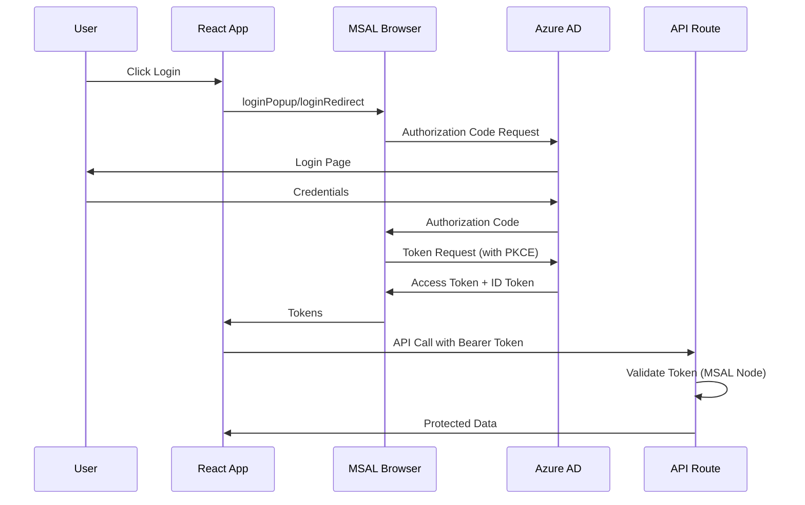

# Authentication Architecture

## Overview

The MCP Portal uses Azure Active Directory (Azure AD) for authentication with a secure, production-ready architecture that properly separates client-side and server-side concerns.

## Package Architecture

### Client-Side Authentication

```
┌─────────────────────────────────────────┐
│         React Components                 │
│                                         │
│  ┌────────────────────────────────┐    │
│  │    @azure/msal-react           │    │
│  │  (React hooks & providers)     │    │
│  └────────────────────────────────┘    │
│                 │                       │
│                 ▼                       │
│  ┌────────────────────────────────┐    │
│  │    @azure/msal-browser         │    │
│  │  (Core browser auth library)   │    │
│  └────────────────────────────────┘    │
└─────────────────────────────────────────┘
```

### Server-Side Authentication

```
┌─────────────────────────────────────────┐
│       Next.js API Routes                │
│                                         │
│  ┌────────────────────────────────┐    │
│  │    @azure/msal-node            │    │
│  │  (Confidential client)         │    │
│  └────────────────────────────────┘    │
│                 │                       │
│                 ▼                       │
│  ┌────────────────────────────────┐    │
│  │    Azure AD Token Validation   │    │
│  │    Service-to-Service Auth     │    │
│  └────────────────────────────────┘    │
└─────────────────────────────────────────┘
```

## Security Configuration

### Environment Variables

We use **T3 Env** with **Zod** for type-safe environment variable validation:

#### Server-Only Variables (NEVER exposed to client)

- `AZURE_TENANT_ID` - Azure AD tenant identifier
- `AZURE_CLIENT_ID` - Application (client) ID
- `AZURE_CLIENT_SECRET` - Client secret (confidential)
- `JWT_SECRET` - Server-side JWT signing key

#### Client-Safe Variables (prefixed with NEXT*PUBLIC*)

- `NEXT_PUBLIC_AZURE_REDIRECT_URI` - OAuth redirect endpoint
- `NEXT_PUBLIC_AZURE_POST_LOGOUT_URI` - Post-logout redirect
- `NEXT_PUBLIC_AZURE_SCOPES` - Requested OAuth scopes

## Authentication Flow

### 1. Client-Side Login (SPA Flow)



### 2. Server-Side Validation

```typescript
// API Route (server-side)
import { getMsalInstance } from "@/config/azure-ad.server";

export async function POST(req: Request) {
  const token = req.headers.get("Authorization")?.replace("Bearer ", "");

  // Validate token using MSAL Node
  const msalInstance = getMsalInstance();
  const result = await msalInstance.acquireTokenOnBehalfOf({
    oboAssertion: token,
    scopes: ["User.Read"],
  });

  // Token is valid, proceed with request
  return NextResponse.json({ data: "protected" });
}
```

## File Structure

```
src/
├── env.mjs                          # T3 Env configuration with Zod validation
├── config/
│   ├── msal.config.ts              # Client-side MSAL configuration
│   └── azure-ad.server.ts          # Server-side MSAL configuration
├── app/
│   └── api/
│       └── auth/
│           ├── config/route.ts     # Returns public auth config to client
│           ├── token/route.ts      # Token validation endpoint
│           └── callback/route.ts   # OAuth callback handler
├── hooks/
│   └── useAuth.ts                  # React authentication hooks
├── contexts/
│   └── AuthContext.tsx             # React authentication context
└── providers/
    └── AuthProvider.tsx            # MSAL React provider wrapper
```

## Best Practices

### 1. Never Expose Secrets to Client

- Client ID and Tenant ID are retrieved via API call, not bundled
- Client Secret is NEVER sent to browser
- Use server-side validation for all protected operations

### 2. Token Storage

- Access tokens: In-memory or sessionStorage
- Refresh tokens: HttpOnly cookies (server-side only)
- Never store tokens in localStorage for production

### 3. PKCE for SPA

- Always use Authorization Code Flow with PKCE
- Never use Implicit Flow (deprecated)

### 4. Server-Side Validation

- Validate all tokens server-side using MSAL Node
- Use On-Behalf-Of flow for calling downstream APIs
- Cache validated tokens to reduce latency

### 5. Environment Configuration

- Use T3 Env for type-safe environment variables
- Separate client and server configurations
- Validate all required variables at startup

## Common Patterns

### Getting User Info Client-Side

```typescript
import { useMsal } from "@azure/msal-react";

function Profile() {
  const { accounts } = useMsal();
  const account = accounts[0];

  return <div>Welcome, {account?.name}!</div>;
}
```

### Making Authenticated API Calls

```typescript
import { useMsal } from "@azure/msal-react";

function useAuthenticatedFetch() {
  const { instance, accounts } = useMsal();

  return async (url: string, options?: RequestInit) => {
    const token = await instance.acquireTokenSilent({
      account: accounts[0],
      scopes: ["api://your-api/access_as_user"],
    });

    return fetch(url, {
      ...options,
      headers: {
        ...options?.headers,
        Authorization: `Bearer ${token.accessToken}`,
      },
    });
  };
}
```

### Server-Side Token Validation

```typescript
// app/api/protected/route.ts
import { getMsalInstance } from "@/config/azure-ad.server";
import { NextRequest, NextResponse } from "next/server";

export async function GET(request: NextRequest) {
  const authHeader = request.headers.get("Authorization");

  if (!authHeader?.startsWith("Bearer ")) {
    return NextResponse.json({ error: "Unauthorized" }, { status: 401 });
  }

  const token = authHeader.substring(7);

  try {
    // Validate token with MSAL Node
    const msal = getMsalInstance();
    // Token validation logic here

    return NextResponse.json({ message: "Success" });
  } catch (error) {
    return NextResponse.json({ error: "Invalid token" }, { status: 401 });
  }
}
```

## Troubleshooting

### Common Issues

1. **"AZURE_CLIENT_ID is not defined"**

   - Ensure `.env.local` exists with required variables
   - Check that variables are properly loaded by T3 Env

2. **"Token validation failed"**

   - Verify Azure AD app registration settings
   - Check that API permissions are configured
   - Ensure redirect URIs match exactly

3. **"CORS errors during login"**
   - Add redirect URIs to Azure AD app registration
   - Ensure `navigateToLoginRequestUrl` is configured correctly

## References

- [MSAL.js Documentation](https://github.com/AzureAD/microsoft-authentication-library-for-js)
- [T3 Env Documentation](https://env.t3.gg/)
- [Azure AD Authentication](https://learn.microsoft.com/en-us/azure/active-directory/develop/)
- [Next.js Authentication Patterns](https://nextjs.org/docs/authentication)
