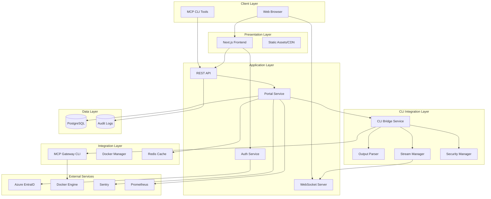

# Technical Architecture

## System Overview

The MCP Portal is a web-based management interface that wraps the existing MCP Gateway CLI (Docker plugin). It provides a modern web UI while leveraging all existing CLI functionality through a secure CLI integration layer, featuring user-specific configurations and Azure EntraID authentication.

## Architecture Diagram



## Component Architecture

### 1. Frontend (Next.js)

```typescript
// Frontend architecture
app/
├── (auth)/                  // Authentication routes
│   ├── login/
│   └── callback/
├── (dashboard)/             // Protected routes
│   ├── servers/
│   ├── config/
│   └── admin/
├── api/                     // API route handlers
└── components/              // Reusable components
```

### 2. Backend Services

```go
// Portal service structure
cmd/docker-mcp/portal/
├── server.go              // HTTP server
├── auth/                  // Authentication
│   ├── azure.go           // Azure AD integration
│   ├── jwt.go             // JWT handling
│   └── middleware.go      // Auth middleware
├── cli/                   // CLI Integration Layer
│   ├── bridge.go          // CLI Bridge Service
│   ├── executor.go        // Command Executor
│   ├── parser.go          // Output Parser
│   ├── stream.go          // Stream Manager
│   └── security.go        // Security Manager
├── handlers/              // API handlers
│   ├── servers.go         // Server management
│   ├── config.go          // Configuration
│   └── admin.go           // Admin operations
├── database/              // Database layer
│   ├── models.go          // Data models
│   ├── queries.go         // SQL queries
│   └── migrations/        // Schema migrations
└── docker/                // Docker integration
    ├── lifecycle.go       // Container lifecycle
    └── monitor.go         // Container monitoring
```

## Data Flow

### Authentication Flow

```sequence
User -> Browser: Access Portal
Browser -> Next.js: Request Page
Next.js -> Azure AD: Redirect to Login
Azure AD -> User: Login Page
User -> Azure AD: Credentials
Azure AD -> Next.js: Auth Code
Next.js -> API: Exchange for Token
API -> Next.js: JWT Token
Next.js -> Browser: Authenticated Session
```

### Server Toggle Flow

```sequence
User -> Dashboard: Toggle Server
Dashboard -> API: POST /api/servers/{id}/toggle
API -> Auth: Validate JWT
API -> CLIBridge: Execute server enable/disable
CLIBridge -> Security: Validate command
CLIBridge -> Executor: Run CLI command
Executor -> Gateway: docker mcp server enable/disable
Gateway -> DockerEngine: Container lifecycle
Executor -> Parser: Parse CLI output
Parser -> StreamMgr: Stream status updates
StreamMgr -> WebSocket: Real-time updates
WebSocket -> Dashboard: UI updates
API -> DB: Store operation result
```

## Technology Stack

### Frontend

- **Framework**: Next.js 15 (App Router)
- **Language**: TypeScript 5.x
- **Styling**: Tailwind CSS + Shadcn/ui
- **State Management**: React Query + Zustand
- **Authentication**: MSAL.js
- **Real-time**: WebSocket/SSE
- **Build**: Turbopack

### Backend

- **Language**: Go 1.24+
- **Framework**: Native HTTP + Gorilla Mux
- **Authentication**: JWT (RS256)
- **Database**: PostgreSQL 17
- **Cache**: Redis 8
- **Container**: Docker Engine API
- **Monitoring**: OpenTelemetry

### Infrastructure

- **Deployment**: Docker Compose
- **Reverse Proxy**: Nginx
- **SSL**: Let's Encrypt
- **Monitoring**: Prometheus + Grafana
- **Logging**: Structured JSON
- **Error Tracking**: Sentry

## Security Architecture

### Authentication & Authorization

```go
type SecurityConfig struct {
    JWT struct {
        PublicKey  string
        Algorithm  string // RS256
        Issuer     string
        Audience   string
    }
    Session struct {
        MaxAge     time.Duration // 8 hours
        InactivityTimeout time.Duration // 30 minutes
        MaxConcurrent int // 3
    }
    RateLimit struct {
        RequestsPerMinute int // 60
        BurstSize        int  // 10
    }
}
```

### Data Protection

- **Encryption at Rest**: Application-level AES-256
- **Encryption in Transit**: TLS 1.3
- **Key Management**: Environment variables + HashiCorp Vault
- **Database Security**: Row-Level Security (RLS)
- **Audit Logging**: Immutable audit trail

## Scalability Design

### Horizontal Scaling

```yaml
# Load balancer configuration
upstream portal_backend {
least_conn;
server portal1:8080 weight=1;
server portal2:8080 weight=1;
server portal3:8080 weight=1;
}
```

### Caching Strategy

- **L1 Cache**: In-memory (application)
- **L2 Cache**: Redis (shared)
- **L3 Cache**: CDN (static assets)

### Database Optimization

- Connection pooling (25 connections)
- Read replicas for queries
- Materialized views for analytics
- Partitioning for audit logs

## Monitoring & Observability

### Metrics Collection

```go
// Key metrics to track
type Metrics struct {
    // Business metrics
    ActiveUsers         Gauge
    ServersEnabled      Counter
    BulkOperations      Histogram

    // Performance metrics
    APILatency          Histogram
    DBQueryTime         Histogram
    CacheHitRate        Gauge

    // System metrics
    ContainerCount      Gauge
    MemoryUsage         Gauge
    ErrorRate           Counter
}
```

### Logging Strategy

```json
{
  "timestamp": "2025-01-01T00:00:00Z",
  "level": "info",
  "service": "portal",
  "trace_id": "abc123",
  "user_id": "user123",
  "action": "server_toggle",
  "server_id": "srv456",
  "duration_ms": 45,
  "status": "success"
}
```

## Deployment Architecture

### Container Orchestration

```yaml
services:
  portal:
    deploy:
      replicas: 3
      update_config:
        parallelism: 1
        delay: 10s
      restart_policy:
        condition: on-failure
        delay: 5s
        max_attempts: 3
```

### Network Architecture

- **Public Subnet**: Load balancer, CDN
- **Application Subnet**: Portal services
- **Database Subnet**: PostgreSQL, Redis
- **Management Subnet**: Monitoring, logging

## CLI Integration Architecture

### CLI Bridge Service

The CLI Bridge Service acts as the critical interface layer between the web portal and the MCP Gateway CLI:

```go
type CLIBridge struct {
    executor    *CommandExecutor   // Secure command execution
    parser      *OutputParser      // CLI output parsing
    streamer    *StreamManager     // Real-time updates
    security    *SecurityManager   // Command validation
}
```

### Command Mapping Table

| UI Action            | HTTP Endpoint                             | CLI Command                                                                 | Timeout | Async | Stream |
| -------------------- | ----------------------------------------- | --------------------------------------------------------------------------- | ------- | ----- | ------ |
| List Servers         | GET /api/v1/servers                       | `docker mcp server list --format json --user {user}`                        | 5s      | No    | No     |
| Get Server Details   | GET /api/v1/servers/{id}                  | `docker mcp server inspect {id} --format json --user {user}`                | 3s      | No    | No     |
| Enable Server        | POST /api/v1/servers/{id}/enable          | `docker mcp server enable {id} --user {user} --config-file {temp_config}`   | 30s     | Yes   | Yes    |
| Disable Server       | POST /api/v1/servers/{id}/disable         | `docker mcp server disable {id} --user {user}`                              | 15s     | Yes   | Yes    |
| Restart Server       | POST /api/v1/servers/{id}/restart         | `docker mcp server restart {id} --user {user}`                              | 30s     | Yes   | Yes    |
| Get Logs             | GET /api/v1/servers/{id}/logs             | `docker mcp server logs {id} --lines {n} --user {user}`                     | 60s     | No    | Yes    |
| Stream Logs          | GET /api/v1/servers/{id}/logs?follow=true | `docker mcp server logs {id} --follow --user {user}`                        | ∞       | Yes   | Yes    |
| Bulk Operations      | POST /api/v1/servers/bulk                 | `docker mcp server bulk {operation} --servers {ids} --user {user}`          | 300s    | Yes   | Yes    |
| Get User Config      | GET /api/v1/config                        | `docker mcp config get --user {user} --format json`                         | 5s      | No    | No     |
| Update Config        | PUT /api/v1/config                        | `docker mcp config set --user {user} --config-file {temp_config}`           | 10s     | No    | No     |
| Export Config        | GET /api/v1/config/export                 | `docker mcp config export --user {user} --format {format}`                  | 10s     | No    | No     |
| Add Custom Server    | POST /api/v1/catalog/custom               | `docker mcp catalog add --user {user} --definition-file {temp_def}`         | 15s     | No    | No     |
| Update Custom Server | PUT /api/v1/catalog/custom/{id}           | `docker mcp catalog update {id} --user {user} --definition-file {temp_def}` | 15s     | No    | No     |
| Remove Custom Server | DELETE /api/v1/catalog/custom/{id}        | `docker mcp catalog remove {id} --user {user}`                              | 10s     | No    | No     |

### Output Parser Framework

```go
type OutputParser interface {
    Parse(output []byte, cmd *Command) (*ParsedResult, error)
    SupportsStreaming() bool
    ParseStream(reader io.Reader, callback StreamCallback) error
    ValidateOutput(output []byte) error
}

type ParsedResult struct {
    Success    bool                   `json:"success"`
    Data       interface{}           `json:"data,omitempty"`
    Error      *ParsedError          `json:"error,omitempty"`
    Warnings   []string              `json:"warnings,omitempty"`
    Metadata   map[string]interface{} `json:"metadata,omitempty"`
    StreamID   string                 `json:"stream_id,omitempty"`
}

// Specialized parsers
type JSONParser struct {
    schema *JSONSchema // Optional schema validation
}

type TableParser struct {
    headerPattern *regexp.Regexp
    separator     string
    columnTypes   map[string]ColumnType
}

type LogParser struct {
    timestampPattern *regexp.Regexp
    levelPattern     *regexp.Regexp
    contextExtractor *ContextExtractor
}

type ProgressParser struct {
    progressPattern *regexp.Regexp
    stateTransitions map[string][]string
}

type ErrorParser struct {
    errorPatterns map[string]*regexp.Regexp
    suggestions   map[string]string
}
```

### Stream Management

Real-time updates are handled through WebSocket connections that receive parsed CLI output:

```go
type StreamManager struct {
    activeStreams sync.Map       // map[streamID]*StreamContext
    wsClients     sync.Map       // map[clientID]*WebSocketClient
    eventBus      *EventBus      // Event distribution
    bufferSize    int            // Stream buffer size
    cleanup       *time.Ticker   // Cleanup inactive streams
}

type StreamContext struct {
    ID          string
    UserID      string
    Command     *Command
    StartTime   time.Time
    Status      StreamStatus
    Parser      OutputParser
    Buffer      *CircularBuffer
    Subscribers []string
    Metadata    map[string]interface{}
}

type WebSocketClient struct {
    ID           string
    UserID       string
    Connection   *websocket.Conn
    Subscriptions []string // Stream IDs
    LastActivity time.Time
    Send         chan []byte
    mu           sync.RWMutex
}

type EventBus struct {
    subscribers map[string][]EventSubscriber
    buffer      chan Event
    workers     int
    mu          sync.RWMutex
}
```

### Security Framework

```go
type SecurityManager struct {
    allowedCommands map[string]*CommandSpec // Whitelist validation
    validator       *InputValidator         // Parameter validation
    resourceLimits  *ResourceLimits         // Execution constraints
    auditLogger     *AuditLogger           // Security event logging
    rateLimiter     *RateLimiter           // Command rate limiting
}

type CommandSpec struct {
    Name                string
    Description         string
    Args                []ArgumentSpec
    MaxRuntime          time.Duration
    RequiredPermissions []Permission
    ResourceLimits      *ResourceLimits
    RateLimitConfig     *RateLimitConfig
    OutputValidation    *OutputValidation
}

type ArgumentSpec struct {
    Name         string
    Type         ArgumentType  // STRING, NUMBER, BOOLEAN, UUID, FILE, ENUM
    Required     bool
    Validator    *regexp.Regexp
    MaxLength    int
    MinValue     *float64
    MaxValue     *float64
    EnumValues   []string
    Sanitizer    SanitizerFunc
}

type ResourceLimits struct {
    MaxMemory        int64         // Maximum memory usage (bytes)
    MaxCPU          float64        // Maximum CPU usage (cores)
    MaxExecutionTime time.Duration // Per-command timeout
    MaxOutputSize   int64          // Maximum output buffer size
    MaxFileHandles  int            // Maximum open file handles
    MaxProcesses    int            // Maximum child processes
}

type RateLimitConfig struct {
    RequestsPerMinute  int
    BurstSize         int
    WindowSize        time.Duration
    ByUser            bool
    ByCommand         bool
}
```

## CLI Integration Layer Architecture

### CLI Binary Deployment Strategy

The MCP CLI binary must be available in the portal container:

```dockerfile
# Portal Dockerfile
FROM golang:1.24-alpine AS builder
WORKDIR /app
COPY . .
RUN go build -o mcp-cli ./cmd/docker-mcp
RUN go build -o portal ./cmd/docker-mcp/portal

FROM alpine:latest
RUN apk --no-cache add ca-certificates docker-cli
WORKDIR /root/
COPY --from=builder /app/mcp-cli ./bin/
COPY --from=builder /app/portal ./bin/
ENV PATH="/root/bin:${PATH}"
EXPOSE 3000
CMD ["./bin/portal"]
```

### CLI Version Management

```go
type CLIManager struct {
    binaryPath    string
    version       string
    capabilities  []string
    healthChecker *HealthChecker
}

func (cm *CLIManager) ValidateInstallation() error {
    // Check binary exists and is executable
    if _, err := os.Stat(cm.binaryPath); err != nil {
        return fmt.Errorf("CLI binary not found: %w", err)
    }

    // Verify version compatibility
    version, err := cm.getVersion()
    if err != nil {
        return fmt.Errorf("failed to get CLI version: %w", err)
    }

    if !cm.isCompatibleVersion(version) {
        return fmt.Errorf("incompatible CLI version: %s", version)
    }

    return nil
}
```

### Non-Docker Desktop Configuration

```yaml
# docker-compose.yml for non-Desktop deployment
services:
  mcp-portal:
    image: docker/mcp-portal:latest
    volumes:
      - /var/run/docker.sock:/var/run/docker.sock:ro
    environment:
      - DOCKER_HOST=unix:///var/run/docker.sock
      - MCP_CLI_PATH=/usr/local/bin/docker-mcp
    user: "1000:999" # user:docker group
    networks:
      - mcp-network

networks:
  mcp-network:
    driver: bridge
    ipam:
      config:
        - subnet: 10.20.0.0/16
```

## API Design with CLI Integration

### REST Endpoint to CLI Command Mapping

```yaml
endpoint_mappings:
  # Authentication (no CLI mapping - handled by portal)
  POST /auth/login: portal_internal
  POST /auth/refresh: portal_internal
  POST /auth/logout: portal_internal
  GET  /auth/me: portal_internal

  # Server Management
  GET    /servers:
    cli: "docker mcp server list --format json --user {user_id}"
    parser: JSONParser
    timeout: 5s

  GET    /servers/{id}:
    cli: "docker mcp server inspect {server_id} --format json --user {user_id}"
    parser: JSONParser
    timeout: 3s

  POST   /servers/{id}/enable:
    cli: "docker mcp server enable {server_id} --user {user_id} --config-file {temp_config}"
    parser: JSONParser
    timeout: 30s
    async: true
    streaming: true

  POST   /servers/{id}/disable:
    cli: "docker mcp server disable {server_id} --user {user_id}"
    parser: JSONParser
    timeout: 15s
    async: true
    streaming: true

  # Configuration
  GET    /config:
    cli: "docker mcp config get --user {user_id} --format json"
    parser: JSONParser
    timeout: 5s

  # Admin (portal queries database directly for most admin functions)
  GET    /admin/users: portal_db_query
  GET    /admin/audit: portal_db_query
  GET    /admin/metrics: mixed_portal_and_cli
```

### WebSocket Events from CLI Streams

```javascript
// CLI output to WebSocket event mapping
interface CLIStreamEvent {
  stream_id: string;
  event_type: 'CLI_OUTPUT' | 'CLI_ERROR' | 'CLI_COMPLETE' | 'CLI_PROGRESS';
  timestamp: string;
  user_id: string;
  command: string;
  raw_output: string;
  parsed_data?: any;
}

// Business events derived from CLI output
enum EventType {
  SERVER_STATE_CHANGED = 'server_state_changed',
  CONFIG_UPDATED = 'config_updated',
  BULK_OPERATION_PROGRESS = 'bulk_operation_progress',
  SYSTEM_NOTIFICATION = 'system_notification',
  CLI_STREAM_DATA = 'cli_stream_data',
  CLI_COMMAND_COMPLETE = 'cli_command_complete',
  CLI_ERROR = 'cli_error'
}

// Enhanced event payload
interface Event {
  id: string;
  type: EventType;
  timestamp: string;
  userId: string;
  payload: any;
  source: 'cli' | 'portal' | 'system';
  correlation_id?: string; // Links related events
  stream_id?: string;      // For streaming operations
}

// CLI-specific event payloads
interface ServerStateChangedPayload {
  server_id: string;
  old_state: string;
  new_state: string;
  container_id?: string;
  progress?: number;
  cli_output: string;
}

interface BulkOperationProgressPayload {
  operation_id: string;
  total: number;
  completed: number;
  failed: number;
  current_server?: string;
  cli_output: string;
}
```

## Error Handling

### Error Response Format

```json
{
  "error": {
    "code": "RESOURCE_NOT_FOUND",
    "message": "Server not found",
    "details": {
      "server_id": "srv123",
      "user_id": "user456"
    },
    "trace_id": "abc-123-def",
    "timestamp": "2024-01-01T00:00:00Z"
  }
}
```

### Error Categories

- **4xx Client Errors**: Validation, authentication, authorization
- **5xx Server Errors**: Internal errors, dependencies
- **Custom Business Errors**: Quota exceeded, conflict

## Performance Requirements

| Metric               | Target  | Measurement     |
| -------------------- | ------- | --------------- |
| Page Load Time       | < 2s    | 95th percentile |
| API Response Time    | < 200ms | 95th percentile |
| Container Start Time | < 5s    | Average         |
| WebSocket Latency    | < 50ms  | 95th percentile |
| Database Query Time  | < 100ms | 95th percentile |
| Cache Hit Rate       | > 80%   | Average         |
| Concurrent Users     | 1000    | Peak            |
| Uptime               | 99.9%   | Monthly         |

## Disaster Recovery

### Backup Strategy

- **Database**: Daily full backup, hourly incremental
- **Configuration**: Version controlled in Git
- **Containers**: Image registry with versioning
- **Audit Logs**: Archived after 30 days

### Recovery Objectives

- **RTO (Recovery Time Objective)**: 4 hours
- **RPO (Recovery Point Objective)**: 1 hour

## Future Considerations

### Phase 2 Enhancements

- Multi-tenant support
- Federated authentication
- Advanced RBAC
- Cost management
- Usage analytics

### Technical Debt

- Migrate to Kubernetes
- Implement service mesh
- Add distributed tracing
- Enhanced caching layer
- GraphQL API option
