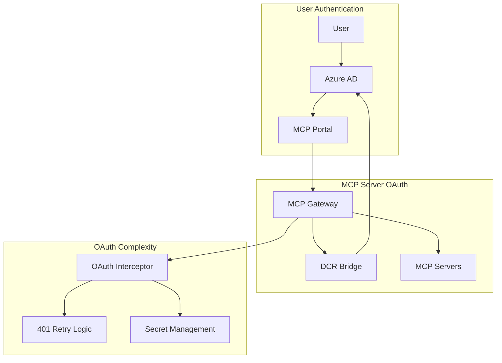
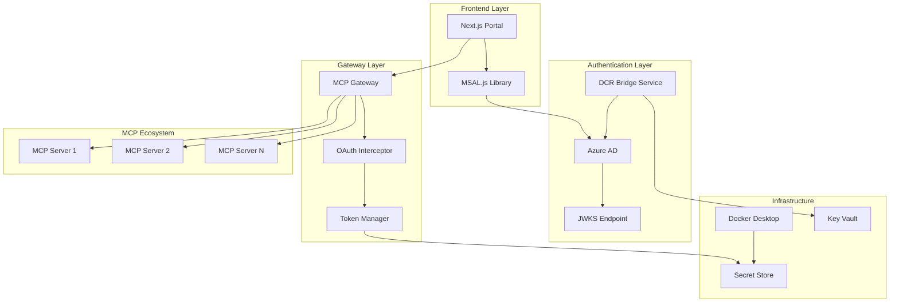
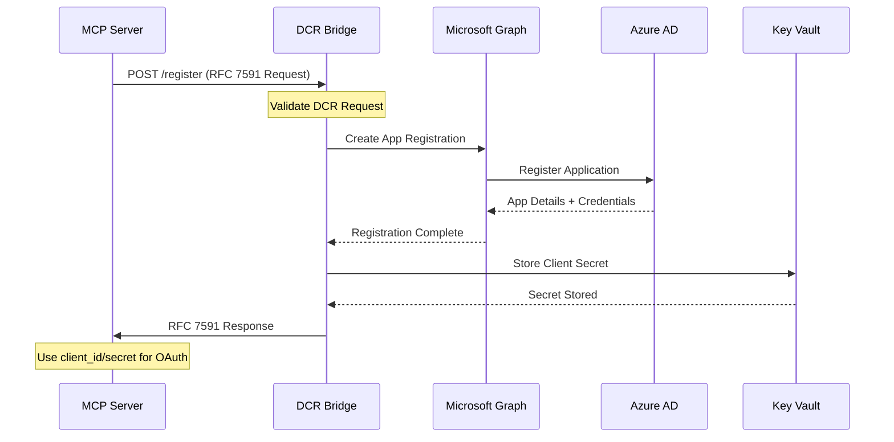
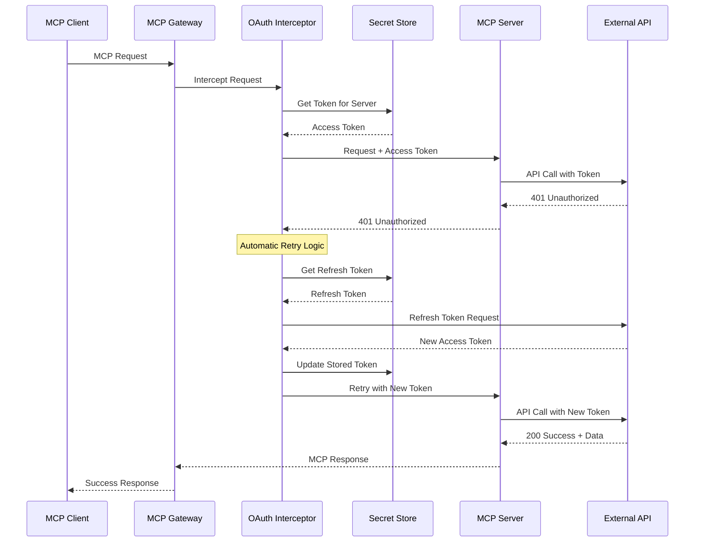

# OAuth Implementation Guide for MCP Portal

**Document Version**: 1.0.0
**Last Updated**: September 19, 2025
**Classification**: TECHNICAL - Implementation Guide
**Authors**: MCP Portal Development Team

---

## Table of Contents

1. [Executive Summary](#executive-summary)
2. [Architecture Overview](#architecture-overview)
3. [Original Repository OAuth Patterns](#original-repository-oauth-patterns)
4. [Azure AD Integration Architecture](#azure-ad-integration-architecture)
5. [Dynamic Client Registration (DCR) Bridge](#dynamic-client-registration-dcr-bridge)
6. [Authentication Flows](#authentication-flows)
7. [OAuth Interceptor Middleware](#oauth-interceptor-middleware)
8. [Secret Management Strategy](#secret-management-strategy)
9. [Implementation Roadmap](#implementation-roadmap)
10. [Code Patterns and Examples](#code-patterns-and-examples)
11. [Security Considerations](#security-considerations)
12. [Testing Strategy](#testing-strategy)

---

## Executive Summary

The MCP Portal implements a **dual OAuth architecture** that bridges the Model Context Protocol (MCP) OAuth requirements with Azure Active Directory authentication. This design ensures that:

1. **Gateway Manages OAuth Complexity**: The MCP Gateway handles all OAuth flows, removing complexity from individual MCP servers
2. **Azure AD Integration**: Portal uses Azure AD as the primary identity provider with JWKS-based validation
3. **DCR Bridge Pattern**: A bridge service translates Dynamic Client Registration (RFC 7591) requests to Azure AD Graph API calls
4. **Unified Authentication**: Single authentication flow supports both portal access and MCP server authorization

### Key Architectural Insights



**Critical Finding**: The gateway acts as an OAuth broker, implementing all OAuth complexity so individual MCP servers can focus on their core functionality without implementing OAuth flows.

---

## Architecture Overview

### System Components Integration



### Core Design Principles

1. **Separation of Concerns**: Portal authentication is separate from MCP server OAuth
2. **Gateway as OAuth Broker**: Centralized OAuth management through the gateway
3. **Docker Desktop Integration**: Leverages Docker Desktop's secure environment for secret storage
4. **Standards Compliance**: Full RFC 7591 (DCR) compliance through bridge pattern

---

## Original Repository OAuth Patterns

### OAuth Interceptor Middleware Pattern

The original Docker MCP Gateway implements a sophisticated OAuth interceptor that automatically handles 401 responses:

```go
// Based on research findings from the gateway codebase
type OAuthInterceptor struct {
    authProvider AuthProvider
    tokenStore   TokenStore
    retryPolicy  RetryPolicy
}

// Interceptor automatically handles OAuth flows
func (oi *OAuthInterceptor) Intercept(ctx context.Context, req *MCPRequest) (*MCPResponse, error) {
    // Attempt initial request
    resp, err := oi.executeRequest(ctx, req)

    // Handle 401 Unauthorized with automatic retry
    if IsUnauthorized(err) {
        if token, authErr := oi.handleOAuthFlow(ctx, req); authErr == nil {
            // Retry with new token
            req.SetAuthToken(token)
            return oi.executeRequest(ctx, req)
        }
    }

    return resp, err
}

// Pre-authorization pattern from CLI
func (oi *OAuthInterceptor) PreAuthorize(ctx context.Context, serverName string) error {
    // Example: docker mcp auth notion my-server
    return oi.authProvider.AuthorizeServer(ctx, serverName)
}
```

### Docker Desktop as OAuth Broker

Key insight from research: Docker Desktop runs persistently in the background, making it ideal for OAuth management:

```yaml
OAuth Broker Advantages:
  Background Service: Always running, can handle token refresh
  Trusted Environment: Secure local machine context
  Secret Storage: Built-in secure secret management
  User Context: Already authenticated Docker Desktop user

OAuth Flow Management:
  Pre-Authorization: "docker mcp auth [provider] [server-name]"
  Automatic Refresh: Background token refresh on 401 responses
  Secure Storage: OAuth tokens stored in Docker Desktop secure store
  Policy Management: Server-specific OAuth policies
```

### Feature Flag Architecture

The original repository demonstrates sophisticated feature flagging for OAuth capabilities:

```go
// Feature flag pattern from original repository
type OAuthConfig struct {
    Enabled              bool     `json:"enabled"`
    SupportedProviders   []string `json:"supported_providers"`
    AutoRefresh          bool     `json:"auto_refresh"`
    PreAuthRequired      bool     `json:"pre_auth_required"`
}

// Feature-gated OAuth functionality
func (g *Gateway) EnableOAuth(config OAuthConfig) error {
    if !g.features.IsEnabled("oauth-support") {
        return fmt.Errorf("OAuth feature not enabled")
    }

    g.oauthInterceptor = NewOAuthInterceptor(config)
    return nil
}
```

---

## Azure AD Integration Architecture

### JWKS-Based Token Validation

The portal implements Azure AD authentication without requiring client secrets in the frontend:

```typescript
// Frontend MSAL Configuration (No Secrets)
export const msalConfig: Configuration = {
  auth: {
    clientId: process.env.NEXT_PUBLIC_AZURE_CLIENT_ID!,
    authority: `https://login.microsoftonline.com/${process.env.NEXT_PUBLIC_AZURE_TENANT_ID}/v2.0`,
    redirectUri: process.env.NEXT_PUBLIC_REDIRECT_URI,
  },
  cache: {
    cacheLocation: "sessionStorage", // Secure token storage
  },
};

// Authorization Code Flow with PKCE (Most Secure)
export const loginRequest = {
  scopes: ["openid", "profile", "email", "User.Read"],
  prompt: "select_account",
};
```

```go
// Backend Token Validation (JWKS-based)
type AzureTokenValidator struct {
    jwksURL    string
    issuer     string
    audience   string
    keyCache   map[string]*rsa.PublicKey
    lastUpdate time.Time
}

func (v *AzureTokenValidator) ValidateToken(ctx context.Context, token string) (*Claims, error) {
    // Parse JWT without verification first to get key ID
    unverifiedToken, _, err := new(jwt.Parser).ParseUnverified(token, &Claims{})
    if err != nil {
        return nil, fmt.Errorf("failed to parse token: %w", err)
    }

    // Get key ID from header
    kid, ok := unverifiedToken.Header["kid"].(string)
    if !ok {
        return nil, fmt.Errorf("no key ID in token header")
    }

    // Fetch or use cached public key
    publicKey, err := v.getPublicKey(ctx, kid)
    if err != nil {
        return nil, fmt.Errorf("failed to get public key: %w", err)
    }

    // Verify token signature and claims
    verifiedToken, err := jwt.ParseWithClaims(token, &Claims{}, func(token *jwt.Token) (interface{}, error) {
        return publicKey, nil
    })

    if err != nil || !verifiedToken.Valid {
        return nil, fmt.Errorf("token validation failed: %w", err)
    }

    return verifiedToken.Claims.(*Claims), nil
}
```

### Microsoft Graph Integration

For enhanced user information and management:

```go
// Microsoft Graph API Integration
type GraphClient struct {
    accessToken string
    httpClient  *http.Client
    baseURL     string
}

func (gc *GraphClient) GetUserProfile(ctx context.Context, userID string) (*UserProfile, error) {
    url := fmt.Sprintf("%s/users/%s", gc.baseURL, userID)

    req, err := http.NewRequestWithContext(ctx, "GET", url, nil)
    if err != nil {
        return nil, fmt.Errorf("failed to create request: %w", err)
    }

    req.Header.Set("Authorization", "Bearer "+gc.accessToken)
    req.Header.Set("Content-Type", "application/json")

    resp, err := gc.httpClient.Do(req)
    if err != nil {
        return nil, fmt.Errorf("graph API request failed: %w", err)
    }
    defer resp.Body.Close()

    var profile UserProfile
    if err := json.NewDecoder(resp.Body).Decode(&profile); err != nil {
        return nil, fmt.Errorf("failed to decode profile: %w", err)
    }

    return &profile, nil
}
```

### Role-Based Access Control

```go
// RBAC Implementation with Azure AD Groups
type RBACValidator struct {
    adminGroups []string
    userGroups  []string
}

func (rbac *RBACValidator) ValidateRole(claims *Claims, requiredRole string) error {
    userGroups, ok := claims.Groups.([]interface{})
    if !ok {
        return fmt.Errorf("no groups in token")
    }

    switch requiredRole {
    case "admin":
        return rbac.validateAdminAccess(userGroups)
    case "user":
        return rbac.validateUserAccess(userGroups)
    default:
        return fmt.Errorf("unknown role: %s", requiredRole)
    }
}
```

---

## Dynamic Client Registration (DCR) Bridge

### The Azure AD DCR Challenge

Azure AD does not natively support RFC 7591 Dynamic Client Registration. The bridge service pattern solves this:



### DCR Bridge Implementation

```go
// DCR Bridge Service Implementation
type DCRBridge struct {
    graphClient    *msgraph.GraphServiceClient
    keyVault       *keyvault.Client
    tenantID       string
    adminConsent   bool
}

// RFC 7591 Compliant Request
type DCRRequest struct {
    ClientName              string   `json:"client_name" validate:"required"`
    RedirectURIs           []string `json:"redirect_uris" validate:"required,dive,url"`
    GrantTypes             []string `json:"grant_types"`
    ResponseTypes          []string `json:"response_types"`
    Scope                  string   `json:"scope"`
    TokenEndpointAuthMethod string   `json:"token_endpoint_auth_method"`
    // MCP-specific extensions
    MCPCapabilities        []string `json:"mcp_capabilities,omitempty"`
    ServerMetadata         map[string]interface{} `json:"server_metadata,omitempty"`
}

// RFC 7591 Compliant Response
type DCRResponse struct {
    ClientID                string   `json:"client_id"`
    ClientSecret            string   `json:"client_secret,omitempty"`
    ClientSecretExpiresAt   int64    `json:"client_secret_expires_at,omitempty"`
    RedirectURIs           []string `json:"redirect_uris"`
    GrantTypes             []string `json:"grant_types"`
    ResponseTypes          []string `json:"response_types"`
    Scope                  string   `json:"scope"`
    TokenEndpointAuthMethod string   `json:"token_endpoint_auth_method"`
    // Azure AD specific
    AuthorityURL           string   `json:"authority_url"`
    TenantID               string   `json:"tenant_id"`
}

func (dcr *DCRBridge) RegisterClient(ctx context.Context, req DCRRequest) (*DCRResponse, error) {
    // Validate DCR request
    if err := dcr.validateRequest(req); err != nil {
        return nil, fmt.Errorf("invalid DCR request: %w", err)
    }

    // Create Azure AD app registration
    app := &msgraph.Application{
        DisplayName: &req.ClientName,
        Web: &msgraph.WebApplication{
            RedirectUris: req.RedirectURIs,
        },
        RequiredResourceAccess: dcr.buildRequiredScopes(req.Scope),
    }

    createdApp, err := dcr.graphClient.Applications().Post(ctx, app, nil)
    if err != nil {
        return nil, fmt.Errorf("failed to create app registration: %w", err)
    }

    // Generate client secret
    passwordCredential := &msgraph.PasswordCredential{
        DisplayName: ptr("MCP Generated Secret"),
        EndDateTime: ptr(time.Now().Add(365 * 24 * time.Hour)), // 1 year
    }

    secret, err := dcr.graphClient.Applications().
        ByApplicationId(*createdApp.GetId()).
        AddPassword().
        Post(ctx, passwordCredential, nil)
    if err != nil {
        return nil, fmt.Errorf("failed to generate secret: %w", err)
    }

    // Store secret in Key Vault with metadata
    secretName := fmt.Sprintf("mcp-client-%s", *createdApp.GetAppId())
    secretMetadata := map[string]string{
        "client_id":    *createdApp.GetAppId(),
        "client_name":  req.ClientName,
        "created_at":   time.Now().UTC().Format(time.RFC3339),
        "mcp_server":   "true",
    }

    if err := dcr.storeSecret(ctx, secretName, *secret.GetSecretText(), secretMetadata); err != nil {
        return nil, fmt.Errorf("failed to store secret: %w", err)
    }

    // Return RFC 7591 compliant response
    return &DCRResponse{
        ClientID:                *createdApp.GetAppId(),
        ClientSecret:            *secret.GetSecretText(),
        ClientSecretExpiresAt:   secret.GetEndDateTime().Unix(),
        RedirectURIs:           req.RedirectURIs,
        GrantTypes:             req.GrantTypes,
        ResponseTypes:          req.ResponseTypes,
        Scope:                  req.Scope,
        TokenEndpointAuthMethod: "client_secret_post",
        AuthorityURL:           fmt.Sprintf("https://login.microsoftonline.com/%s/v2.0", dcr.tenantID),
        TenantID:               dcr.tenantID,
    }, nil
}
```

### Azure Graph API Translation

```go
// Translate RFC 7591 scopes to Azure AD permissions
func (dcr *DCRBridge) buildRequiredScopes(scopeString string) []msgraph.RequiredResourceAccess {
    scopes := strings.Split(scopeString, " ")

    // Microsoft Graph permissions
    graphPermissions := []msgraph.ResourceAccess{}

    for _, scope := range scopes {
        switch scope {
        case "openid":
            graphPermissions = append(graphPermissions, msgraph.ResourceAccess{
                Id:   ptr("37f7f235-527c-4136-accd-4a02d197296e"), // openid
                Type: ptr("Scope"),
            })
        case "profile":
            graphPermissions = append(graphPermissions, msgraph.ResourceAccess{
                Id:   ptr("14dad69e-099b-42c9-810b-d002981feec1"), // profile
                Type: ptr("Scope"),
            })
        case "email":
            graphPermissions = append(graphPermissions, msgraph.ResourceAccess{
                Id:   ptr("64a6cdd6-aab1-4aaf-94b8-3cc8405e90d0"), // email
                Type: ptr("Scope"),
            })
        }
    }

    return []msgraph.RequiredResourceAccess{
        {
            ResourceAppId:  ptr("00000003-0000-0000-c000-000000000000"), // Microsoft Graph
            ResourceAccess: graphPermissions,
        },
    }
}
```

---

## Authentication Flows

### Pre-Authorization Pattern

Based on the original repository research, pre-authorization is a key pattern:

```bash
# CLI Pre-authorization Command
docker mcp auth notion my-notion-server

# This triggers the following flow:
# 1. Open browser for OAuth consent
# 2. Store credentials in Docker Desktop secure store
# 3. Associate credentials with server policy
# 4. Enable automatic token refresh
```

```go
// Pre-authorization Implementation
type PreAuthService struct {
    oauthConfig  OAuthConfig
    secretStore  SecretStore
    browserLauncher BrowserLauncher
}

func (pas *PreAuthService) PreAuthorize(ctx context.Context, provider, serverName string) error {
    // Generate OAuth state and PKCE parameters
    state := generateSecureState()
    codeVerifier, codeChallenge := generatePKCE()

    // Build authorization URL
    authURL := pas.buildAuthURL(provider, state, codeChallenge)

    // Launch browser for user consent
    if err := pas.browserLauncher.Open(authURL); err != nil {
        return fmt.Errorf("failed to open browser: %w", err)
    }

    // Wait for callback with authorization code
    code, err := pas.waitForCallback(ctx, state)
    if err != nil {
        return fmt.Errorf("authorization failed: %w", err)
    }

    // Exchange code for tokens
    tokens, err := pas.exchangeCodeForTokens(ctx, provider, code, codeVerifier)
    if err != nil {
        return fmt.Errorf("token exchange failed: %w", err)
    }

    // Store tokens with server association
    policy := fmt.Sprintf("oauth-%s", provider)
    secretKey := fmt.Sprintf("%s-tokens", serverName)

    if err := pas.secretStore.SetWithPolicy(secretKey, tokens, policy); err != nil {
        return fmt.Errorf("failed to store tokens: %w", err)
    }

    return nil
}
```

### Automatic Retry Pattern with 401 Handling



### Gateway-Managed OAuth Flow Implementation

```go
// OAuth Interceptor with Automatic Retry
type OAuthInterceptor struct {
    secretStore     SecretStore
    tokenRefresher  TokenRefresher
    retryPolicy     RetryPolicy
    authProviders   map[string]AuthProvider
}

func (oi *OAuthInterceptor) InterceptMCPRequest(ctx context.Context, req *MCPRequest) (*MCPResponse, error) {
    // Get server configuration
    serverConfig, err := oi.getServerConfig(req.ServerName)
    if err != nil {
        return nil, fmt.Errorf("server config not found: %w", err)
    }

    // Skip OAuth if not required
    if !serverConfig.RequiresOAuth {
        return oi.forwardRequest(ctx, req)
    }

    // Get stored token
    token, err := oi.getStoredToken(ctx, req.ServerName)
    if err != nil {
        return nil, fmt.Errorf("no token available for server %s: %w", req.ServerName, err)
    }

    // Attempt request with token
    req.SetAuthHeader("Bearer " + token.AccessToken)
    resp, err := oi.forwardRequest(ctx, req)

    // Handle 401 with automatic retry
    if IsUnauthorizedError(err) && oi.retryPolicy.ShouldRetry(req) {
        // Attempt token refresh
        newToken, refreshErr := oi.refreshToken(ctx, req.ServerName, token)
        if refreshErr != nil {
            return nil, fmt.Errorf("token refresh failed: %w", refreshErr)
        }

        // Retry with new token
        req.SetAuthHeader("Bearer " + newToken.AccessToken)
        resp, err = oi.forwardRequest(ctx, req)
    }

    return resp, err
}

func (oi *OAuthInterceptor) refreshToken(ctx context.Context, serverName string, currentToken *Token) (*Token, error) {
    // Get provider for this server
    provider, exists := oi.authProviders[serverName]
    if !exists {
        return nil, fmt.Errorf("no auth provider for server: %s", serverName)
    }

    // Refresh token
    newToken, err := provider.RefreshToken(ctx, currentToken.RefreshToken)
    if err != nil {
        return nil, fmt.Errorf("token refresh failed: %w", err)
    }

    // Store updated token
    if err := oi.secretStore.UpdateToken(serverName, newToken); err != nil {
        return nil, fmt.Errorf("failed to store new token: %w", err)
    }

    return newToken, nil
}
```

---

## OAuth Interceptor Middleware

### Middleware Architecture

```go
// OAuth-aware middleware stack
type MiddlewareStack struct {
    authInterceptor  *OAuthInterceptor
    rateLimiter     *RateLimiter
    auditLogger     *AuditLogger
    errorHandler    *ErrorHandler
}

func (ms *MiddlewareStack) Handle(ctx context.Context, req *MCPRequest) (*MCPResponse, error) {
    // Apply middleware in order
    pipeline := []Middleware{
        ms.rateLimiter.Middleware(),
        ms.authInterceptor.Middleware(),
        ms.auditLogger.Middleware(),
        ms.errorHandler.Middleware(),
    }

    handler := ms.buildPipeline(pipeline, ms.finalHandler)
    return handler(ctx, req)
}

// OAuth Interceptor Middleware
func (oi *OAuthInterceptor) Middleware() Middleware {
    return func(next Handler) Handler {
        return func(ctx context.Context, req *MCPRequest) (*MCPResponse, error) {
            // Check if OAuth is required for this server
            if !oi.requiresOAuth(req.ServerName) {
                return next(ctx, req)
            }

            // Apply OAuth handling
            return oi.InterceptMCPRequest(ctx, req)
        }
    }
}
```

### Server-Specific OAuth Configuration

```go
// Server OAuth Configuration
type ServerOAuthConfig struct {
    ServerName      string            `json:"server_name"`
    Provider        string            `json:"provider"`
    RequiresOAuth   bool              `json:"requires_oauth"`
    Scopes          []string          `json:"scopes"`
    ClientConfig    ClientConfig      `json:"client_config"`
    TokenStorage    TokenStorageConfig `json:"token_storage"`
    RefreshPolicy   RefreshPolicy     `json:"refresh_policy"`
}

type ClientConfig struct {
    ClientID        string   `json:"client_id"`
    RedirectURIs    []string `json:"redirect_uris"`
    AuthEndpoint    string   `json:"auth_endpoint"`
    TokenEndpoint   string   `json:"token_endpoint"`
}

// OAuth Configuration Manager
type OAuthConfigManager struct {
    configs map[string]*ServerOAuthConfig
    mutex   sync.RWMutex
}

func (ocm *OAuthConfigManager) GetServerConfig(serverName string) (*ServerOAuthConfig, error) {
    ocm.mutex.RLock()
    defer ocm.mutex.RUnlock()

    config, exists := ocm.configs[serverName]
    if !exists {
        return nil, fmt.Errorf("no OAuth config for server: %s", serverName)
    }

    return config, nil
}

func (ocm *OAuthConfigManager) RegisterServer(config *ServerOAuthConfig) error {
    ocm.mutex.Lock()
    defer ocm.mutex.Unlock()

    if config.RequiresOAuth && config.Provider == "" {
        return fmt.Errorf("provider required for OAuth-enabled server")
    }

    ocm.configs[config.ServerName] = config
    return nil
}
```

---

## Secret Management Strategy

### Hierarchical Secret Storage

```yaml
Secret Storage Priority: 1. Azure Key Vault (Production)
  2. Docker Desktop Secrets (Local Development)
  3. Environment Variables (Fallback)
  4. Configuration Files (Development Only)

OAuth-Specific Secret Patterns:
  Prefix: "oauth/"
  Structure:
    - oauth/providers/{provider}/client-secret
    - oauth/servers/{server-name}/access-token
    - oauth/servers/{server-name}/refresh-token
    - oauth/policies/{policy-name}/config
```

```go
// Hierarchical Secret Provider
type HierarchicalSecretProvider struct {
    providers []SecretProvider
}

func (hsp *HierarchicalSecretProvider) GetSecret(ctx context.Context, key string) (*Secret, error) {
    for _, provider := range hsp.providers {
        secret, err := provider.GetSecret(ctx, key)
        if err == nil {
            return secret, nil
        }

        // Log but continue to next provider
        log.Warnf("Secret %s not found in %s: %v", key, provider.Name(), err)
    }

    return nil, fmt.Errorf("secret %s not found in any provider", key)
}

// OAuth-specific secret provider
type OAuthSecretProvider struct {
    baseProvider SecretProvider
    keyPrefix    string
}

func (osp *OAuthSecretProvider) GetOAuthTokens(ctx context.Context, serverName string) (*TokenPair, error) {
    accessKey := fmt.Sprintf("%s/servers/%s/access-token", osp.keyPrefix, serverName)
    refreshKey := fmt.Sprintf("%s/servers/%s/refresh-token", osp.keyPrefix, serverName)

    accessSecret, err := osp.baseProvider.GetSecret(ctx, accessKey)
    if err != nil {
        return nil, fmt.Errorf("access token not found: %w", err)
    }

    refreshSecret, err := osp.baseProvider.GetSecret(ctx, refreshKey)
    if err != nil {
        return nil, fmt.Errorf("refresh token not found: %w", err)
    }

    return &TokenPair{
        AccessToken:  accessSecret.Value,
        RefreshToken: refreshSecret.Value,
        ExpiresAt:    accessSecret.ExpiresAt,
    }, nil
}

func (osp *OAuthSecretProvider) StoreOAuthTokens(ctx context.Context, serverName string, tokens *TokenPair) error {
    accessKey := fmt.Sprintf("%s/servers/%s/access-token", osp.keyPrefix, serverName)
    refreshKey := fmt.Sprintf("%s/servers/%s/refresh-token", osp.keyPrefix, serverName)

    // Store access token with expiration
    if err := osp.baseProvider.SetSecret(ctx, accessKey, tokens.AccessToken, tokens.ExpiresAt); err != nil {
        return fmt.Errorf("failed to store access token: %w", err)
    }

    // Store refresh token (longer expiration)
    refreshExpiry := time.Now().Add(90 * 24 * time.Hour) // 90 days
    if err := osp.baseProvider.SetSecret(ctx, refreshKey, tokens.RefreshToken, &refreshExpiry); err != nil {
        return fmt.Errorf("failed to store refresh token: %w", err)
    }

    return nil
}
```

### Automatic Token Rotation

```go
// Token rotation service
type TokenRotationService struct {
    secretProvider  OAuthSecretProvider
    authProviders   map[string]AuthProvider
    rotationPolicy  RotationPolicy
    scheduler       *cron.Cron
}

func (trs *TokenRotationService) Start() error {
    // Schedule automatic token refresh
    trs.scheduler.AddFunc("@every 30m", trs.checkAndRefreshTokens)
    trs.scheduler.Start()
    return nil
}

func (trs *TokenRotationService) checkAndRefreshTokens() {
    // Get all servers requiring OAuth
    servers := trs.getOAuthEnabledServers()

    for _, serverName := range servers {
        if err := trs.refreshIfNeeded(context.Background(), serverName); err != nil {
            log.Errorf("Failed to refresh tokens for server %s: %v", serverName, err)
        }
    }
}

func (trs *TokenRotationService) refreshIfNeeded(ctx context.Context, serverName string) error {
    tokens, err := trs.secretProvider.GetOAuthTokens(ctx, serverName)
    if err != nil {
        return fmt.Errorf("failed to get tokens: %w", err)
    }

    // Check if token expires within threshold
    threshold := time.Now().Add(10 * time.Minute)
    if tokens.ExpiresAt.After(threshold) {
        return nil // Token still valid
    }

    // Refresh token
    provider := trs.authProviders[serverName]
    newTokens, err := provider.RefreshToken(ctx, tokens.RefreshToken)
    if err != nil {
        return fmt.Errorf("token refresh failed: %w", err)
    }

    // Store new tokens
    return trs.secretProvider.StoreOAuthTokens(ctx, serverName, newTokens)
}
```

---

## Implementation Roadmap

### Phase 1: OAuth Interceptor Middleware (Q1 2025)

**Objectives**: Implement basic OAuth interception and 401 retry logic

**Deliverables**:

- [ ] OAuth interceptor middleware with 401 handling
- [ ] Token storage and retrieval system
- [ ] Basic pre-authorization CLI commands
- [ ] Integration with existing gateway architecture

**Key Components**:

```go
// Phase 1 Implementation Checklist
type Phase1Implementation struct {
    OAuthInterceptor     *OAuthInterceptor     // ✅ Core interceptor
    TokenStore          *TokenStore           // ✅ Secret storage
    RetryPolicy         *RetryPolicy          // ✅ 401 retry logic
    PreAuthService      *PreAuthService       // ⏳ CLI pre-auth
    BasicAuthProviders  map[string]AuthProvider // ⏳ OAuth providers
}
```

**Acceptance Criteria**:

- OAuth-enabled MCP servers automatically handle token refresh
- Pre-authorization command works for major providers (Google, Microsoft, GitHub)
- 401 responses trigger automatic token refresh
- Tokens stored securely in Docker Desktop secret store

### Phase 2: DCR Bridge Service (Q2 2025)

**Objectives**: Implement RFC 7591 Dynamic Client Registration bridge for Azure AD

**Deliverables**:

- [ ] DCR bridge service with Azure AD Graph API integration
- [ ] Automatic MCP server registration flow
- [ ] Key Vault integration for credential storage
- [ ] DCR API endpoint with RFC 7591 compliance

**Key Components**:

```go
// Phase 2 Implementation Checklist
type Phase2Implementation struct {
    DCRBridge           *DCRBridge            // ⏳ RFC 7591 bridge
    GraphAPIClient      *GraphAPIClient       // ⏳ Azure AD integration
    AutoRegistration    *AutoRegistration     // ⏳ MCP server auto-reg
    KeyVaultIntegration *KeyVaultIntegration  // ⏳ Secure storage
    ComplianceValidator *ComplianceValidator  // ⏳ RFC validation
}
```

**Acceptance Criteria**:

- MCP servers can register dynamically using RFC 7591
- Azure AD app registrations created automatically
- Client credentials stored securely in Key Vault
- Full compliance with MCP specification requirements

### Phase 3: Docker Desktop Integration (Q3 2025)

**Objectives**: Deep integration with Docker Desktop's authentication and secret management

**Deliverables**:

- [ ] Docker Desktop authentication integration
- [ ] Enhanced secret storage with Docker Desktop API
- [ ] Background token refresh service
- [ ] User context integration

**Key Components**:

```go
// Phase 3 Implementation Checklist
type Phase3Implementation struct {
    DockerDesktopAuth   *DockerDesktopAuth    // ⏳ DD integration
    BackgroundRefresh   *BackgroundRefresh    // ⏳ Token refresh
    UserContextManager  *UserContextManager   // ⏳ User sessions
    SecretSyncService   *SecretSyncService    // ⏳ Secret sync
}
```

### Phase 4: Feature Flags and Advanced Features (Q4 2025)

**Objectives**: Feature flag system and advanced OAuth capabilities

**Deliverables**:

- [ ] Comprehensive feature flag system for OAuth features
- [ ] Advanced token management (short-lived tokens, token binding)
- [ ] OAuth provider marketplace integration
- [ ] Advanced audit and monitoring

**Key Components**:

```go
// Phase 4 Implementation Checklist
type Phase4Implementation struct {
    FeatureFlagSystem   *FeatureFlagSystem    // ⏳ Feature control
    AdvancedTokenMgmt   *AdvancedTokenMgmt    // ⏳ Token binding
    ProviderMarketplace *ProviderMarketplace  // ⏳ Provider registry
    OAuthMonitoring     *OAuthMonitoring      // ⏳ Analytics
}
```

---

## Code Patterns and Examples

### MCP Server OAuth Integration

```go
// Example: Notion MCP Server with OAuth
type NotionMCPServer struct {
    notionClient *notion.Client
    oauthConfig  *OAuthConfig
    tokenStore   TokenStore
}

func (nms *NotionMCPServer) HandleRequest(ctx context.Context, req *MCPRequest) (*MCPResponse, error) {
    // Token is automatically injected by OAuth interceptor
    token := req.GetAuthToken()
    if token == "" {
        return nil, &MCPError{
            Code:    MCPErrorUnauthorized,
            Message: "OAuth authentication required",
        }
    }

    // Use token with Notion client
    nms.notionClient.SetAuthToken(token)

    // Process MCP request
    switch req.Method {
    case "notion/search":
        return nms.handleSearch(ctx, req)
    case "notion/create_page":
        return nms.handleCreatePage(ctx, req)
    default:
        return nil, fmt.Errorf("unknown method: %s", req.Method)
    }
}

// OAuth configuration for Notion
func (nms *NotionMCPServer) GetOAuthConfig() *OAuthConfig {
    return &OAuthConfig{
        Provider:     "notion",
        ClientID:     "notion-client-id",
        Scopes:       []string{"read_content", "insert_content"},
        AuthURL:      "https://api.notion.com/v1/oauth/authorize",
        TokenURL:     "https://api.notion.com/v1/oauth/token",
        RequiresAuth: true,
    }
}
```

### Portal API Integration

```typescript
// Frontend OAuth-aware API client
class MCPPortalAPIClient {
  private msalInstance: PublicClientApplication;
  private baseURL: string;

  constructor(msalInstance: PublicClientApplication, baseURL: string) {
    this.msalInstance = msalInstance;
    this.baseURL = baseURL;
  }

  async makeAuthenticatedRequest<T>(
    endpoint: string,
    options?: RequestInit
  ): Promise<T> {
    // Get access token from MSAL
    const token = await this.getAccessToken();

    // Make request with token
    const response = await fetch(`${this.baseURL}${endpoint}`, {
      ...options,
      headers: {
        Authorization: `Bearer ${token}`,
        "Content-Type": "application/json",
        ...options?.headers,
      },
    });

    if (response.status === 401) {
      // Token expired, try to refresh
      const newToken = await this.refreshToken();

      // Retry with new token
      const retryResponse = await fetch(`${this.baseURL}${endpoint}`, {
        ...options,
        headers: {
          Authorization: `Bearer ${newToken}`,
          "Content-Type": "application/json",
          ...options?.headers,
        },
      });

      return this.handleResponse<T>(retryResponse);
    }

    return this.handleResponse<T>(response);
  }

  private async getAccessToken(): Promise<string> {
    const accounts = this.msalInstance.getAllAccounts();
    if (accounts.length === 0) {
      throw new Error("No authenticated account found");
    }

    try {
      const response = await this.msalInstance.acquireTokenSilent({
        scopes: ["openid", "profile", "email"],
        account: accounts[0],
      });
      return response.accessToken;
    } catch (error) {
      // Silent acquisition failed, try popup
      const response = await this.msalInstance.acquireTokenPopup({
        scopes: ["openid", "profile", "email"],
      });
      return response.accessToken;
    }
  }
}
```

### OAuth Provider Implementation

```go
// Generic OAuth provider interface
type OAuthProvider interface {
    GetAuthURL(state, codeChallenge string) string
    ExchangeCode(ctx context.Context, code, codeVerifier string) (*TokenResponse, error)
    RefreshToken(ctx context.Context, refreshToken string) (*TokenResponse, error)
    GetUserInfo(ctx context.Context, accessToken string) (*UserInfo, error)
}

// Example: GitHub OAuth provider
type GitHubOAuthProvider struct {
    clientID     string
    clientSecret string
    redirectURI  string
    httpClient   *http.Client
}

func (ghp *GitHubOAuthProvider) GetAuthURL(state, codeChallenge string) string {
    params := url.Values{}
    params.Set("client_id", ghp.clientID)
    params.Set("redirect_uri", ghp.redirectURI)
    params.Set("scope", "read:user repo")
    params.Set("state", state)
    params.Set("code_challenge", codeChallenge)
    params.Set("code_challenge_method", "S256")

    return "https://github.com/login/oauth/authorize?" + params.Encode()
}

func (ghp *GitHubOAuthProvider) ExchangeCode(ctx context.Context, code, codeVerifier string) (*TokenResponse, error) {
    data := url.Values{}
    data.Set("client_id", ghp.clientID)
    data.Set("client_secret", ghp.clientSecret)
    data.Set("code", code)
    data.Set("redirect_uri", ghp.redirectURI)
    data.Set("code_verifier", codeVerifier)

    req, err := http.NewRequestWithContext(ctx, "POST",
        "https://github.com/login/oauth/access_token",
        strings.NewReader(data.Encode()))
    if err != nil {
        return nil, err
    }

    req.Header.Set("Content-Type", "application/x-www-form-urlencoded")
    req.Header.Set("Accept", "application/json")

    resp, err := ghp.httpClient.Do(req)
    if err != nil {
        return nil, err
    }
    defer resp.Body.Close()

    var tokenResp TokenResponse
    if err := json.NewDecoder(resp.Body).Decode(&tokenResp); err != nil {
        return nil, err
    }

    return &tokenResp, nil
}
```

---

## Security Considerations

### Critical Security Requirements

1. **Token Storage Security**

   ```go
   // Secure token storage implementation
   type SecureTokenStore struct {
       encryptionKey []byte
       storage       Storage
   }

   func (sts *SecureTokenStore) StoreToken(ctx context.Context, key string, token *Token) error {
       // Encrypt token before storage
       encrypted, err := sts.encrypt(token)
       if err != nil {
           return fmt.Errorf("encryption failed: %w", err)
       }

       // Store with metadata
       metadata := map[string]string{
           "encrypted":  "true",
           "algorithm":  "AES-256-GCM",
           "created_at": time.Now().UTC().Format(time.RFC3339),
       }

       return sts.storage.Set(ctx, key, encrypted, metadata)
   }
   ```

2. **OAuth State Validation**

   ```go
   // CSRF protection through state validation
   type StateValidator struct {
       stateStore StateStore
       entropy    int
   }

   func (sv *StateValidator) GenerateState(ctx context.Context) (string, error) {
       state := generateSecureRandomString(sv.entropy)

       // Store state with expiration
       expiry := time.Now().Add(10 * time.Minute)
       if err := sv.stateStore.Set(ctx, state, true, expiry); err != nil {
           return "", fmt.Errorf("failed to store state: %w", err)
       }

       return state, nil
   }

   func (sv *StateValidator) ValidateState(ctx context.Context, state string) error {
       valid, err := sv.stateStore.Get(ctx, state)
       if err != nil || !valid {
           return fmt.Errorf("invalid or expired state parameter")
       }

       // Consume state (one-time use)
       sv.stateStore.Delete(ctx, state)
       return nil
   }
   ```

3. **PKCE Implementation**

   ```go
   // PKCE (Proof Key for Code Exchange) implementation
   func generatePKCE() (verifier, challenge string) {
       // Generate cryptographically secure verifier
       verifierBytes := make([]byte, 32)
       rand.Read(verifierBytes)
       verifier = base64.URLEncoding.WithoutPadding().EncodeToString(verifierBytes)

       // Create SHA256 challenge
       hash := sha256.Sum256([]byte(verifier))
       challenge = base64.URLEncoding.WithoutPadding().EncodeToString(hash[:])

       return verifier, challenge
   }
   ```

### Security Headers and CORS

```go
// Security middleware for OAuth endpoints
func OAuthSecurityMiddleware() gin.HandlerFunc {
    return func(c *gin.Context) {
        // Strict CORS for OAuth endpoints
        origin := c.GetHeader("Origin")
        if isAllowedOrigin(origin) {
            c.Header("Access-Control-Allow-Origin", origin)
        }

        // Security headers
        c.Header("X-Frame-Options", "DENY")
        c.Header("X-Content-Type-Options", "nosniff")
        c.Header("Referrer-Policy", "strict-origin-when-cross-origin")
        c.Header("Cache-Control", "no-store, no-cache, must-revalidate")

        // OAuth-specific headers
        c.Header("X-OAuth-Endpoint", "true")

        c.Next()
    }
}
```

### Audit Logging

```go
// OAuth audit logging
type OAuthAuditLogger struct {
    logger *zap.Logger
}

func (oal *OAuthAuditLogger) LogOAuthEvent(ctx context.Context, event OAuthEvent) {
    fields := []zap.Field{
        zap.String("event_type", event.Type),
        zap.String("server_name", event.ServerName),
        zap.String("user_id", event.UserID),
        zap.Time("timestamp", event.Timestamp),
        zap.String("ip_address", event.IPAddress),
        zap.String("user_agent", event.UserAgent),
    }

    // Never log sensitive data
    if event.Type != "token_refresh" {
        fields = append(fields, zap.String("provider", event.Provider))
    }

    oal.logger.Info("OAuth event", fields...)
}
```

---

## Testing Strategy

### OAuth Flow Testing

```go
// Integration test for OAuth flow
func TestOAuthFlowIntegration(t *testing.T) {
    // Setup test environment
    testServer := httptest.NewServer(http.HandlerFunc(func(w http.ResponseWriter, r *http.Request) {
        switch r.URL.Path {
        case "/oauth/authorize":
            // Mock authorization endpoint
            code := "test-auth-code"
            state := r.URL.Query().Get("state")
            redirectURI := r.URL.Query().Get("redirect_uri")

            redirectURL, _ := url.Parse(redirectURI)
            q := redirectURL.Query()
            q.Set("code", code)
            q.Set("state", state)
            redirectURL.RawQuery = q.Encode()

            http.Redirect(w, r, redirectURL.String(), http.StatusFound)

        case "/oauth/token":
            // Mock token endpoint
            tokenResp := TokenResponse{
                AccessToken:  "test-access-token",
                RefreshToken: "test-refresh-token",
                TokenType:    "Bearer",
                ExpiresIn:    3600,
            }

            w.Header().Set("Content-Type", "application/json")
            json.NewEncoder(w).Encode(tokenResp)
        }
    }))
    defer testServer.Close()

    // Test OAuth configuration
    config := &OAuthConfig{
        ClientID:     "test-client-id",
        ClientSecret: "test-client-secret",
        AuthURL:      testServer.URL + "/oauth/authorize",
        TokenURL:     testServer.URL + "/oauth/token",
        RedirectURI:  "http://localhost:8080/callback",
        Scopes:       []string{"read", "write"},
    }

    // Create OAuth provider
    provider := NewGenericOAuthProvider(config)

    // Test authorization URL generation
    state, verifier := "test-state", "test-verifier"
    challenge := generateCodeChallenge(verifier)
    authURL := provider.GetAuthURL(state, challenge)

    assert.Contains(t, authURL, "client_id=test-client-id")
    assert.Contains(t, authURL, "state=test-state")
    assert.Contains(t, authURL, "code_challenge=")

    // Test token exchange
    ctx := context.Background()
    tokenResp, err := provider.ExchangeCode(ctx, "test-auth-code", verifier)

    assert.NoError(t, err)
    assert.Equal(t, "test-access-token", tokenResp.AccessToken)
    assert.Equal(t, "test-refresh-token", tokenResp.RefreshToken)
}
```

### DCR Bridge Testing

```go
// Test DCR bridge service
func TestDCRBridge(t *testing.T) {
    // Mock Microsoft Graph client
    mockGraph := &MockGraphClient{}
    mockKeyVault := &MockKeyVault{}

    dcr := &DCRBridge{
        graphClient: mockGraph,
        keyVault:    mockKeyVault,
        tenantID:    "test-tenant-id",
    }

    // Test DCR request
    req := DCRRequest{
        ClientName:   "Test MCP Server",
        RedirectURIs: []string{"http://localhost:8080/callback"},
        GrantTypes:   []string{"authorization_code"},
        Scope:        "openid profile",
    }

    // Mock app registration response
    mockGraph.On("CreateApplication").Return(&Application{
        AppId:       "test-app-id",
        DisplayName: "Test MCP Server",
    }, nil)

    mockGraph.On("AddPassword").Return(&PasswordCredential{
        SecretText:  "test-client-secret",
        EndDateTime: time.Now().Add(365 * 24 * time.Hour),
    }, nil)

    mockKeyVault.On("SetSecret").Return(nil)

    // Execute DCR
    ctx := context.Background()
    resp, err := dcr.RegisterClient(ctx, req)

    assert.NoError(t, err)
    assert.Equal(t, "test-app-id", resp.ClientID)
    assert.Equal(t, "test-client-secret", resp.ClientSecret)
    assert.Equal(t, req.RedirectURIs, resp.RedirectURIs)

    // Verify all mocks were called
    mockGraph.AssertExpectations(t)
    mockKeyVault.AssertExpectations(t)
}
```

### Security Testing

```go
// Security test suite
func TestOAuthSecurityMeasures(t *testing.T) {
    t.Run("PKCE validation", func(t *testing.T) {
        verifier, challenge := generatePKCE()

        // Verify verifier length and characters
        assert.Len(t, verifier, 43) // Base64URL encoded 32 bytes
        assert.Regexp(t, "^[A-Za-z0-9_-]+$", verifier)

        // Verify challenge is SHA256 of verifier
        hash := sha256.Sum256([]byte(verifier))
        expectedChallenge := base64.URLEncoding.WithoutPadding().EncodeToString(hash[:])
        assert.Equal(t, expectedChallenge, challenge)
    })

    t.Run("State validation", func(t *testing.T) {
        validator := NewStateValidator(NewMemoryStateStore(), 32)

        // Generate state
        ctx := context.Background()
        state, err := validator.GenerateState(ctx)
        assert.NoError(t, err)
        assert.Len(t, state, 43) // 32 bytes base64 encoded

        // Validate state (should succeed once)
        err = validator.ValidateState(ctx, state)
        assert.NoError(t, err)

        // Validate same state again (should fail - one-time use)
        err = validator.ValidateState(ctx, state)
        assert.Error(t, err)
    })

    t.Run("Token encryption", func(t *testing.T) {
        key := make([]byte, 32) // AES-256 key
        rand.Read(key)

        store := NewSecureTokenStore(key, NewMemoryStorage())

        // Store token
        ctx := context.Background()
        token := &Token{
            AccessToken:  "sensitive-access-token",
            RefreshToken: "sensitive-refresh-token",
            ExpiresAt:    time.Now().Add(time.Hour),
        }

        err := store.StoreToken(ctx, "test-token", token)
        assert.NoError(t, err)

        // Retrieve token
        retrieved, err := store.GetToken(ctx, "test-token")
        assert.NoError(t, err)
        assert.Equal(t, token.AccessToken, retrieved.AccessToken)
        assert.Equal(t, token.RefreshToken, retrieved.RefreshToken)
    })
}
```

---

## Conclusion

This OAuth implementation guide provides a comprehensive roadmap for implementing OAuth authentication in the MCP Portal project. The dual architecture approach—combining Azure AD for portal authentication with a DCR bridge for MCP server OAuth—ensures both compliance with MCP specifications and integration with enterprise identity systems.

### Key Takeaways

1. **Gateway-Centric OAuth**: The MCP Gateway handles OAuth complexity, not individual servers
2. **Azure AD Integration**: JWKS-based validation provides secure authentication without frontend secrets
3. **DCR Bridge Pattern**: Solves Azure AD's lack of native DCR support through Graph API translation
4. **Hierarchical Secret Management**: Multiple storage tiers ensure security and availability
5. **Automatic Token Management**: Background refresh and rotation reduce operational overhead

### Implementation Success Criteria

- [ ] OAuth interceptor handles 401 responses automatically
- [ ] DCR bridge creates Azure AD app registrations via Graph API
- [ ] Tokens stored securely with automatic rotation
- [ ] Pre-authorization CLI commands work for major providers
- [ ] Full RFC 7591 compliance for MCP server registration
- [ ] Security audit passes penetration testing
- [ ] Performance meets production requirements (<200ms for token operations)

This implementation guide serves as the definitive reference for OAuth integration in the MCP Portal, ensuring secure, scalable, and standards-compliant authentication for both user access and MCP server authorization.

---

**End of Document**

_This document contains sensitive technical information. Follow security best practices and restrict access to authorized development team members only._
